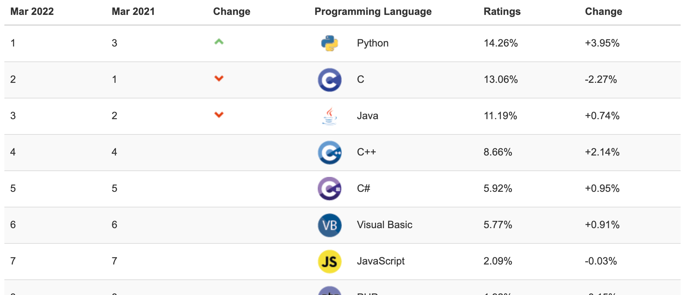

# 자바(JAVA)

- 프로그래밍 언어 중 하나
- 프로그래밍 언어 선호도 3위 (TIOBE index 2021년 12월 기준)

> 개인적인 언어 습득 난이도: C > C++ , Java, JavaScript > Python  
> But, 한 번 배우고 난 후 사용할 때는 비슷비슷함

## 자바 특징

**플랫폼 독립적**
- 운영체제에 따라 코드를 재 삭성하지 않아도 됨

**객체 지향적**
- 절차 지향적 언어에 비해 생산성 높음, 보안성 높음

## 자바 프로그램 작성/ 실행 과정

자바 소스 코드를 컴파일러를 거치고 바이트 코드로 만들어 진다.  
JVM을 통해 운영체제별로 실행할 수 있게 만들어 준다.

## 자바 활용도

- 웹 애플레이케이션  
- 모바일 애플리케이션  
- 엔터프라이즈 애플리케이션  
- 웹/앱 서버

## 자바 플랫폼 (Java Platform)

1. JAVA SE (Standard Edition)
  - 기본 개발 환경

2. JAVA EE(Enterprise Edition)
- 서버 기반 프로그램 개발 환경

3. JAVA ME(Micro Edition)
- 모바일, 임베디드 시스템 개발 환경