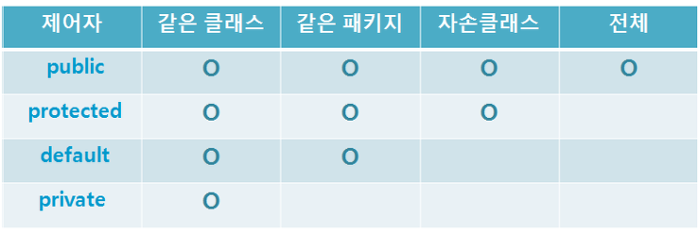

# 클래스와 객체

## 클래스 (class)

- 객체를 정의하는 설계도
- 불어빨 틀
- 레시피
- ...

## 객체, 인스턴스

- 객체 (Object)
  - 실체

- 인스턴스(Instance)
  - 클래스와 객체의 관계
  - 클래스로부터 객체를 선언 (인스턴스 화)
  - 어떤 객체는 어떤 클래스의 인스턴스


## 클래스 사용

- 클래스 : 객체를 만들기 위한 설계도
  - 객체 변수, 메소드로 이루어짐

```java
public class 클래스명 {
    // 객체변수
    // 메소드
    // + 접근제어자
    // + static
    
}

클래스명 객체명 = new 클래스명();
```

## 생성자 (Constructor)

- 객체가 생성될 때 자동으로 호출됨
- 생성자 규칙
  - 클래스명과 이름 맞추기
  - 리턴 타입 없음

```java
public class 클래스명 {
    클래스명() { }
}
```

## this, this()

- this  
객체 자신을 의미
- this()  
생성자


## 오버로딩 (Overloading)

- 한 클래스 내에서 같은 이름의 메소드를 여러 개 정의
- 오버로딩 조건
  - 메소드의 이름이 같아야 함
  - 매개변수의 개수 또는 타입이 달라야 함  
    (리턴타입의 차이로는 오버로딩이 되지 않음)

```java
public class 클래스명 {
    클래스명() {}
    
    클래스명(String name, String type) {
        구현 내용;
    }
}
```

## 접근제어자

- 클래스의 변수나 메서드의 접근에 제한을 두는 키워드
- 접근 제어자 종류
  - private: 해당 클래스에서만 접근 가능  
  - public: 어디서든 접근 가능
  - default: 해당 패키지 내에서만 접근 가능  
  - protected: 해당 패키지 및 상속받은 클래스에서 접근 가능





## static

- 변수나 메소드의 특성을 바꾸는 키워드  
- Static 특징  
  - 메모리에 한번만 할당됨  
  - 즉, Static 변수나 메소드는 공유되는 특성을 가짐

- Static 클래스 변수
  - 해당 클래스의 각 객체들이 값을 공유
- Static 클래스 메소드
  - 객체를 생성하지 않아도 호출가능