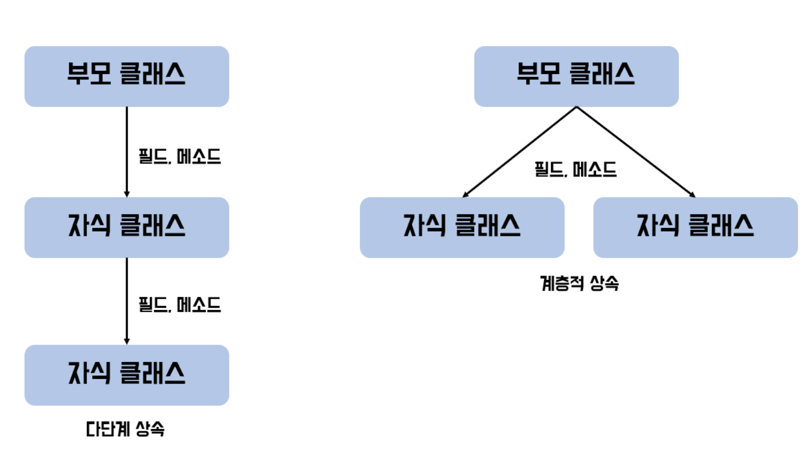

# 상속

- 기존 클래스에 기능 추가 및 재정의하여 새로운 클래스를 정의
  - 부모 클래스: 상속 대상이 되는 기존 클래스
  - 자식 클래스: 기존 클래스를 상속하는 클래스
  
- 부모 클래스의 필드와 메소드가 상속됨




- 다중 상속은 불가능
- private, default 멤버는 자식 클래스에서 접근 불가

```java
class 자식 클래스명 extends 부모클래스 {
    필드;
    메소드;
}
```

## super, super()

- super
  - 부모 클래스와 자식 클래스의 멤버 이름이 같을 때 구분하는 키워드

- super()
  - 부모 클래스의 생성자 호출

## 오버라이딩 (Overriding)

- 부모 클래스의 메소드를 자식 클래스에서 재정의
- 오버라이딩 조건
  - 메소드의 선언부는 부모 클래스의 메소드와 동일해야 함
  - 반환 타입에 한해,  
  부모 클래스의 반환 타입으로 변환할 수 있는 타입으로 변경 가능
  - 부모 클래스의 메소드보다 접근제어자를 더 좁은 범위로 변경 불가
  - 부모 클래스의 메소드보다 더 큰 범위의 예외 선언 불가

