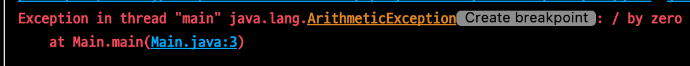

# 예외 ( Exception )

- 정상적이지 않은 Case
    - 0으로 나누기
    - 배열의 인덱스 초기화
    - 없는 파일 열기
    - ...

```java
int a = 1/0;
```




## 예외 처리 (Excpetion Handling)

- 정상적이지 않은 Case애 대ㅑ한 적절한 처리 방법

| 방법 1 |                                                        방법2                                                        |
| :---: |:-----------------------------------------------------------------------------------------------------------------:|
| try { <br> ... <br> } catch (에외 case 1) { <br> } catch (에외 case 2) { ... <br> } | int a = 0; <br><br> try { <br> a = 5/0; <br> } catch (ArithmeticException e) { <br> System.out.println(e); <br> } | 


## finally 

- 예외 발생 여부와 관계없이 할상 실행되는 부분

```java
try {
    예외가 발생할 수도 있는 부분;
} catch (에외 case 1) {
    예외 case 1이 발생해야 실행되는 부분;    
} finally {
    항상 실행되는 부분;    
}
```

## throw, throws

- throw : 예외를 발생 시킴
- throws : 예외를 전가 시킴

```java
... 함수이름() {
    throw new Exception();
}

...함수이름() throws Exception {
    ...    
}
```

