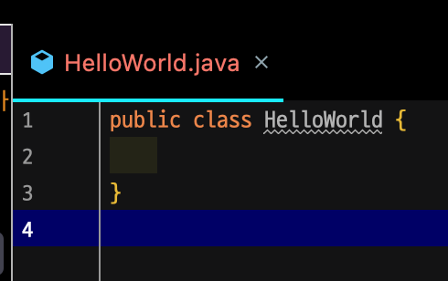
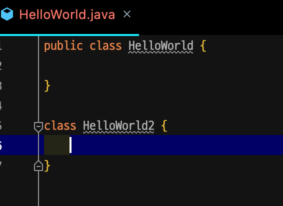
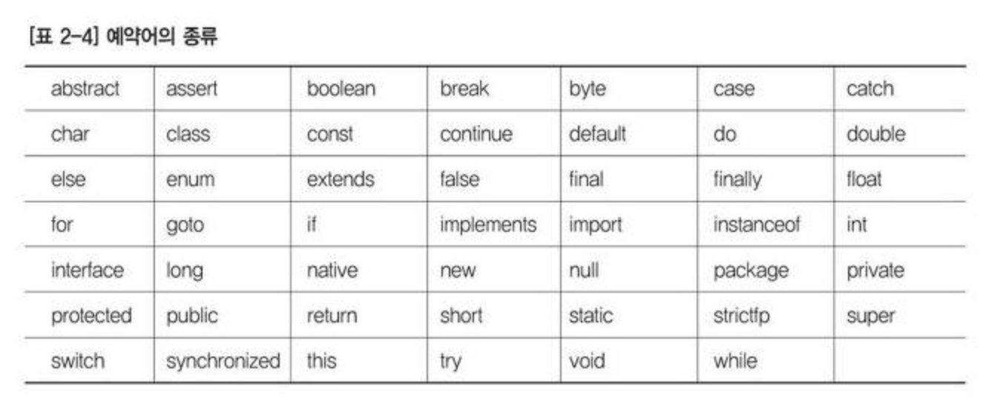
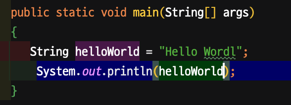

# 자바 구조와 문장

## 클래스

- 자바 프로그램 단위
- 하나의 클래스는 하나의 소스 파일로 구성
- 클래스 이름 이후에 블록으로 구성({})
- 클래스 이름은 대소문자를 구분(userName과 UserName은 다름)
- public 키워드를 사용하는 경우는 파일 이름과 일치

- 클래스
  

  

- 클래스안에 다른 클래스 사용하기

## 패키지 

- 다양한 자바 클래스가 모여있는 폴더(보통 서로 관련 있는 것들끼리 모여있음)
- package 키워드를 이용하여 패키지를 생성(보통 소문자를 사용)
- 자바 파일 소스상에서 맨 앞에 위치
- 패키지 이름에서 마침표(.)를 사용하여 하위 폴더를 정의

패키지, 클래스 생성 실습.

자바 클래스는 필드와 메소드로 구성

## 필드

- 소속변수 (membered variables: 멤버변수) 이라고도 함.
- 속성이라고 함

## 메소드

- 보통 알고 있는 함수와 같은 기능을 수행

main() 함수는 약간 특별한 메소드(함수)로 자바 프로그램이 실행되는 문장으로 되어 있다.  
거의 예약어 수준이라고 볼 수 있다. (public static void main !!)

자바 언어에서 문법적으로 의미 있는 단어로 사용하기 위해서 미리 예약해서 정의해 놓은 단어  
보통 키워드 보다는 예약어로 많이 불림  
이클립에서는 보통 자주빛으로 나오거나 파랑색으로 표현됨

- 자바 자료형의 기본형이 많이 사용됨.
- 클래스를 만들때, 필드(속성, 멤버변수)를 만들때, 함수(메서드)를 만들때 많이 사용됨.
- 제어문, 반복문을 사용할때 많이 사용됨

사실 이 3가지 경우가 거의 다임

## 식별자

사용자가 정의하여 사용하는 단어  
사용자가 정의하는 것들  
클래스 이름, 필드(속성, 멤버 변수) 이름, 함수 (메서드) 이름 

식별자를 작성하는 규칙  
대소문자 알파벳, 숫자(0~9) 민줄(_), 달러기호(&)로 구성  
하지만, 한글도 됨

규칙
- 예약어는 식별자로 이용할 수 없다.
- 식별자의 첫 문자로 숫자가 나올 수 없다.
- 식별자는 대소문자는 다르게 인식한다.
- 단어의 중간에 공백을 넣을 수 없다.
- 한글을 식별자로 사용할 수 있다.

## 주석

프로그램 코드의 내용에 전혀 영얗을 미치지 않는 말 그래로 코멘트

한줄 주석: //  
한줄 수적은 // 이후부터 그 줄의 마지막까지 주석으로 인식

블록 주석: /* */  
/** 은 주석 시작을 표시하며 */ 은 주석 종료를 표시  
주로 여러 줄에 걸쳐 주석을 사용할 때 이용  
보통 프로그램의 처음 부분에는 작성자와 소스파일 관련 정보를 주석으로 넣는다.

문서화 주석  
블록 주석에 ***를 한개 더 붙여서 시작
/***** ... */
JavaDocs의 문서를 볼수 있게 처리함

## 문장

프로그램에서 컴퓨터에게 명령을 내리는 최소 단위  
문자은 세미콜론 ;으로 종료

## 블록

중괄호 {}를 사용하며 여러 문장으로 구성  
보통 스코프(범위, 영역)을 정의할 떄 사용  
클래스의 범위, 함수의 범위, 반복문의 범위, 조건문의 범위 등  
사용자가 임의로 블록을 구성
(너무 당연한거 임. 왜나하면 사용자가 클래스를 만들고 함수를 만들고 반복문을 만들기 때문)

## 인턴테이션

- 클래스에 속한 필드나 메소드를 작성할 때, 보통 탭만큼 들여쓰는 방식
- 블록에 속한 문장 역시 탭만큼 들여쓰기
- 이유 : 가독성
- 컴퓨터는 인턴트에 대해서 관심이 없음

## 출력

- System.out.println();
- System.out.print();
- System.out.printf();

| 현식 문자열 | 설명 |
| :----: | :----: |
| %d | 숫자 10진수로 출력 |
| %o | 숫자 8진수로 출력 |
| %x | 숫자 16진수로 출력(소문자) |
| %X | 숫자 16진수로 출력(대문자) |
| %f | 소수점 형식으로 출력 |
| %c | 소수점 형식으로 출력 |
| %s | 문자열로 출력 |