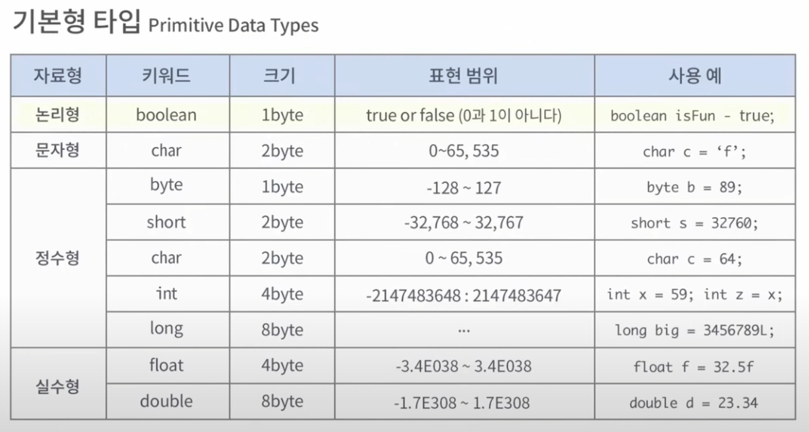

# 정수, 2진수, 보수

비트(bit, binary digit)는 하나의 비트  
바이트(byte)는 컴퓨터의 기억장치의 크기를 나타내는 단위이며, 바이트의 실질적 의미는 ASCII 문자 하나를 나타낼 수 있다는 것  
워드(word)는 CPU가 한 번에 처리할 수 있는 데이터의 크기

int 형은 - 31bit 사용  
첫 비트는 부호 비트로 사용 - 총 (32비트)

double 형은 - 63bit 사용  - 총 (64비트)
 
