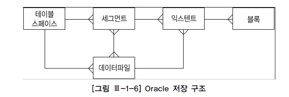

# 1. 데이터베이스 아키텍처

```
오라클에서는 디스크에 저장된 데이터 집합(Datafile, Redo Log File, Control File 등)을 Database라고 부른다.
그리고 SGA 공유 메모리 영역과 이를 액세스하는 프로세스 집합을 합쳐서 Instance라고 부른다.
```
<br>

## 백그라운드 프로세스

**System Monitor (SMON)** : 장애가 발생한 시스템을 재기동할 때 인스턴스 복구를 수행하고, 임시 세그먼트와 익스텐트를 모니터링 한다.  

**Process Monitor** : 이상이 생긴 프로세스가 사용하던 리소스를 복구한다.  

**Database Writers (DBWn)** : 버퍼캐시에 있는 Dirty 버퍼를 데이터파일에 기록한다.  

**Log Writer (LGWR)** : 로그 버퍼 엔트리를 Redo 로그 파일에 기록한다.  

**Archiver (ARCn)**: 꽉 찬 Redo 로그가 덮어 쓰여지기 전에 Archive 로그 디렉토리로 백업한다.  

**Checkpoint(CKPT)** : Checkpoint 프로세스는 이전에 Checkpoint가 일어났던 마지막 시점 이후의 데이터베이스 변경 사항을 데이터파일에 기록하도록 트리거링하고, 기록이 완료되면 현재 어디까지 기록했는지 컨트롤파일과 데이터 파일 헤더에 저장한다.  

**Recoverer(RECO)** : 분산 트랜잭션 과정에 발생한 문제를 해결한다.

<br>

## 데이터 저장 구조

`블록(=페이지)` : 대부분 DBMS는 블록 단위로 I/O 한다. 이는 하나의 레코드에서 하나의 컬럼만 읽더라도 그것이 속한 블록을 통째로 읽게 됨을 뜻한다.  

`익스텐트` : 공간을 확장하는 단위다. 테이블이나 인덱스에 데이터를 입력하다가 공간이 부족해지면 해당 오브젝트가 속한 테이블스페이스(물리적으로 데이터파일)로부터 추가적인 공간을 할당받는데, 이때 정해진 익스텐트 크기의 연속된 블록을 할당받는다.  

`세그먼트` : 데이터 저장공간을 사용하는 오브젝트(테이블, 인덱스, 파티션, 클러스터, LOB 등)를 저장공간을 사용하지 않는 오브젝트(뷰, 시너님, 시퀀스, 함수, 프로시저, 트리거 등)와 구분해서 세그먼트라고 부른다. 저장공간을 사용한다는 것은 테이블스페이스로부터 한 개 이상의 익스텐트를 할당받음을 뜻한다. 세그먼트는 익스텐트의 집합이라고 말할 수 있는데, 익스텐트 내 블록이 논리적으로 서로 인접한 반면, 익스텐트끼리 서로 인접하지 않는다.  

`테이블스페이스` : 세그먼트를 담는 컨테이너로서, 여러 데이터파일로 구성된다. 각 세그먼트는 정확히 한 테이블스페이스만 속하지만, 한 테이블스페이스에는 여러 세그먼트가 존재할 수 있다. 한 세그먼트는 여러 데이터파일에 걸쳐 저장된다. 한 테이블스페이스가 여러 데이터파일로 구성되기 때문이다.

<br>
<br>



- 한 테이블스페이스에는 여러 세그먼트가 존재하므로 1:M 관계이다.
- 익스텐트는 블록의 집합이므로 익스텐트와 블록은 1:M 관계이다.
- 세그먼트는 익스텐트의 집합이므로 세그먼트와 익스텐트는 1:M 관계이다.

<br>

## Undo를 사용하는 목적

1) Transaction Rollback
2) Transaction Recovery (-> Instance Recovery 시 rollback 단계)
3) Read Consistency

## Redo 로그는 아래 3가지 목적을 위해 사용된다.

1) Database Recovery (=Media Recovery)
2) Cache Recovery(-> Instance Recovery 시 forward 단계)
3) Fast Commit

첫째, Redo 로그는 물리적으로 디스크에 결함이 생기는 등 Media Fail 발생 시 데이터베이스를 복구하기 위해 사용되며, 이때는 Archived Redo 로그를 이용하게 된다. `Media Recovery`라고도 한다.

둘째, Redo 로그는 Cache Recovery를 위해 사용되며 다른 말로 'Instance Recovery'라고도 한다.  
모든 데이터베이스 시스템이 I/O 성능을 위해 버퍼캐시를 사용하지만, 버퍼캐시는 휘발성이다.  
캐시에만 적용한 변경사항을 아직 데이터파일에 기록하지 않은 상태에서 정전 등이 발생해 인스턴스가 비정상적으로 종료되면, 그때까지의 작업 내용을 모두 잃게 된다.  
이러한 트랜잭션 데이터 유실에 대비하기 위해 Redo 로그를 남긴다.

셋째, Redo 로그는 Fast Commit을 위해 사용된다. 변경된 메모리 버퍼 블록을 데이터 파일에 기록하는 작업은 Random 액세스 방식으로 이루어지기 때문에 느리다.  
반면 로그는 Append 방식으로 기록하므로 훨씬빠르다.  
따르서 트랜잭션에 의한 변경사항을 건건이 데이터파일에 기록하기보다 우선 Append방식으로 빠르게 로그 파일에 기록하고, 버퍼캐시 블록과 데이터 파일 블록 간 동기화는 적절한 수단(DBWR, Checkpoint)을 이용해 나중에 일관(Batch) 수행한다.  

사용자가 요구한 갱신사항을 휘발성인 버퍼캐시에만 기록한 채 아직 디스크에 영구 기록하지 않았더라도 Redo 로그를 믿고 빠르게 커밋을 완료한다는 의미로 'Fast Commit'이라는 용어를 사용한다.  
커밋 정보가 로그파일에 기록돼 있기만 하면, 인스턴스 Crash가 발생하더라도 Redo 로그를 이용해 언제든 복구 가능하므로 사용자 프로세스는 안심하고 커밋을 완료할 수 있다.