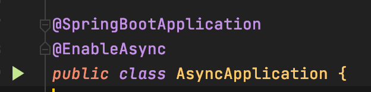
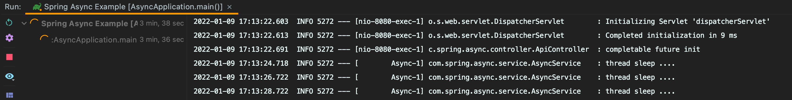
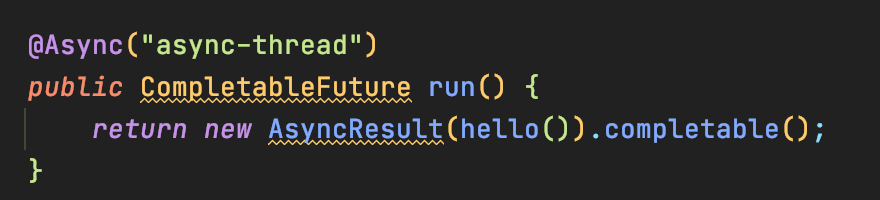

# spring 비동기

---

<br>



spring boot에서 비동기를 사용하기 위해서는 ```@EnableAsync``` 어노테이션을 추가해 줘야 합니다.


api 테스트를 위해 postman을 많이 사용했지만 이번에는 Talend Api 를 사용하여 테스트를 해보겠습니다.


<br><br>




service 단에서 메소드가 비동기를 하기 위해서는 ```@Async```를 추가해주셔야 합니다.

<br><br>



