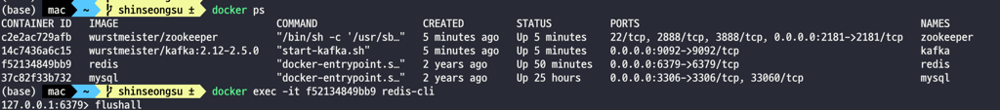
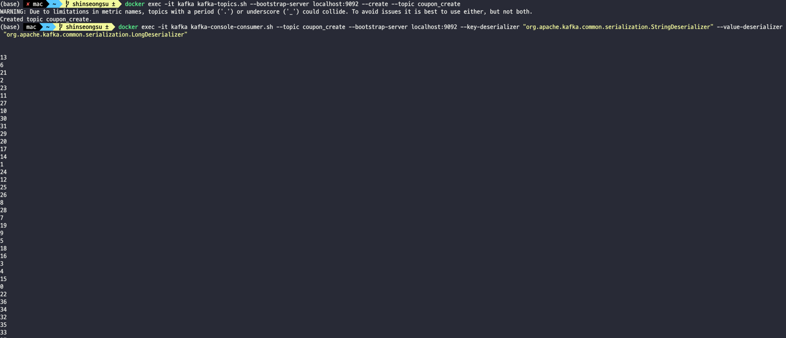

# redis



```
docker exec -it f52134849bb9 redis-cli
```

docker는 이런형식으로 들어가며, flushall 명령어로 숫자카운팅을 초기화 할 수 있다.


# kafka



- topic 생성

```
docker exec -it kafka kafka-topics.sh --bootstrap-server localhost:9092 --create --topic coupon_create
```

- 컨슈머 실행
```
docker exec -it kafka kafka-console-consumer.sh --topic coupon_create --bootstrap-server localhost:9092 --key-deserializer "org.apache.kafka.common.serialization.StringDeserializer" --value-deserializer "org.apache.kafka.common.serialization.LongDeserializer"
```