# 프로세스와 스레드 기본

## 프로세스


- 프로세스는 운영체제에 연속적으로 실행되고 있는 프로그램을 뜻합니다. 우리(유저)가 프로그램을 실행했다면 프로세스는 메모리 위에 올라가 있게 되며 운영체제게 의해 CPU, 메모리 자원을 할당받게 됩니다.

- 프로세스 독립된 메모리 영역으로 Code, Data, Stack, Heap을 할당받습니다.
  - `Code` 는 개발자가 작성한 코드라고 보시면 됩니다.
  - `Data`는 전역변수, 정적변수, 배열, 구조체 등 프로그램이 실행되면서 생기는 정적인 데이터들이 저장됩니다.
  - `Stack`은 함수 호출과 관련된 정보(실행정보, 지역변수 파라미터 등)이 저장됩니다. 일반적으로 컴파일 타임에 Stack의 크기가 결정됩니다.

> TIP
> Stack Overflow는 프로세스에 할당된 Stack 메모리가 초과되었을 때 생기는 문제입니다.
> 함수에서 너무 큰 지역변수를 선언하거나 재귀적으로 무한정으로 함수를 호출하게 될 떄 발생합니다.

- Heap은 런타임에 동적으로 메모리를 처리해야 하는 상황에서 사용되는 공간입니다.
  - Array을 사용하거나 외부 파일을 읽을 때 등등 예로 들 수 있습니다.
  - 사용자에 의해 메모리 공간이 동적으로 할당되고 해제될 수 있습니다.

## 스레드


- 스레드는 특정한 시점에 프로그램의 작업을 수행하는 역활을 합니다. 일반적으로 프로세스 안에서 실제 코드를 실행하는 단위라고 보시면 됩니다.

  - 스레드는 CPU 이용의 기본 단위입니다. 한 개의 스레드 작업은 1개의 CPU코어에 할당되게 됩니다.
  - 스레드가 실행되기 위해선 자원(함수 실행 정보, 지역 변수 등)을 저장할 메모리가 필요하며, 이는 프로세스가 할당받은 메모리를 사용합니다.

- 스레드는 프로세스 내에 존재하기에 프로세스의 자원을 공유하게 됩니다. 각자의 스레드는 Stack을 별도로 가지고 있게 되며 나머지 자원 (Code, Data, Heap)을 공유합니다.

  - 만약 여러 스레드가 실행된다면 프로세스의 자원을 공유하기에 빠르게 자원을 가져다 쓸 수 있습니다. 반면 프로세스가 다른 프로세스의 자원을 사용하기 위해서는 IPC(Inter-Process Communication)이라는 방식을 사용해야 합니다.

- 우리가 개발한 프로그램을 실행하면 일반적으로 1개의 프로세스와 1개의 메인 스레드를 가지게 됩니다. 그러나 프로그램이 해야 할 데스크톱이 많아지면 자연스럽게 여러 개의 스레드를 동시에 실행 할 수 있으며, 혹은 여러개의 프로세스를 동시에 운영할 수도 있습니다.

> TIP
> 프로세스와 스레드의 차이와 장단점을 비교하는 글이 많습니다. 이는 멀티 프로세스, 멀티 스레드를 선택해야 하는 기준에서 나온 장단점일 뿐, 실제로 프로세스와 스레들르 분리해서 비교하는 건 옳지 않습니다.

## 더 공부하면 좋을 것

- 운영체제의 스케줄링 기법

  - 하나의 머신에서 수많은 프로세스들을 효율적으로 관리하기 위해 다양한 스케줄링 기법들이 존재합니다.

- 스레드의 구분 (유저 스레드와 커널 스레드)

  - 실제로 스레드는 유저 스레드와 커널 스레드로 나뉩니다. 이떄 유저 스레드는 운영체제와 자원을 요구하기 위해 커널 스레드와 매핑이 되어 있습니다.

- 다중 스레드 모델
  - 다중 스레드의 경우 유저 스레드와 커널 스레드가 연결되어 있는 방식이 다양합니다.

# 병렬성과 동시성

## 동시성

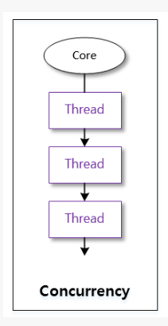

## 배경

컴퓨터의의 구성요소 중 하나인 CPU(Central Processing Unit)는 말 그대로 컴퓨터 중심부에서 컴퓨터 명령을 처리하는 역활을 합니다. 우리가 컴퓨터를 사용하여 내리는 명령들, 예를 들어 "크롬 브라우저를 실행해줘"을 바로 이 CPU가 처리하게 됩니다.

컴퓨터가 발전하던 초기에는 컴퓨터 하나당 CPU가 하나였습니다. CPU가 하나이나 한 번에 처리할 수 있는 명령도 하나였습니다. 이런 상황에서 만약 단순한 CPU 계산이 아닌 외부 서버와 통신을 하게 되는 I/O 작업들이 많이 있다면 어떻게 될까요?

예를 들어 어떤 작업이 1분이 걸린다고 하면, 그 중 10초만 CPU를 사용하고 나머지 50초는 API서버의 응답을 기다는 I/O Blocking한 상황입니다. 이 50초 동안 CPU는 아무것도 하지 않고 기다리게 됩니다. (이를 CPU가 블락 상태에 있다고 합니다.)

만약 이 50초 동안 가만히 있는 CPU를 그 다음에 수행되어야 할 작업을 미리 만들어서 넣어준다면, 전체적으로 작업 속도가 더 빨라질 것입니다. 즉 CPU가 가만히 있지 않도곩 최대한 활용하도록 하는 것이죠.

## 개념

이러한 아이디어는 운영체제에서 구현되어, 하나의 CPU를 최대한 활용하여 여러 작업들을 빠르게 수행합니다. 여전히 CPU는 한번에 하나의 명령어만 처리하지만, CPU가 맡는 프로세스(스레드)가 Block 상태가 되면 빠르게 다음에 처리해야할 프로세스가 CPU를 점유하게 됩니다. (CPU 입장에서는 여러 프로세스를 번갈아 가며 일을 하기 위해선 프로세스의 정보들을 메모리에 저장하고 불러와야 합니다. 이떄 CPU가 작업해야할 프로세스를 바꾸는 일을 "컨텍스트 스위치"이라고 합니다.)

CPU가 쉴 틈 없이 한 번에 주어진 데스크톱을 빠르게 처리되다 보니 컴퓨터 사용자는 사실상 모든 프로세스의 명령이 "동시에" 처리된다고 느끼게 됩니다. 이렇게 진행되는 현상을 우리는 `동시성(Concurrency)` 이라고 부릅니다.

> TIP  
> 동시성이라는 개념은 물리적으로 CPU 1개의 코어에서만 동작하는 개념은 아닙니다.  
> 제한된 자원에서 여러 작업을 한번에 실행시키려는 논리적인 개념이라고 보시면 됩니다.

## CPU Bound vs I/O Bound

컴퓨터가 수행하는 하나의 작업은 CPU와 I/O 작업로 이루어집니다.  
이 때 컴퓨터 작업을 크게 2가지로 나눠볼 수 있습니다. 하나의 CPU Bounded Task 이고 다른 하나의 I/O Bound Task 이다.

CPU Bounded Task 작업을 실행하는 데 I/O보다는 CPU를 더 많이 쓰는 작업을 말합니다. 예를 들면 머신 러닝과 같이 연산이 복잡한 로직이 여기에 해당합니다. I/O 작업이 아예없는 것은 아니지만, 대체로 CPU 사용량이 더 압도적입니다.

I/O Bounded Task는 작업을 실행하는데, CPU보다는 I/O 가 더 많은 작업을 말합니다.
예를 들면 크롤링 로직, DB와 연결하여 데이터를 주고받는 로직 등이 여기에 해당합니다. 일반적으로 웹, WAS 서버는 I/O Bounded한 경우가 많습니다.

## 병렬성

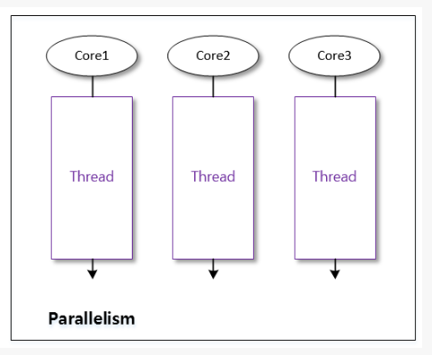

컴퓨터 하드웨어는 점점 발전하여, 이제 컴퓨터 하나당 2개 이상의 CPU를 가질 수 있게 되었습니다. CPU가 2개 이므로 이제 우리는 동시에 2개의 명령어를 실행할 수 있습니다. 이렇게 여러 개의 작업을 동시에 진행되는 현상을 `병렬성(Parallelism)` 이라고 부릅니다.

위에서 "동시성"은 실제로는 하나의 명령을 빠르게 수행하지만 처리속도가 매우 빨라 여러 작업이 동시에 진행되는 것처럼 "느껴지게" 해주었다면, "실제로" 여러 개의 명령어를 동시에 실행하는 것입니다. 물론 운영체제가 여러 CPU를 골고루 쓰도록 매니징해줍니다.

또한 병렬성은 동싱성을 품을 수도 있습니다. 여러 개의 CPU를 사용하면 각각의 CPU에서 여러 태스크(스레드나 프로세스)를 실행시키려고 한다면 동시성을 구현한 것이죠.

## 정리

- 동시성(Concurrency)은 하나의 CPU로 여러 작업을 빠르게 처리하는 것입니다.

  - 여러 작업이 한번에 실행되는 것처럼 보이지만, 실제로 하나의 CPU에서 처리하고 있는 것입니다.
  - CPU 1코어에 해당하는 물리적인 개념이 아닌, 제한된 자원에서 여러 작업을 한번에 실행시키려는 논리적인 개념입니다.

- 병렬성(Parallelism)은 여러 개의 CPU로 여러 작업을 빠르게 처리하는 것입니다.
  - 여러 작업이 실제로 여러 개의 CPU를 통해 한번에 처리 됩니다.

# 멀티 스레드와 멀티 프로세스

## 멀티 스레딩

보통 우리가 적성하는 코드를 실행하면 하나의 프로세스로 동작합니다. 또, 하나의 프로세스는 보통 하나의 스레드만 사용하여 동작합니다. 예를 들면 파이썬 코드로 이를 확인해볼 수 있습니다.

```python
import os
import threading

def run() -> None:
  print(f"process_id: {os.getpid()}")
  print(f"thread_id: {threading.get_ident()}")

if __name__ == "__main__":
  run()
```

위 코드를 실행하면 다음과 같은 결과가 나옵니다.

```
process_id: 25939
thread_id: 4539137536
```

이렇게 하나의 프로세스에서 하나의 스레드만 사용하는 것을 "싱글 스레딩"이라고 합니다. 우리가 작성하는 대부분의 코드들은 이렇게 싱글 스레딩입니다.

그런데 하나의 프로세스에서 여러 개의 스레드를 사용할 수도 있습니다. 예를 들면 파이썬에서 다음처럼 가능합니다.

```python
import os
import thrading
from concurrent.fufures import ThreadPoolExecutor

def run() -> None:
  print(f"process_id: {os.getpid()}")
  time.sleep(5)    # 5초 동안 대기입니다.
  print(f"thread_id: {threading.get_ident()}")

# run 함수를 실행하는 2개의 스레드를 띄웁니다.
if __name__ == "__main__":
  with ThreadPoolExecutor() as executor:
    n_threads = 2
    for _ in range(n_threads):
      executor.submit(run)
```

위 코드를 실행한 결과는 다음과 같습니다.

```python
process_id: 27188
process_id: 27188    # 같은 프로세스에서 생성했으므로, 프로세스 ID는 같습니다.

# 5초 뒤

thread_id: 123145819027461
thread_id: 498205328902384  # 서로 다른 스레드이므로 스레드 ID는 다릅니다.

```

이렇게 여러 개의 스레드를 사용하는 것을 "멀티 스레딩"이라고 합니다.

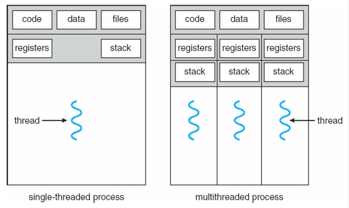

멀티 스레딩은 우리가 위에서 배운 "동시성"과 "병렬성"을 구현하는 방법 중 하나입니다.  
컴퓨터가 하나의 CPU 코어만 가진 경우 "동시성" 되고, 여러 개의 코어를 가진 경우 "동시성"과 "병렬성"이 둘 다 구현하는 샘이 됩니다. (여러 개의 CPU코어를 사용하면 동시에, 각 코어에서 여러 개의 스레드를 컨텍스트 스위칭 하며 사용하기도 하기 떄문이죠)

그렇다면 멀티 스레딩은 보통 언제 사용하면 좋을 까요? 멀티 스레딩을 사용하는 대표적인 경우는 독립적인 I/O Bounded 작업이 많은 경우 입니다.

예를 들면 여러 사이트를 크롤링해야 하는 경우, 각 크롤링 작업은 대부분 I/O (해당 서버에 요청하고 응답받기 떄문) 작업이기 떄문에, 멀티 스레딩을 사용하기 좋습니다. 파이썬 코드로 대략적인 코드를 구현하면 다음과 같습니다.

```python
import requests
import concurrent.futures import ThreadPoolExecutor

def parse(html_string: str) -> None:
  # html 문자를 파싱하는 로직이 들어갑니다.
  pass

def crawl(url: str) -> None:
  # 대부분 I/O Bounded 작업입니다.
  res = requests.get(url)
  parse(res.text)

urls = [
  "https://tansfil.tistory.com",
  "https://daliyheumsi.tistory.com",
  "https://zzsza.github.io/",
  "https://www.humphreyahn.dev/"
]

if __name__ == "__main__":
  # 최대 4개의 스레드를 띄워 각 스레드에서 위 주소들을 크롤링합니다.
  # 즉 크롤링(I/O Bounded) 작업이 동시적(concurrency)으로 일어납니다.
  with ThreadPoolExecutor(max_workers=4) as executor:
    for url in range(urls):
      executor.submit(crawl, url)

```

> TIP  
> 파이썬 멀티 스레드는 사실 싱글 스레드처럼 동작합니다.  
> 위에서 멀티 스레딩 코드를 구현했지만, 실제로 파이썬 내부적으로 GIL(Global Interpreter Lock) 이라는 정책에 따라 싱글 스레드 처럼 동작합니다.

# 멀티 프로세싱

지금까지 하나의 프로세스만 사용해왔습니다. 이제 프로그램을 실행에 2개 이상의 프로세스를 사용해봅니다. 이를 멀티 프로세싱이라고 합니다.

예를 들면 파이썬 코드로 다음과 같이 구현할 수 있습니다.

```python
import os
import threading
import time
from concurrent.futures import ProcessPoolExecutor

def run():
  print(f"process_id {os.getpid()}")
  time.sleep(5)
  print(f"thread_id: {thread.get_ident()}")

if __name__ == "__main__":
  with ProcessPoolExecutor() as executor:
    n_processes = 2
      for _ in range(n_processes):
        executor.submit(run)

```

위 코드를 실행하면 다음과 같은 결과가 나옵니다.

```python
process_id: 24953
process_id: 49320  # 서로 프로세스이므로, 프로세스 ID는 다릅니다.

# (5초 뒤 )

thread_id:235720702422
thread_id:102984190241 # 서로 다른 프로세스 내에서 실행되고 있으므로 당연히 스레드 ID도 다릅니다.

```

멀티 프로세싱은 역시 "동시성"과 "병합성"을 구현하는 방법 중 하나입니다. 컴퓨터가 하나의 CPU 코어만 가질 경우 "동시성"이 되고, 여러 개의 코어를 가진 경우 "동시성"과 "병렬성"이 둘 다 구현하는 셈이 됩니다.

그렇다면 언제 멀티 프로세싱을 사용하면 좋을까요? 멀티 프로세싱을 사용하는 대표적인 경우 독립적인 CPU Bounded 작업이 많은 경우입니다.

예를 들면 다음처럼 머신 러닝 코드에서 전처리하는 부분을 멀티 프로세싱을 풀어낼 수 있습니다.

```python
import multiprocessing
from concurrent.futures import ProcessPoolExecutor

import numpy as np

def preprocess(data: np, array) -> np.array:
  # 대부분 CPU Bounded 작업입니다.
  ...

data = np.array([1, 2, 3, 4, 5, 6, 7, 8, 9, 10])
num_cores = multiprocessing.cpu_count()  # 12

if __name__ == "__main__":
  # 데이터를 CPU 코어 수만큼 지웁니다.
  splited_data = np.array_split(data, num_cores)

  # 최대 CPU /코어 개수 만큼의 프로세스를 띄워 각 프로세스에서 데이터를 전처리하는 작업을 합니다.
  # 즉 전처리(CPU Bounded) 작업이 병렬적(parallelism)으로 일어납니다.
  with ProcessPoolExecutor(max_workers=num_cores) as executor:
    for data_chunk in splited_data:
      future = executor.submit(preprocess, data_chunk)
      ...
```

## 멀티 스레드가 멀티 프로세스의 차이

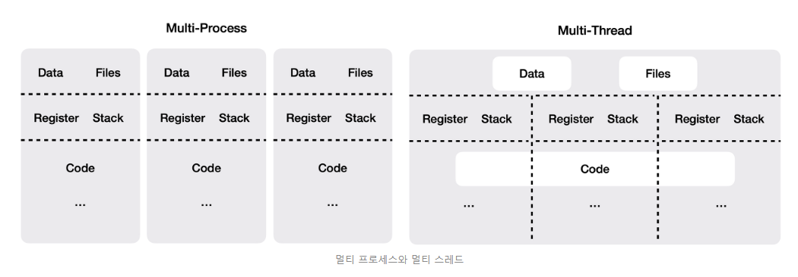

- 멀티 스레드과 멀티 프로세스의 가장 큰 차이는 "메모리를 공유하는가?" 입니다. 멀티 스레드는 여러 개의 스레드가 하나의 프로세스 안에서 같은 메모리를 사용합니다. 반면 ㅁ멀티 프로세스는 각 프로세스가 별도의 메모리 공간을 갖습니다.

- 멀티 스레드는 멀티 프로세스보다 적은 메모리 공간을 사용하며, 스레드간 컨텍스트 스위칭도 빠릅니다. 하지만 같은 메모리에 있는 자원들을 공유하므로, 각 스레드에서 자원 관리에 주의해야 합니다.(동기화 문제) 또한 하나의 스레드가 장애 시 전체 프로세스에 영향을 줍니다.

- 멀티 프로세스는 멀티 스레드보다 더 많은 메모리 공간을 차지하고, 프로세스간 컨텍스트 스위칭도 스레드에 비하면 느린 편입니다. 하지만 각각 독립적인 메모리 공간을 가지기에 자우너 관리를 더 쉽게 할 수 있습니다. 따라서 스레드에 비하면 시스템이 전체적으로 안정적입니다.

- 보통 메모리를 공유해야 하며 간단하게 작업을 구현하고 싶은 경우 멀티 스레딩을 사용하고, 독립적으로 메모리를 가지고 안정적으로 관리하고 싶은 경우 멀티 프로세싱을 사용하는 경우가 많습니다.

## 정리

- 멀티 스레딩은 하나의 프로세스에서 여러 개의 스레드를 사용하는 것입니다.

  - 스레드간 하나의 프레스의 메모리 공간을 공유합니다.
  - 멀티 프로세싱보다 메모리 공간을 적게 쓰고, 컨텍스트 스위칭도 빠릅니다.
  - 하지만 동시성 문제와 안정성에 대한 단점이 있습니다.

- 멀티 프로세싱은 하나의 프로세스에서 여러 프로세스를 사용하는 것입니다.

  - 각 프로세스는 독립된 메모리 공간을 사용합니다.
  - 동시성과 안정성에 대한 장점을 가지지만, 멀티 스레딩보다 메모리 공간을 많이 쓰고, 컨텍스트 스위칭도 느립니다.

- 멀티 스레딩과 멀티 프로세싱은 동시성과 병렬성의 구현 방법입니다.
- 병렬성을 가지면서 동시성을 가질 수도 있습니다.
  - 멀티 프로세싱을 하도록 구현함과 동시에, 각 프로세스에서 멀티 스레딩을 하도록 구현하면 병렬성과 동시성 모두 가져가는 셈입니다.

# 동기와 비동기, 블락과 논블락

## 동기와 비동기

동기(Synchronous)와 비동기(Asyncronus)는 "두 작업의 작동 방식"에 대한 내용입니다.

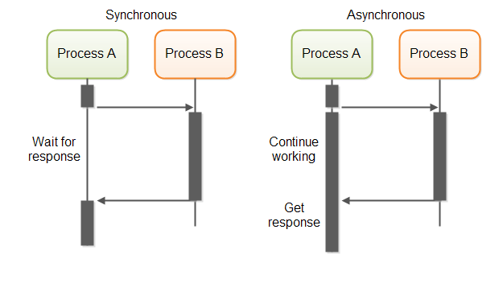

### 동기(Synchronous)

동기 방식은 작업 A가 작업 B에 작업 요청을 하고 작업 A가 작업 B가 작업을 끝날 때까지 관심을 가지고 기다리는 방식입니다.  
요청을 했을 때 시간이 많이 걸리더라도 요청한 처리에서 결과가 주어셔야 합니다.

예를 들어 우리가 웹 게시판 서버를 운영한다고 합시다. 우리는 어떤 작업에서 서버에 게시글을 생성하라는 요청을 보냈고, 우리는 서버가 게시글을 생서하기까지 기다립니다. 그리고 마침내 서버로부터 게시글 생성 처리가 완료되었다는 메시지를 받았습니다. 우리는 이제 이후에 필요한 작업을 마저 합니다. 이런 작업 방식을 동기적이라고 표현합니다.

우리가 만드는 대부분의 코드는 동기 방식의 코드라고 볼 수 있습니다. 동기 방식은 직관적이고 이해가 쉽습니다. 또한 설계가 비교적 단순합니다.

### 비동기(Asyncronus)

비동기 방식은 작업 A가 작업 B에게 작업 요청을 하고 작업 A가 작업 B가 작업을 끝낼 때까지 관심을 버리고 기다리지 않습니다. 즉, 요청과 결과가 동시에 일어나지 않는 것이죠.

마찬가지로 웹 게시판 서버를 운영한다고 합시다. 서버에 게시글 생성 요청을 보냈는데, 응답으로 요청을 잘 받았고, 처리 중이라는 메시지를 받았습니다. 이제 우리는 필요한 작업을 마처한 뒤, 게시글이 잘 생성되었는지 확인하기 위해 서버에 한번 더 게시글 생성이 완료되었는지 확인하는 요청을 보내야 합니다. 이런 작업 방식을 비동기적이라고 표현합니다.

비동기 방식은 동기보다 비직관적이고 이해하기도 어렵습니다. 또한, 설계도 다소 복잡합니다. 하지만 요청 결과를 받을때까지 기다리지 않고 다른 작업을 수행할 수 있어 효율적입니다.

> WARNING  
> 동기, 비동기는 프로그래밍 언어의 특성이 아닙니다.  
> 예를 들어, 파이썬은 기본적으로 대부분 동기 기반의 코드지만, 내장 지원 라이브러리를 통해 비동기 코드를 작성할 수 있습니다. 반면 자바스크립트는 대표적인 비동기 언어로 소개되곤 하지만, 실제 동기 코드로도 많이 작성합니다.

## 블락과 논블락

블락(Block)과 논블락(NonBlock)은 "작업의 상태"에 대한 내용입니다.

### 블락

일반적으로 함수 A가 함수 B를 호출하면, 프로세스의 제어권은 함수 B로 넘어가게 됩니다. 함수 B가 프로세스의 제어권을 가지고 있는 동안 함수 A는 아무것도 하지 않게 되는데 이 상태를 블락 상태에 있다고 말합니다. 또 이런 함수 B를 블락킹 함수라고 말할 수 있습니다. 함수 B가 모두 실행되고, 프로세스의 제어권이 다시 함수 A로 오게 되면 함수 함수 A의 "블락"상태는 풀리게 되죠

### 논블락

이번에도 마찬가지로 두 함수 A,B가 있다고 합니다. 함수 A에서 함수 B를 스레드로 함수를 호출했습니다. 스레드를 생성하는 함수는 함수 B를 별도의 스레드로 생성하고, 특정 객체를 바로 리턴합니다. 함수 A가 있는 스레드는 함수 호출 이후의 일을 계속해서 하게됩니다. 즉 이과정에서 A는 "블락" 상태를 가지지 않습니다. 이렇게 "블락" 상태를 가지지 않는 상태를 논블락 상태라고 합니다. 또 이런 함수 B를 논블락킹 함수라고 부를 수 있습니다.

블락 / 논블락 접하는 가장 대표적인 사례가 I/O 관련 코드를 작성할 때 입니다.

## 동기/비동기 vs 블락/논블락 차이

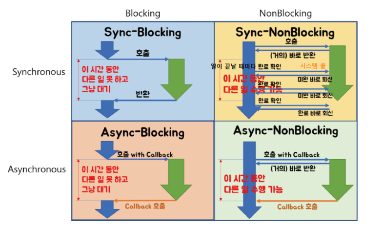

동기는 블락과 비동기는 논블락과 비슷한 개념처럼 보입니다.

동기/비동기는 한 작업에서 다른 작업의 작업 완료 여부에 관심이 있느냐에 있습니다.  
즉 관심이 있다면 동기 작업이고, 관심이 없다면 비동기 작업입니다.

한편 블락/논블락은 함 함수에서 호출한 다른 함수가 바로 리턴을 하여, 현재 진행중인 함수 프로세스 제어권을 가져가느냐 아니냐에 있습니다. 호출한 함수가 바로 리턴하지 않아, 프로세스 제어권을 뺏기게 되면 블락상태에 있게 되는 것이다. 반면 바로 리턴하게 된다면 논블락 상태에 있게 되는 것입니다.

> TIP  
> 블락, 논블락 달리 동기, 비동기는 추상적인 개념입니다.  
> 어떤 맥락에서는 블락, 논블락을 동기, 비동기라고 부를 수 있습니다. 따라서 이 개념들을 너무 분리하여 외우실 필요는 없습니다.

## 예시로 이해해보기

좀 더 구체적인 예시를 파이썬 코드와 함꼐 보면 이해해봅시다.

### 동기 / 블락

동기이면서 블락인 상황은 가장 일반적이고, 흔하게 볼 수 있는 상황입니다.

```python
# sync / block

import time

def a():
  print("start in a()")
  time.sleep(3)
  print("finnished in a()")

def b():
  print("start in b()")
  time.sleep(2)
  print("finnished in b()")

def task():
  print("start in task()")
  a()
  b()
  print("finished in task()")

task()
```

코드를 실행하면 다음과 같습니다.

```python
start in task()
start in a()
finished in a()
start in b()
finished in b()
finished in task()
```

task 은 a를 먼저 실행한 후 b를 순차적으로 실행합니다. 두 함수가 실행되는 동안 task 블락 상태에 놓이게 됩니다. 또한 task은 a, b의 작업 완료 여부에 의존적이므로 동기적이라고 볼 수 있습니다.

### 비동기 / 논블락

비동기이면서 논블락인 상황 역시 일반적이고, 흔하게 볼 수 있는 상황입니다.

```python
# async / non-block

import asyncio

async def a():
  print("start in a()")
  await asyncio.sleep(2)
  print("finnished in a()")

async def b():
  print("start in b()")
  await asyncio.sleep(2)
  print("finnished in b()")

async def task():
  print("start in task()")
  asyncio.create_task(a())
  asyncio.creaet_task(b())
  print("finished in task()")
  await asyncio.sleep(3)

async def main():
  await task()

asyncio.run(main())
```

코드를 실행하면 다음과 같습니다.

```python
start in task()
finnished in task()
start in a()
start in b()
finished in a()
finished in b()
```

task는 a와 b를 실행했지만, 두 함수가 실행되고 끝나기까지 기다리지 않습니다. task는 호출 후 논 블락 상태로 본인의 로직을 막힘없이 실행합니다. 또한 task는 a와 b의 작업 종료 여부에 관심이 없으므로 비동기 입니다.

### 동기 / 논블락

자 이제부터가 조금 헷갈립니다. 동기이면서 논블락인 작업은 어떤 결우일까요? 이런 경우를 생각해볼 수 있습니다.

- 작업 A가 작업 B를 실행시키지만, 프로세스 제어권을 놓치지 않는다. -> 논블락
- 작업 A가 어느정도 자신의 작업 이후, 작업 B의 작업 완료 여부에 관심이 있다. -> 동기

흔한 경우는 아닙니다만 이렇게 쓰이는 경우가 종종 있습니다.

```python
# sync/ non-block

import asyncio

global a_task_success
a_task_success = False

async def a():
  print("doing ... in a()")
  await asyncio.sleep(3)
  print("finished a!")
  global a_task_success
  a_task_success = True

async def task():
  print("doing task ...")
  asyncio.create_task(a())

  print(doing somthing ...")
  global a_task_success
  while a_task_sucess is False:
    print("waiting a to be finished ...")
    await asyncio.sleep(1)

asyncio.run(task())
```

코드를 실행하면 다음과 같습니다.

```python
start in task()
doing something ... in task()
start in a()
waiting a() to be finished ... in task()
waiting a() to be finished ... in task()
finished in a()
finished in task()
```

task는 a를 실행하지만 논블락 상태를 가지고 본이의 로직을 막힘없이 실행합니다. 하지만 마지막 while 문에서 a 태스크가 끝나길 기다리고 있습니다. a 태스크가 완료될 떄, a_task_sucess를 True로 바꿔주어야 비로소 task도 끝나게 됩니다. 즉 task는 a의 작업 완료 시점에 의존적이므로 동기적입니다.

### 비동기 / 블락

마찬가지로 헷갈립니다. 비동기인데 블락인 상황은 어떤 경우일까요? 이런 경우를 생각해볼 수 있습니다.

- 작업 A는 작업 B를 실행시켰지만, 작업 A는 작업 B의 작업 완료 여부에 관심이 없습니다. -> 비동기
- 작업 A가 작업 B를 실행시켰지만, 작업 A는 프로세스 제어권을 잃었습니다.

일반적으로 좋은 경우는 아닙니다만, 코드로 구현하면 다음과 같은 모양새입니다.

```python
# sync / non-block

import asyncio

async def a():
  print("start in a()")
  await asyncio.sleep(3)
  print("finished in a()")

async def task():
  print("start in task()")
  value await a()
  print("doing something ... in task()")
  print("finished in task()")

asyncio.run(task())
```

코드를 실행하면 다음과 같습니다.

```python
start in task()
start in a()
finished in a()
doing something ... in task()
finished in task()
```

비동기/블락 결과는 동기/블락과 결과와 같은 확인할 수 있습니다. 보통 비동기 처리 로직에서 데이터베이스의 결과 값을 받아와야만 하는 경우에 이런 방식으로 코드를 작성할 수 있습니다.

## 정리

- 동기와 비동기는 작업 완료에 관심이 있느냐에 관한 작동 방식입니다.

  - 작업 A가 작업 B의 작업 완료에 관심이 있다면 동기입니다.
  - 관심이 없다면 비동기 입니다.

- 블락과 논블락은 프로세스 제어권을 뺏기는 상태에 관한 내용입니다.

  - 함수 A가 함수 B를 호출하고 함수 B가 실행되는 동안 프로세스 제어권을 뺏겨 본인 로직을 실행하지 못하는 경우 블락입니다.
  - 반면 프로세스 제어권을 뺏기지 않고 바로 리턴 받아 본인의 로직을 실행하면 논블락입니다.

- 일반적으로 동기/블락과 비동기/논블락 방식이 쓰입니다.

  - 동기/블락 방식은 이해하기 쉽고 직관적이지만 일반적으로 느립니다.
  - 비동기/논블락 방식은 이해하기 어렵고 프로그램 흐름도 어려워지만 일반적으로 빠릅니다.

- 동기, 비동기, 블락, 논블락의 차이점을 외우려고 하기 보단, 맥락을 파악하는 정도면 충분합니다.

# 가상화 기술과 도커

## 가상화 기술

### 등장 배경

가상화 기술이란 하드웨어 리소스를 추상화하여 소프트웨어화 하는 기술을 말합니다.  
예를 들어 우리는 가상화 기술을 통해 "CPU 1코어, Memory는 2Gi, 운영체제는 "Ubuntu:16.04"인 소프트웨어를 만들 수 있습니다.  
실제로 우리가 잘 알고 있는 AWS나 GCP, AZURE와 같은 클라우드 서비스들은 가상화 기술이 근본을 이루고 있다고 보면 됩니다.

가상화 기술의 등장 이전에는 소프트웨어는 하드웨어에 크게 종속되었습니다. 그래서 아래와 같은 문제들이 있었습니다.

- 하나의 서비스를 제공하기 위해서는 하나의 컴퓨터 전체에 서버 프로그램을 띄워서 사용해야만 했습니다. 사용량이 적은 서비스더라도 컴퓨터의 CPU, Memory 등의 리소스를 전부 사용할 수 밖에 없었습니다.
- OS나 하드웨어의 특징에 따라 소프트웨어의 동작에 영향을 끼쳤습니다. 예를 들면 리눅스 컴퓨터에 서버를 운영하는 회사에서 개발자들이 Window 컴퓨터, Mac 컴퓨터를 사용한다면 "내 컴퓨터에서는 됐지만 왜 안돼"를 시전할 수 있게 됩니다.

그러나 가상화기술이 나오면서 이런 문제점들은 자연스럽게 해결되었습니다.

- 하드웨어 리소스도 추상화되었기에 서비스에 자원을 자유롭게 할당할 수 있습니다.
- OS에 관계없이 동일한 환경에서 소프트웨어를 구동할 수 있습니다.

실제로 클라우드(AWS, GCP 등)에서 우리가 사용하는 대부분의 서비스는 내부적으로 가상화 기술이 도입되어 있습니다.  
우리가 클라우드에서 컴퓨터 리소스를 빌릴 때 컴퓨터 한 대를 빌리느게 아닌, 특정 리소스만큼 할당된 가상화 공간을 제공받습니다.

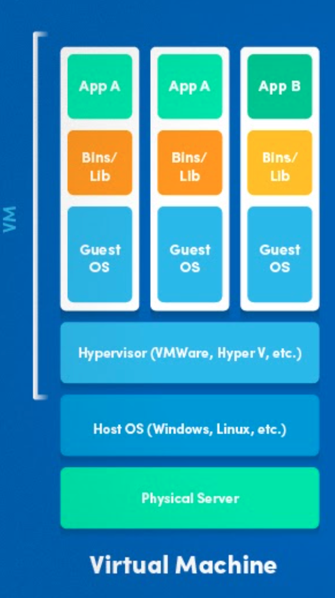

VM은 하드웨어를 가상화하는 기술 중 하나입니다. 컴퓨터에 기본적으로 설치한 OS(Host OS) 위에 Hypervisor라는 소프트웨어를 통해 여러 OS(Guest OS)를 띄우고 컴퓨터 리소스를 제어할 수 있습니다.  
그리고 이렇게 만든 각각의 환경에서 애플리케이션을 독립적으로 실행할 수 있습니다.

예를 들어, VM으로 여러분이 사용하는 Window OS 환경에서 별도의 Window, Mac OS, Linux 등이 OS를 동시에 올려두고 각 cpu, memory 사용량 등을 조정할 수 있습니다.  
이렇게 하나의 컴퓨터로도 여러 개의 독립된 하드웨어 환경을 격리시켜 실행하는 것이 가능합니다.

그러나 VM은 명확한 단점들이 존재합니다. 

1. **용량을 많이 차지합니다.**   
VM은 운영체제를 비롯한 실행 환경에 필요한 파일들을 "이미지"라는 형태로 저장하고 있습니다.  
그런데 이 이미지의 용량 자체가 꽤 큽니다.  
따라서 VM으로 여러 가상환경을 운영하면, VM으로만으로도 많은 리소스가 낭비됩니다. (보통 이러걸 무겁다고 표현합니다.)

2. **실행환경의 부가적인 설정들을 완전히 구현하기 어렵습니다.**  
예를 들어 우리가 실행 환경을 위해 리눅스 이미지를 사용하여 VM 가상환경을 구축한다고 해봅시다.  
실제로 서버를 실행하려면 리눅스 이미지 위에 여러 모듈을 설치해야 하는데 설치해야 하는 환경이 그렇게 쉽지는 않았습니다.

## 컨테이너 (Container)

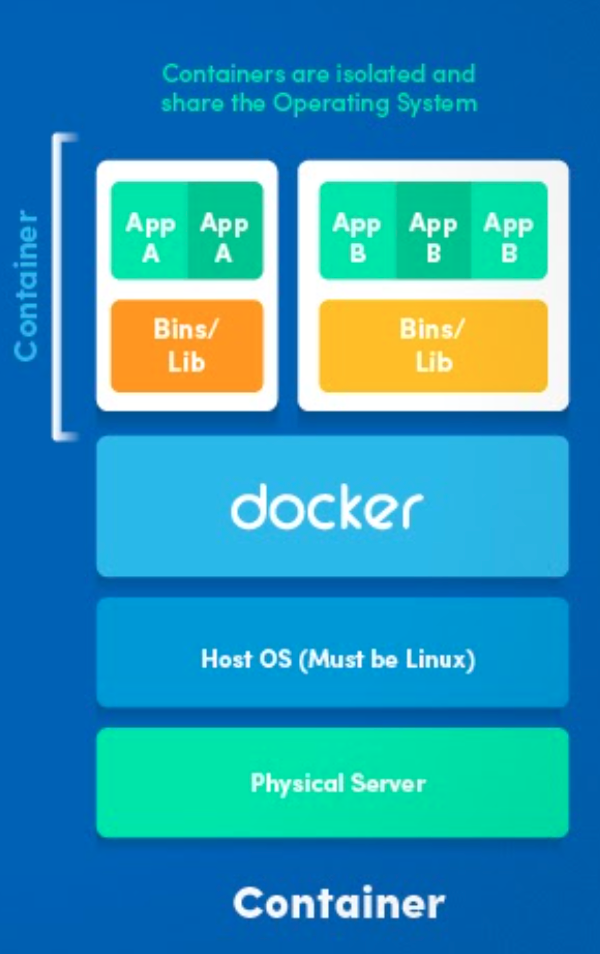

VM이 너무 무겁다는 불만이 나오는 가운데 `컨테이너`라는 기술이 본격적으로 주목을 받기 시작했습니다.  
컨테이너는 원래 리눅스 OS에 내장된 기술로 단일 컴퓨터(머신)에서 프로세스들을 독립적으로 실행할 수 있도록 돕는 기술입니다.  
현재 VM과 마찬가지로 이미지로 실행환경을 가상화하고 실행시킬 수 있는 도구라고 보시면 됩니다.

컨테이너는 머신의 OS 커널을 직접 공유하기 때문에 VM에 비해 상대적으로 빠르고 가볍습니다.  
기존 VM은 하이퍼바이저(Hypervisor)라는 소프트웨어 위에 OS를 추가로 실행해야 하기에 무거운 반면, 컨테이너 기술은 OS커널과 컨테이너를 연결해주는 컨테이너 엔진(도커와 같은)만 있으면 되기 때문이죠.

> TIP  
> 컨테이너 기술이 VM보다 모든 면에서 뛰어나다는 건 아닙니다.  
> 컨테이너는 격리된 환경처럼 보이지만 실제로는 같은 OS를 바라보는 가상으로 격리된 프로세스입니다.  
> 따라서 OS 커널에 장애가 발생하면 같이 영향을 받을 수밖에 없으며 보안적으로 취약한 문제가 있습니다.

## 도커(Docker)

컨테이너를 실행하기 위해선 컨테이너 엔진을 필요로 합니다.  
현재 가장 유명한 컨테이너 엔진은 바로 `도커(Docker)` 입니다.  
대부분의 리눅스, 맥, 윈도우 OS 유저들은 도커를 표준처럼 사용하고 있습니다.

도커에는 크게 `컨테이너`와 `이미지`라는 개념이 있습니다.  
컨테이너는 논리적으로 격리된 프로세스를 의미하며 이미지는 컨테이너를 실행하기 위한 정보(소스 코드, 라이브러리 등)를 담고 있는 것입니다.

VM에서는 "이미지"를 만드는 것이 시간이 오래 걸리고 용량도 큰 작업이었는데, Docker에서는 비교적 빠르고 용량도 가볍습니다.  
Docker에서는 이 이미지를 누구나 쉽고 빠르게 만들 수 있습니다.

### 실습

도커를 사용하는 예시를 간단하게 살펴보겠습니다.  
다음처럼 파이썬 코드가 실행될 컨테이너의 정보를 담고 있는 이미지를 만들 수 있습니다.(아래 코드는 Dockerfile 이라는 파일에 담깁니다.)

```dockerfile
# 파이썬 코드를 실행하는 이미지를 만듭니다.
# 리눅스 우붙누 이미지를 기반으로 만듭니다. (기반이 되는 이미지를 베이스 이미지라고 합니다.)
FROM ubuntu:18.04

# 리눅스 우분투 환경에 파이썬을 설치합니다.
RUN apt-get update -y
RUN apt-get install -y python-pip python-dev build-essential

# 우리가 작성한 파이썬 코드를 설치하고 실행합니다.
COPY .. /app
WORKDIR /app
RUN pip install -r requirements.txt
ENTRYPOINT ["python"]
CMD ["app.py"]
```

위에서는 베이스 이미지로 `ubuntu:18.04`를 사용했지만, 다음처럼 파이썬이 이미 설치되어 있는 이미지를 베이스 이미지를 사용할 수도 있습니다.

```dockerfile
# 파이썬 코드를 실행하는 이미지를 만듭니다.
# 파이썬 3.8 이미지를 베이스 이미지로 사용합니다.
FROM python:3.8

# 우리가 작성한 파이썬 코드를 설치하고 실행합니다.
COPY . /app
WORKDIR /app
RUN pip install -r requirements.txt
ENTRYPOINT ["python"]
CMD ["app.py"]
```

이후 다음처럼 도커 명령어로 위 `Dockerfile`파일을 가지고 이미지를 만듭니다. (이를 보통 빌드한다고 합니다.)

```
$ docker build . -t my-app
```

이렇게 만든 이미지는 다음처럼 도커 명령어로 확인할 수 있습니다.

```
$ docker images
```

이렇게 만든 이미지는 다음처럼 실행 가능합니다. 명령어를 치면 컨테이너가 도커 엔진 위에서 실행됩니다.

```
$ docker run my-app
```

Dockerhub라고 하는 미지 저장소에 이렇게 사용할 수 있는 미지가 매우 많습니다. 이렇게 공개된 이미지로 나만의 이미지를 만들 수 있고, 자신이 만든 이미지를 이미지 저장소에 공개할 수도 있습니다.


예를 들어 Dockerhub에 공개된 mysql 5.8이미지를 사용하고 싶으면 다음처럼 docker 명령어를 입력하면 됩니다.

```
$ docker pull mysql:5.8
$ docker run mysql:5.8
```

이를 통해 컴퓨터에 손쉽게 mysql을 실행시킬 수 있습니다.

## 정리

- 가상화 기술의 큰 축은 VM과 컨테이너 기술입니다.
  - VM은 이미지마다 전용 운영체제가 있기에 안정적인 프로세스 격리가 가능하지만, 이미지 용량이 크고 속도가 느린 편입니다.
  - 컨테이너 기술은 VM과 다르게 Guest OS를 가지지 않도록 기술적으로 구현되었습니다. 그래서 상대적으로 가볍고 빠릅니다.

- 컨테이너 기술을 쉽게 실행하고 관리할 수 있도록 돕는 오픈소스 플랫폼으로 도커가 있습니다.
  - `Dockerfile` 내에 실행하기 위한 모든 설정이 기록되어 있기 떄문에, Docker 문법을 아는 사람이라면 쉽게 실행환경을 이해할 수 있고 재현할 수 있습니다.  
  - `Dockerfile` 에 작성된 설정 말고는 별다른 의존성이 없습니다. 따라서 도커가 설치된 어느 컴퓨터에서든 도커 이미지를 실행시키면 동일한 실행환경에서 소프트웨어를 실행시킬 수 있습니다.


# 배포와 CI/CD

## 배포(Deployment)

한 프론트엔드 개발자가 있습니다. 열심히 코드를 작성한 뒤, 나름대로 테스트까지 마쳤습니다.  
그리고 이제 인터넷으로 사용자들 해당 웹 사이트에 접속하게 만들고 싶습니다.  
어떻게 하면 사름들에게 웹 사이트에 접속하게 할 수 있을까요?

가장 간단한 방법은 인터넷이 연결되어 있는 컴퓨터를 하나 산 뒤, 이 컴퓨터(서버)에 개발한 소스 코드를 다운받은 후, 실행시키는 것이죠.

> TIP  
> 실제로 카페24와 같이 컴퓨터를 알려주는 웹 호스팅 서비스를 이용하면 웹 소스 코드를 올려 손쉽게 외부에 공개할 수 있습니다.

이렇게 프로그램(소스 코드)을 외부 환경에 설치하고 실행하는 일련의 과정을 배포라고 합니다.  
더 예를 들면, 새로운 모바일 앱을 앱 스토어에 등록하는 것도 배포입니다.  기존에 있던 웹 서비스를 업데이트하는 작업도 배포라고 할 수 있습니다.

## 배포 방법의 변화

그렇다면 배포는 보통 어떻게 할까요? 세월이 지나면서 배포 방법도 많은 변화가 있었는데, 이에 대해 간략히 살펴봅시다. (절대적인 순서는 아닙니다.)

### 직접 소스 코드 설치 & 실행하기

초기에는 서버에 직접 코드를 설치했습니다.  
예를 들면 디스크나 CD, 지금으로 치면 USB 같은 디스크에 소스 코드를 담아, 서버가 있는 곳으로 가서 소스 코드를 직접 다운받아 실행시키는 것이죠.  
배포는 할 수 있느나, "서버가 있는 곳까지 소스 코드를 들고 매번 가야 하는 불편함"이 존재합니다.

### FTP나 원격저장소로 설치 & 실행하기

인터넷의 발달로 이제 인터넷을 통해 서버에 접속할 수 있게 되었습니다.  
이제 직접 코드를 들고 컴퓨터가 있는 곳까지 가지 않고, FTP를 통해 서버에 소스 코드를 업로드 합니다.  
또는 Github와 같은 코드 원격 저장소를 통해 작업한 코드를 업로드하고, 서버에서 다운받아 설치합니다.  
이후 서버에 접속하여 소스 코드를 실행시켜 배포합니다. 이전보다 훨씬 편해졌습니다.

하지만 서버가 여러 대인 경우, 이전 작업을 서버 개수만큼 해야하는 불편함은 여전히 존재했습니다.  
또한 서버의 운영체제나 환경설정에 따라 내가 작성한 코드가 실행되지 않는 일도 발생했습니다.  
예를 들어 윈도우 환경에서 코드를 개발하고 테스트할 땐 문제가 없었는데, 서버의 운영체제인 리눅스에서 실행하면 문제가 발생하는 것입니다.

헌 서버에 여러 개의 서비스를 실행할 때도 문제가 되었습니다. 예를 들어 서버에 A라는 서비스가 실행되고 있었다고 합니다.  
B라는 서비스를 이 서버 위에 또 배포하고 싶어 B 코드를 설치합니다.  
이때 B를 설치하는 과정에서 A라는 서비스가 사용하고 있던 운영체제의 설정이 바뀌거나, 라이브러리가 바뀌는 부작용이 발생할 수 있습니다.  
두 서비스는 독립적인 서비스인데, 같은 실행 환경을 공유하고 있기 때문에 이런 현상이 발생하게 된 것입니다.

이 때문에 "코드를 실행하는 환경"과 "배포의 독립성"이 중요한 이슈로 떠오르게 됩니다.

### VM 위에서 배포하기

VM 등장 이후 이제 배포에 VM을 적극적으로 활용합니다.  
VM을 사용하면 윈도우 환경에서 개발해도, 실제 서버에 배포하기 전에 VM으로 리눅스 환경을 구축하여 이 위에서 실행을 테스트할 수 있게 됩니다.  
그리고 서버에도 마찬가지로 VM을 사용하여 테스트했던 환경과 똑같은 운영체제 환경을 구축할 수 있습니다.  
이를 통해 "코드를 실행하는 환경"을 일관되게 가져갈 수 있었습니다.

### 컨테이너 기반(Docker)으로 배포하기

컨테이너는 VM 이후에 등장합니다.  
VM보다 가벼운 컨테이너 기술을 활용해 배포에 더 적극적으로 활요하게 됩니다.  
현재 IT 회사에서 이뤄지는 대부분의 배포는 Docker를 통해 이루어집니다.  
구체적으로 다음의 과정을 거칩니다.

- 먼저 코드 개발을 완료합니다.
- 이제 배포 할 단계입니다. 위처럼 `Dockerfile`을 작성합니다.
- `docker build` 명령어를 입력하면 위 `Dockerfile`을 읽어 이미지를 만들게 됩니다. (보통 이를 "빌드"라고 표현합니다.)
- Dockerhub와 같은 임지 저장소에 만든 이미지를 업로드합니다.
- 배포할 서버에 접속하여, 업로드한 컨테이너 이미지를 다운받은 뒤 `docker run (컨테이너 이름)` 으로 실행합니다.

Docker를 사용하면 VM보다 가벼우면서도 독립적인 실행환경을 갖출 수 있습니다.  
또한, `Dockerfile` 내에 실행하기 위한 모든 설정이 기록되어 있기 때문에, Docker 문법을 아는 사람이라면 쉽게 실행환경을 이해할 수 있고 재현할 수 있습니다.

Docker의 이런 혁신적인 장점 때문에 현재 소스 코드를 배포하는 Docker가 폭발적으로 쓰이고 있습니다.

## CI/CD

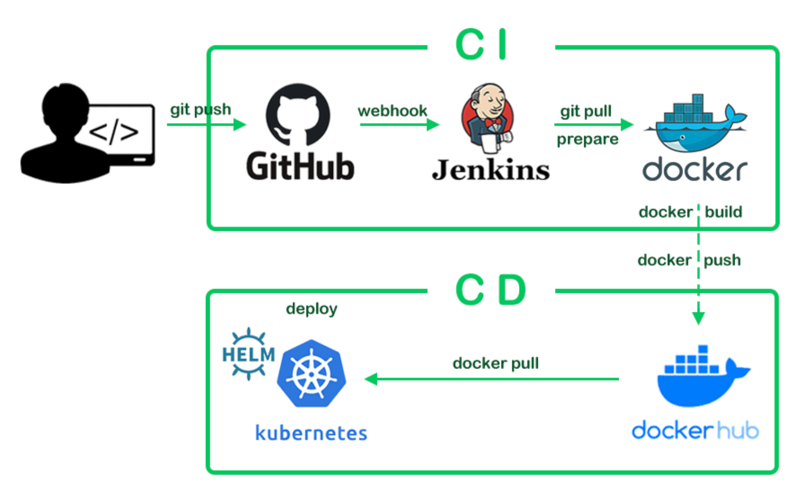

Docker로 인해 이전보다 배포하는 속도가 빨라지고 더욱 자주 하게 되었습니다. 하지만 더 자주, 더 빨리 배포하기 위해선 배포 과정을 최대한 자동화하는 게 중요합니다.

- Docker 컨테이너 이미지를 빌드하는 과정
- 빌드된 이미지를 저장소에 업로드하는 과정
- 업로드한 컨테이너 이미지를 서버에서 다운받아 실행하는 과정

만약 위 과정이 자동화되면 팀원들이 더 빠르고 쉽게 배포를 진행할 수 있게 됩니다.  
예를 들면 작업한 코드를 원격 저장소(Github)에 올리게 되면, 즉시 위 세 과정이 순차적으로 동작하도록 할 수 있습니다.  
Github에 개발한 코드만 올리면 바로 배포가 되는 것이죠.  
이를 지속적 통합/지속적 배포(Continous Intefration / Continous Deployment), 일명 `CI/CD` 라고 부릅니다.

> CI(Continous Integration)  
> CI/CD에서 CD는 주로 "배포"를 의미하는 한편 , CI는 주로 "테스트와 빌드"를 의미합니다.  
> 위 내용에서 "테스트"에 대한 내용은 포함하지 않았는데 실제 현업에서는 테스트에 대한 내용까지 포함합니다.  
> 즉, 코드를 개발하면 자동으로 "테스트"하고, 테스트를 통과한 후에는 "빌드" 함으로써 코드를 개발해 나갈 때 지속해서 문제없이 코드를 "통합"해 나가는 것입니다.


CI/CD 도구로는 Jenkins, CircleCI, Travis, Github Action, BuddyWorks와 같은 것들이 있습니다.  
CI와 CD를 하나의 도구로 사용하기도 하, 경우에 따라 분리하여 사용하기도 합니다.

이러한 CI/CD 개념과 도구 덕분에 개발자들은 더욱 빠르게 배포할 수 있었습니다.  
빠르게 배포 후 피드백을 받으니 개발 진척 속도도 더 빨라졌습니다.

> 회사에서 이런 CI/CD 업무는 보통 데브옵스 엔지니어가 담당합니다.  
> 아직 데브옵스 엔지니어 팀이 없거나, 업무가 분당되지 않은 경우 개발자들이 직접 하기도 합니다.


## 정리

- 배포는 내가 만든 작업물을 외부 환경에 공개하는 일입니다.
- 배포 방법은 직접 설치, FTP나 원격저장소, VM을 거쳐 현재는 Docker를 사용하기까지 발전 과정이 있었습니다.
- 좀 더 자주, 빠른 배포를 위해 CI/CD 개념과 도구들이 생겨났습니다.  
- CI/CD로 개발과 배포를 막힘없이 진행할 수 있습니다.

# 쿠키와 세션

우리가 자주 사용하는 HTTP 프로토콜의 특징으로 `비연결성(Connectionless)`와 `무상태성(Stateless)` 이 있습니다.  
비연경성은 한 번의 HTTP 통신으로 요청과 응답이 오긴 히우에 통신을 끊는다는 것이며, 이로 인해 통신과 관련된 상태는 남지 않습니다.(Stateless).

예를 들어, 사용자가 로그인 요청을 한 뒤 응답을 받았다고 하더라도, 다음 요청에 이렇게 로그인된 정보는 통신 어디에도 남지 않습니다.  
따라서 서버 입장에서는 네트워크 요청이 왔을 때 이 요청이 어떤 사용자의 요청인지 알 수 없습니다.

이렇게 상태 값을 가지지 않는 HTTP 통신 환경의 문제를 세션과 쿠키를 활용해서 해결할 수 있습니다.

## 쿠키

**쿠키는 웹 서버와 통신 과정에서 특정 정보를 저장하기 위한 Key - value 형태의 유효기간을 가진 데이터입니다.**  

1. 웹 서버에서는 클라이언트(웹 브라우저)에게 특정 데이터를 남기고 싶을 때 응답 HTTP 헤더에 `Set-Cookie: 데이터`를 기록합니다.
2. 브라우저는 자동으로 HTTP 헤더의 쿠키 정보를 읽고 웹 서버의 도메인에 매칭해서 저장합니다.
3. 나중에 웹 서버에 HTTP 요청을 날리게 되면 자동으로 쿠키를 헤더에 담아서 전송합니다.

> TIP
> 브라우저에는 다양한 종류의 데이터를 저장할 수 있는 공간을 제공합니다. 쿠키를 저장하는 공간 이외에도 로컬 스토리지, 세션 스토리지 등이 있습니다.

쿠키는 도메인(웹사이트) 별로 쿠키를 다양하게 들 수 있습니다.  
우리가 네이버, 쿠팡 등 다양한 도메인의 웹 서비스에서도 인증 정보나 장바구니 상태를 유지할 수 있는 건 도메인별로 쿠키가 유지되기 떄문입니다.  
크롬 브라우저에서 개발자도구 - Applciation 탭을 확인해보면 다음처럼 쿠키의 형태를 확인할 수 있습니다.  

쿠키는 보통 다음처럼 사용됩니다.  

- 서버 세션 관리
- 트래킹 (행동, 패턴 분석)
- 사용자 개인화

특히 인증/인가를 위해 자주 사용되는데, 이에 대한 내용은 다음강의에 다룹니다.

## 세션

**세션은 클라이언트와 서버 간의 네트워크 연결에 대한 정보를 담고 있는 객체입니다.**

세션은 서버 쪽에서 관리하는 객체로, 클라이언트와의 연결에 대한 정보를 담습니다. 이떄 세션을 저장하기 위해선 별도의 세션 스토리지를 구현하곤 합니다.

일반적으로 세션을 사용해서 HTTP 통신을 하는 경우 아래와 같은 흐름을 따릅니다.

1. 클라이언트가 서버와 연결을 시도하면 서버는 해당 연결에 대한 정보를 세션 저장소에서 찾습니다.
2. 세션 저장소에 정보가 존재하지 않는다면 새로운 세션을 만들고 저장합니다.
3. 클라이언트에게 생성된 세션 정보를 쿠키 혹은 다른 방식으로 넘깁니다.
4. 클라이언트는 해당 정보를 저장하고 있다가, 이후 요청에 세션 정보를 포함하여 요청을 보냅니다.

일반적으로 서버에서는 세션을 관리할 때 ID로 관리하고, 접속 시간에 제한을 두곤 합니다. 예를 들면 다음처럼 말이죠

```json
"session_id": {
  "user_id": "grab",
  "role": "Admin",
  "created_at": "2022-01-01 10:00:00",
  "expire_time": "2022-01-02 10:00:00",
}
```

세션은 일반적으로 사용자에 대한 식별이 필요할 때 사용합니다.  
로그인 뿐만 아니라 동시 접속 탐지, 접속 기록 수집 값은 다양한 곳ㅇ네 세션을 활용할 수 있습니다.

## 세션과 쿠키의 차이

세션과 쿠키의 가장 큰 차이는, 인증에 대한 정보를 어디에 저장하느냐에 있습니다.

쿠키는 이 정보를 클라이언트 쪽에 저장합니다. 즉 인증 절차에 대한 모든 정보가 클라이언트에 저장한 쿠키에 있습니다.  
세션은 이 정보를 서버 쪽에 저장합니다. 즉 모든 정보가 서버 쪽에서 관리하는 별도의 세션 저장소에 있습니다.

> TIP  
> 세션과 쿠키는 서로 대립하는 관계가 아닙니다.  
> 쿠키는 브라우저에 특정 데이터를 저장하는 방식이지만, 세션은 클라이언트/서버 구조에서 연결 정보(객체)를 저장하는 방식입니다.

## 정리

- 쿠키는 브라우저가 사용하는 임시저장소 중 하나로 Key-value 형태로 데이터를 담습니다.
- 세션은 클라이언트와 서버 간의 네트워크 연결에 대한 정보를 담고 있는 객체로, 서버에서 생성하고 관리합니다. 쿠키와 마찬가지로 보통 key-value 향태로 데이터를 담습니다. 
- 이 둘은 대립된 관계보단, 모두 활용하여 인증을 구현하게 됩니다.


# 사용자 인증 (Authentication)

페이스북을 사용하기 위해선 로그인을 해야 합니다.  
로그인한 이후에 내 글을 마음대로 올리고 수정할 수 있지만, 타인이 올린 글은 맘대로 수정할 수 없습니다.  
또한 접근이 허용되지 않는 페이지들도 존재하곤 합니다.

이때 서비스를 이용하는 사용자를 식별하는 기술로 `인증(Authentication)` 이라고 합니다.  
예를 들어, 게시판을 생각해봅시다. 회원가입을 하고 글을 쓴 뒤 서버에 저장 요청을 하려고합니다.  
이때 서버 입장에서는 이 글을 쓴 계정이 누구이며, 등록된 사용자인지 어떻게 알까요? 이를 검증하고 식별하는 일이 바로 인증입니다.

## 인증 방식

여러 인증을 구현하는 방식을 정리해봤습니다. 참고로 대표적인 인증 방식으로는 세션 방식과 토큰 방식을 많이 활용합니다.

참고: 아래 예시는 웹 브라우저 인증을 예로 들지만 웹 브라우저가 아닌 브라우저가 아닌 모바일이나 다른 프로그램에서도 이와 유사하게 구현합니다. 

## 계정 정보를 클라이언트에서 저장하기

계정 정보를 클라이언트에서 저장한 후 서버에 보내주는 방식이 있습니다. 이는 간단하게 구현할 수 있다는 장점이 있습니다.

웹 브라우저에서는 계정 정보를 쿠키 저장소에 저장하여 인증을 간단하게 구현할 수 있습니다.

쿠키를 사용하는 방법은 다음과 같습니다.

1. 먼저 사용자는 로그인 페이지에서 다음처럼 계정 정보를 요청 메시지에 담아 서버에 요청을 보냅니다.

```
user_id: grab
password: 1234
```

1. 그림 서버는 이 정보를 받아 등록된 사용자임을 확인하고, 응답 메시지에 브라우저 쿠키에 위 정보를 응답 헤더에 인코딩을 하여 인증 정보를 담습니다.

```
# 예시
set-cookie: ajdi3jiorfiosdnfn44.
# 디코딩하게 되면 user_id=12345&password=1234 값을 반환합니다.
```

3. 응답을 받은 클라이언트는 이 데이터를 브라우저 쿠키에 저장합니다.
4. 클라이언트는 서버로 요청을 보낼 때마다 이 쿠키를 함께 보내면, 서버에서는 해당 쿠키 정보를 디코딩해서 데이터베이스를 통해 인증을 진행합니다.

이 방법으로, 우리는 매번 요청에 계정 정보를 담지 않아도 됩니다.

그러나, 브라우저의 쿠키에 유저의 인증 정보가 그대로 남아있다는 점은 보안에 취약합니다.  
또한 서버에서는 요청에 포함된 쿠키를 계속해서 데이터베이스와 통신해야 하기 때문에 자원 낭비 및 성능 저하로 연결될 수 있습니다.

> **쿠키만으로도 충분한 경우**  
> 위 방법처럼 쿠키를 잘 활용하는 경우도 있습니다.  
> 대표적으로 쇼핑몰의 장바구니 기능이 있습니다.  
> 보통 로그인을 하지 않아도(비회원으로) 장바구니에 물건 담기가 가능합니다.  
> 이런 시스템은 별도의 인증을 거치지 않지만, 브라우저에 담긴 쿠키로 개별 회원들을 어느 정도 구분합니.  
> 이렇게 쿠키는 꼭 인증을 목적으로 쓰이지 않고, "임시 저장소"로서 폭넒게 사용됩니다.

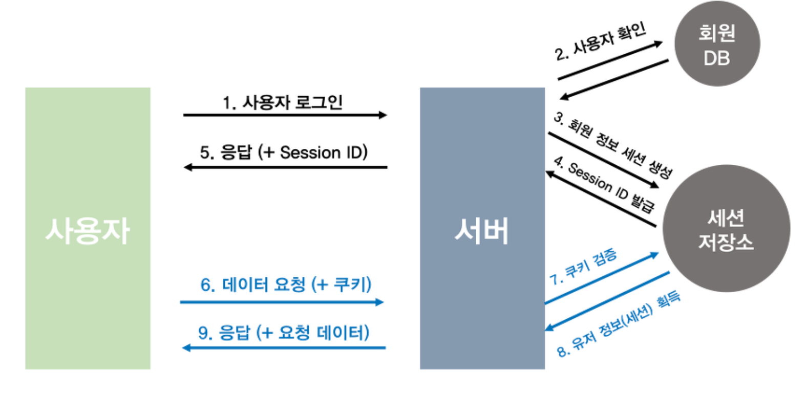

세션은 클라이언트와 서버 간의 네트워크 연결에 대한 정보를 담고 있는 객체라고 했습니다.  
보통 인증을 구현할 때 인증정보를 담을 수 있는 세션을 많이 활용합니다.

1. 사용자는 쿠키를 사용하는 떄와 똑같이 로그인 페이지에서 계정 정보를 다음처럼 요청 메시지에 담아 서버에 요청을 보냅니다.

```
user_id: grab
password: 1234
```

2. 서버는 이 계정 정보를 받아 유효한 계정인지 확인한 후, "세션"이라고 하는 객체를 만들어 유저 정보와 접속 시간 등 연결에 대한 정보를 이 객체에 담습니다. 그리고 세션을 세션 저장소에 저장합니다.  
3. 그리고 응답 헤더에 다음처럼 생성한 세션 ID를 담아 클라이언트에 응답합니다.

```
# 예시
set-cookie: sessionid=12345
```

4. 응답을 받은 클라이언트는 이 데이터를 마찬가지로 브라우저 쿠키에 저장합니다.
5. 이제 클라이언트와 서버는 그대로 드러나는 세션 ID를 주고받게 되고, 서버는 요청을 받을 때마다 세션 저장소에서 세션ID를 찾고, 유효한 세션ID인지 확인합니다.  
만약 유효하다면 인증에 성공하는 것이고, 유효하지 않다면 인증에 실패한 것입니다.

이 방법을 이용했을 때 장점은 아래와 같습니다.

- 게정 정보를 브라우저 쿠키에 그대로 노출하지 않습니다.
- 세션의 유효기간을 설정할 수 있기에 보안과 다양한 기능(동시 접속 차단 등)을 구현할 수 있습니다.
- 데이터베이스의 부하를 줄일 수 있습니다.

다만 인증에 필요한 데이터들을 서버 혹은 별도의 세션 서버에서 관리하기 때문에 서버에 부하가 생기게 됩니다.  
실제로 대규모 서비스를 운영하기 위해선 세션 저장소를 체계적으로 관리하는 일도 중요합니다.

## 토큰 기반 인증

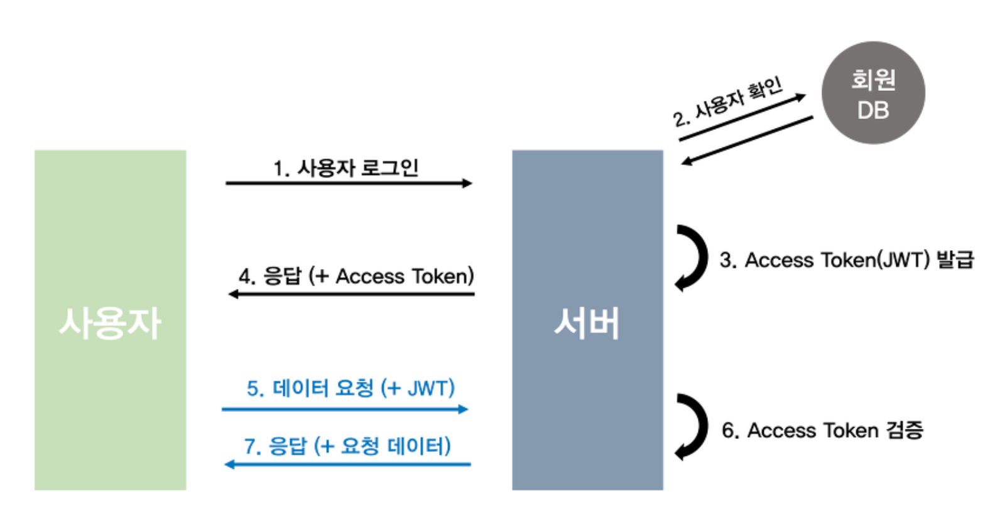

세션 방식과 함께 많이 사용되는 인증방식으로 `토큰 인증(Token Authentication)` 방식이 있습니다.

토큰은 별도의 저장소를 사용하지 않고, "토큰"이라고 하는 하나의 문자열에 인증에 필요한 데이터를 모두 담는 방법입니다.  
토큰은 여러 종류가 있으나, `JWT(Json Web Token)`이 가장 흔하게 사용됩니다.

토큰을 사용하는 방법은 다음과 같습니다.

1. 사용자는 로그인 페이지에 서계정 정보를 다음처럼 요청 메시지에 답이 서버에 요청을 보냅니다.

```
user_id: grab
password: 1234
```

2. 서버는 이 계정 정보를 받아, 유효한 사용자인지 확인하는 후 다음처럼 유저 정보와 인증에 필요한 데이터를 문자열로 인코딩합니다.(이 문자열을 토큰이라고 합니다.)

```
gjiwaegnwiaognwpngwpanvnwepognwapegfnweopafjweopagnawepighiawpengwpoefw
```

- 토큰은 인증에 필요한 정보를 담아 암호화된 문자열인데, 이 문자열을 복호화하면 원본 데이터를 얻을 수 있습니다.

```
user_id: grab
role: Admin
created_at: 2022-01-01 10:00:00
```

3. 서버는 응답 메시지에 위 토큰을 담아 응답하고 클라이언트는 해당 토큰을 특정 저장소에 저장합니다.
4. 클라이언트가 토큰을 포함하여 요청했을 때, 서버에서는 토큰을 복호화하여 사용자를 확인합니다. 만약 올바르지 않은, 위변조된 토큰이라면 복호화되지 않습니다.

이 방법은 세션처럼 별도의 세션 저장소가 필요하지 않기에 상대적으로 구현이 간편합니다. 인증 로직(토큰 암호화와 복호화)을 서버에 잘 구현해두면 됩니다.

하지만 토큰에 많은 데이터를 저장할수록 토큰이 커지면서 네트워크 통신 비율이 비싸집니다. 또한 한 번 발급된 토큰에 대해서는 중간에 폐기할 수 없다는 단점도 존재합니다.

> TIP  
> 결국 세션과 토큰 방식의 차이는, 세션은 별도의 저장소에서 세션들을 관리하고 대조하는 방식이며 토큰은 암호화, 복호화 방식으로 별다른 저장소 없이 인증을 진행하는 방식입니다.  
> 서로 장단점이 있으니 상황에 맞게 사용해주시면 됩니다.

## 인가

인가(Authorization)는 인증을 마친 사용자가 요청에 대해 유효한 권한을 가지고 있는지 확인하는 작업입니다.

예를 들어, 게시판에서 일반 계정은 자신의 글만 수정하고 지울 수 있습니다.  
남의 글을 수정하거나 지울 수 있는 권한이 없습니다.  
하지만 관리자 사용자는 모든 계정의 글을 수정하고 지울 수 있는 권한이 있습니다.  
이처럼 인증된 계정 사이에도 "권한"이 다른 경우가 있습니다.

그래서 어떤 자원에 대한 접근을 사용자의 권한(Role)에 따라 다르게 설정해주는 것이 중요합니다.


## 정리

- 인증은 사용자가 등록된 사용자인지 확인하고 식별하는 직업입니다.
- 현대에는 인증 방식으로 쿠키/세션, 토큰 방식을 많이 활요합니다.
- 쿠키/세션 인증방식은 세션이라는 객체로 인증하는 방식으로 세션 ID는 쿠키에 담아 클라이언트/서버가 주고받습니다. 대표적인 웹 서비스의 인증 방식입니다.
- 토큰 인증 방식은 유저 정보를 토큰이라고 하는 암호화된 문자열로 만들어 이를 주고받으며 인증하는 방식입니다. 웹 뿐 아니라 모바일 등 다양한 환경에 쓰이도록 범용적입니다.
- 인가는 인증이 완료된 사용자가 요청에 대해 유효한 권한을 가지고 있는지 확인하는 작업입니다.

## oAuth

SNS 로그인은 서비스를 이용하는 사용자들이 비밀번호 같은 정보를 따로 제공하지 않고 다른 서비스(OAuth를 제공하는 서비스들)의 인증 정보로 로그인을 할 수 있는 방식입니다.  
이떄 외부 서비스에서 본 서비스의 계정을 활용할 수 있도록 하는 방식(표준)을 OAuth라고합니다.


