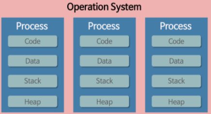
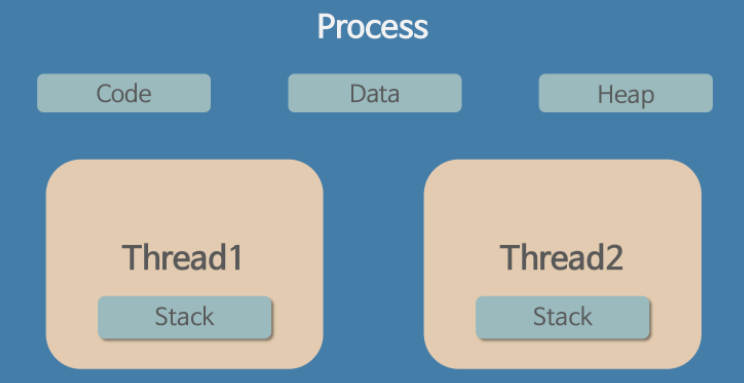

# 프로세스와 스레드 기본

## 프로세스

- 프로세스는 운영체제에 연속적으로 실행되고 있는 프로그램을 뜻합니다. 우리(유저)가 프로그램을 실행했다면 프로세스는 메모리 위에 올라가 있게 되며 운영체제게 의해 CPU, 메모리 자원을 할당받게 됩니다.

- 프로세스 독립된 메모리 영역으로 Code, Data, Stack, Heap을 할당받습니다.
  - `Code` 는 개발자가 작성한 코드라고 보시면 됩니다.
  - `Data`는 전역변수, 정적변수, 배열, 구조체 등 프로그램이 실행되면서 생기는 정적인 데이터들이 저장됩니다.
  - `Stack`은 함수 호출과 관련된 정보(실행정보, 지역변수 파라미터 등)이 저장됩니다. 일반적으로 컴파일 타임에 Stack의 크기가 결정됩니다.

> TIP
> Stack Overflow는 프로세스에 할당된 Stack 메모리가 초과되었을 때 생기는 문제입니다.
> 함수에서 너무 큰 지역변수를 선언하거나 재귀적으로 무한정으로 함수를 호출하게 될 떄 발생합니다.

- Heap은 런타임에 동적으로 메모리를 처리해야 하는 상황에서 사용되는 공간입니다.
  - Array을 사용하거나 외부 파일을 읽을 때 등등 예로 들 수 있습니다.
  - 사용자에 의해 메모리 공간이 동적으로 할당되고 해제될 수 있습니다.

## 스레드

- 스레드는 특정한 시점에 프로그램의 작업을 수행하는 역활을 합니다. 일반적으로 프로세스 안에서 실제 코드를 실행하는 단위라고 보시면 됩니다.

  - 스레드는 CPU 이용의 기본 단위입니다. 한 개의 스레드 작업은 1개의 CPU코어에 할당되게 됩니다.
  - 스레드가 실행되기 위해선 자원(함수 실행 정보, 지역 변수 등)을 저장할 메모리가 필요하며, 이는 프로세스가 할당받은 메모리를 사용합니다.

- 스레드는 프로세스 내에 존재하기에 프로세스의 자원을 공유하게 됩니다. 각자의 스레드는 Stack을 별도로 가지고 있게 되며 나머지 자원 (Code, Data, Heap)을 공유합니다.

  - 만약 여러 스레드가 실행된다면 프로세스의 자원을 공유하기에 빠르게 자원을 가져다 쓸 수 있습니다. 반면 프로세스가 다른 프로세스의 자원을 사용하기 위해서는 IPC(Inter-Process Communication)이라는 방식을 사용해야 합니다.

- 우리가 개발한 프로그램을 실행하면 일반적으로 1개의 프로세스와 1개의 메인 스레드를 가지게 됩니다. 그러나 프로그램이 해야 할 데스크톱이 많아지면 자연스럽게 여러 개의 스레드를 동시에 실행 할 수 있으며, 혹은 여러개의 프로세스를 동시에 운영할 수도 있습니다.

> TIP
> 프로세스와 스레드의 차이와 장단점을 비교하는 글이 많습니다. 이는 멀티 프로세스, 멀티 스레드를 선택해야 하는 기준에서 나온 장단점일 뿐, 실제로 프로세스와 스레들르 분리해서 비교하는 건 옳지 않습니다.

## 더 공부하면 좋을 것

- 운영체제의 스케줄링 기법

  - 하나의 머신에서 수많은 프로세스들을 효율적으로 관리하기 위해 다양한 스케줄링 기법들이 존재합니다.

- 스레드의 구분 (유저 스레드와 커널 스레드)

  - 실제로 스레드는 유저 스레드와 커널 스레드로 나뉩니다. 이떄 유저 스레드는 운영체제와 자원을 요구하기 위해 커널 스레드와 매핑이 되어 있습니다.

- 다중 스레드 모델
  - 다중 스레드의 경우 유저 스레드와 커널 스레드가 연결되어 있는 방식이 다양합니다.
