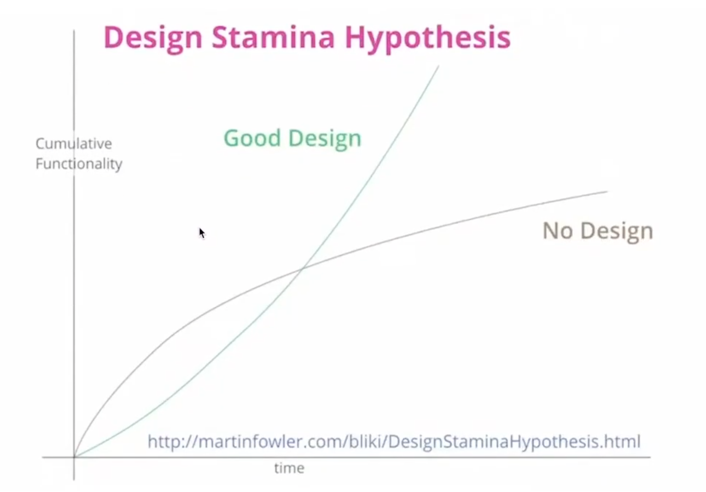

# 아키텍처를 시작하기 전에

## 소프트웨어 아키텍처란

소프트웨어 개발 관점에서 아키텍처는 소프트웨어의 전체적인 구조를 잡아주는 설계도입니다.  

아키텍처는 소프트웨어의 큰 그림을 보게 해줍니다.  
좋은 아키텍처는 사람이 세부적인 코드를 일일이 다 보지 않아도, 일관된 코드 구조로 흐름을 쉽게 유추할 수 있도록 합니다.  
또한 개발을 하다 보면 코드를 어떻게 분리하고 모듈화할지, 객체를 어떻게 설계할지 고민하곤 하는데, 아키텍처는 이러한 고민에 방향을 제시해주는 일종의 지침이라고도 볼 수 있습니다.

몇몇 유명한 아키텍처들은 자주 사용되며 패턴화되기도 하는데, 한 번쯤 들어봤을 만한 레이어드 아키텍처, MVC패턴 들이 바로 이렇게 패턴화된 아키텍처입니다.


## 아키텍처가 없다면

먼저 아키텍처가 없이 개발을 진행한 프로젝트 구조의 예시를 봅시다.

```python
project/
    dependency.py
    model.py
    main.py
```

어떤가요? 이 프로젝트가 어떤 프로젝트 인지 조금의 감이라도 오시나요?

위처럼 아키텍처가 없는 프로젝트들은 다음과 같은 문제점이 있습니다.

- 본인이 작성한 코드나 모듈을 프로젝트 어디에 두어야 할지 모릅니다. 고민하거나 결저하는 데 시간이 듭니다.
- 본인이 생각한 기준과 다른 팀원이 생각한 기준이 다를 수 있습니다. 모듈 위치나 이름이 일관성 없게 됩니다.
- 폴더, 파일 간의 의존관계가 복잡해지면서 컴포넌트를 나누기가 힘들어집니다.
- 팀에 새로 들어온 사람이 프로젝트 코드를 보면, 어디서부터 어떻게 봐야 할지 감이 오지 않습니다. 전체적인 흐름과 설게를 이해하는 데 시간이 오래 걸립니다.

특히 아키텍처 없이 지속해서 개발을 하다 보면 어느 순간 프로젝트 전반에 코드가 덕지덕지 붙어있거나, 산발적으로 로직이 흩어져 있는 것을 느끼게 됩니다.  
이 시점부터는 새로운 기능을 개발하는데 시간이 더 오래 걸리기 시작합니다.  
기능을 개발하려면 기존 코드를 파악해야 하는데, 기존 코드를 파악하는 게 쉽지 않기 때문입니다.  
이는 나중에 리팩토링을 할 떄 더 큰 비용을 지불하게 만듭니다. 



위 그래프는 유명한 엔지니어인 마틴 파울러가 언급한 내용입니다.  
아키텍처 없는 개발은 초반에는 빠른 생산성을 가질 수 있지만, 개발을 지속할 수록 점차 생산성이 떨어지게 됩니다.  
하지만 아키텍처를 잘 설계해두면 이런 문제를 해결하고 생산성을 지속해서 올릴 수 있습니다.

## 아키텍처가 해주는 것

이번엔 나름 아키텍처를 가지고 있는 프로젝트 구조를 보곘습니다. 

```python
project/
    main.py
    entry_point/
        cli.py
    use_cases/
        train.py
        predict.py
    model/
        image_classifier.py
```

> TIP  
> 아키텍처는 단순히 파일을 나누는 폴더링보다 더 포괄적인 개념입니다. 즉 아키텍처를 설계하는 과정에서 자연스럽게 파일을 나누고 특징에 맞게 폴더에 들어갑니다.

어떤가요? 프로젝트가 어떤 프로젝트인지 조금의 감이 오시나요?

- 먼저 `entry_poiunt/cli.py` 를 통해 이 애플리케이션은 CLI(Command Line Interface)를 제공해주는 것을 알 수 있습니다. 
- `use_cases/` 내에 있는 모듈들을 통해, 이 애플리케이션에 train 과 predict 기능이 있음을 알 수 있습니다.
- `model/image-classifier`를 통해, 이 이팰리케이션이 이미지 분류 모델과 관련한 내용임을 알 수 있습니다.

이 처럼 아키텍처를 잘 적용한다면 다음과 같은 효과를 얻을 수 있습니다. 

- 아키텍처는 시스템에 규칙을 만듭니다.
  - 개발자들이 일관적이고 견고한 코드를 만들 수 있습니다.
  - 개발자들이 모듈 분리와 추상화에 대한 고민을 덜기 때문에 코드 생산성이 올라갑니다.
  - 아키텍처를 파악하면, 누군가 작성한 코드를 파악하거나 새로 코드를 작성하는데 더 빠르게 감을 잡을 수 있습니다.
- 소프트웨어의 구성을 한 눈에 파악하기 좋습니다.
  - 특히 패턴화된 아키텍처들은 개발자들 사이의 일종의 언어입니다.
  - 이런 아키텍처들을 채택함으로써 개발자들 간의 커뮤니케이션 비용을 줄일 수 있습니다.
- 좋은 아키텍처는 소프트웨어의 테스트를 쉽게 만들 수 있도록 돕습니다.
  - 테스트를 잘 만들어두면, 다음에 코드를 언제든지 바꿔도 동작에 문제가 없도록 보장받을 수 있습니다.
  - 좋은 아키텍처 - 테스트 - 소프트웨어의 지속 개발은 항상 같이 맞물리는 개념입니다.


## 트레이드 오프

그렇다면 아키텍처의 도입은 항상 필요하고 항상 좋은 걸까요?

위에서 아키텍처의 장점을 말헀지만, 사실 아키텍처를 도입하면 다음과 같은 어려운 점들이 따라옵니다.

- 초반에 아키텍처를 고민하고 결정하는 시간이 필요합니다.
- 코드를 작성하거나 읽어야 할 때 알아야 될 규칙이 늘어납니다.
- 팀원 전체가 프로젝트의 아키텍처 패턴에 익숙해야 합니다.
- 전반적으로 작성해야 할 코드의 양이 늘어납니다.

프로젝트 초반에 당장 세세한 아키텍처를 도입하는 것은 과할 수도 있습니다.  
문제 상황과 앞으로 프로젝트 방향성이 당장 정해지지 않았다면, 먼저 기본적인 작업 흐름을 유지하면서 개발을 하고 나중에 본격적으로 아키텍처 도입을 고려해보는 것도 하나의 방법입니다.


## TIP

1. 아키텍처를 처음에 쉽게 이해하려면 '의존성' 관계에 집중해주세요. 결국 컴포넌트별로 역할을 명확하게 나누고 의존관계를 분명히 하는 것이 핵심입니다.
2. 본인이 자주 사용하는 언어 프레임워크와 아키텍처 패턴을 구글링해서 다른 사람들은 어떻게 구현하는지 알아보고 적용해보는걸 추천드립니다.
    - ex) react with layered architecture, spring with clean architecture


# 대표적인 아키텍처 패턴 알아보기 - 레이어드 아키텍처

여기에는 가장 유명하고 대표적인 아키텍처들에 대해서 소개합니다.

- 레이어드 아키텍처
- 헥사고날 아키텍처
- 클린 아키텍처

레이어드 아키텍처부터 클린 아키텍처 순으로 알아보도록 하겠습니다. 이번 강의에는 가장 대표적인 아키텍처 패턴인 레이어드 아키텍처에 대해 알아보겠습니다.

## 개념

레이어드 아키텍처는 많은 분야에서 사용되는 아키텍처입니다.  
이름 그대로 여러 레이어를 분리하여 레이어 마다 해야 할 역할을 정의해놓은 구조입니다.


대표적인 레이어드 아키텍처인 4 계층 (4 Layered) 아키텍처의 각 레이어 정리하면 아래와 같습니다. 

- 프레젠테이션 레이어
  - 인터페이스와 애플리케이션이 연결되는 곳
  - 웹 통신 프레임 워크, CLI 등 인터페이스, 입출력의 반환 등 외부와의 통신을 담당합니다. 
- 애플리케이션 레이어
  - 소프트웨어가 제공하는 주요 기능(비즈니스 로직)을 구현하는 코드가 모이는 곳
  - 로직을 오케스트레이션하고, 트랜잭션의 시작과 끝을 담당합니다.
- 도메인 레이어
  - 도메인과 관련된 객체들이 모이는 곳
  - 도메인 모델(엔티티 값 객체), 도메인 서비스 등 도메인 문제를 코드로 풀어내는 일을 담당합니다.
- 인프라스트럭처 레이어
  - 다른 레이러를 지탱하는 기술적 기반을 담은 객체들이 모이는 곳
  - DB와의 연결, ORM 객체, 메시지 큐 등 애플리에키션 외적인 인프라들과의 어댑터 역활을 담당합니다.

레이어드 아키텍처는 의존성의 방향이 다음처럼 흐릅니다.

```
프레젠테이션 레이어 -> 애플리케이션 레이어 -> 도메인 레이어 -> 인프라스럭처 레이어
```

즉 프레젠테이션 레이어에 있는 코드는 애플리케이션 레이어에 있는 코드에 의존해야 합니다.  
그 반대인 애플리케이션 레이어 코드가 프레젠테이션 레이어에 있는 코드에 의존하면 안 됩니다.  
이 처럼 의존성 흐름은 항상 프레젠테이션 패턴에서 인프라스트럭처 에이어로 흘러야 합니다. 

> TIP  
> 위는 4개의 레이어로 구성한 레이어로 구성할 수도 있습니다. 3레이어의 경우 보통 다음처럼 구성합니다.  
> 프레젠테이션 레이어 -> 애플리케이션 레이어 -> 데이터 접근 레이어

## 예시

간단한 예를 살펴보겠습니다.  
쇼필몰 웹 서비스의 백엔드 서버를 만든다고 해보죠. 프로젝트 구조는 다음과 같이 구성할 수 있습니다.

```
src/
    presentation_layer/
        product_conroller.py
        user_controller.py
    application_layer/
        product_service.py
        user_service.py
    domain_layer/
        product.py
        user.py
    infrastructure_layer/
        repositories/
            product_repository.py
            user_repository.py
        database.py
        orm.py
```

프로젝트 최상단에서 디렉토리로 레이어를 구분합니다. 그리고 각 디렉토리 내에서 해당 레이어에 들어갈 컴포넌트들을 배치합니다.

각 레이어에 속하는 컴포넌트들을 살펴봅니다.

## 프레젠테이션 레이어

```python
## src/presentaion_layer/product_controller.py

## REST API 형태로 클라이언트에게 입력을 받고, 이름 애플리케이션 서비스가 활용할 수 있는 형태로 바꾸어 전달합니다.  
## 애플리케이션 서비스가 결과를 내놓으면 이름 REST API 에서 약속한 형태로 변환하여 클라이언트에게 HTTP 통신으로 반환합니다. 

from fastapi import FastAPI
from src.presentation_layer.web import app
from src.application_layer import product_service

@app.post("/products", status_code=200)
def register_products(json_req) -> None:
    product = product_service.create_product(name=json_req.name, price=json_req.price)
    response = {
        "product": product
    }
    return response

```

## 애플리케이션 레이어

```python
# src/application_layer/product_service.py

# 프레젠테이션 레이어에서 넘겨받은 입력을 비즈니스 로직에 맞게 처리합니다.  
# 이런 처리 로직을 서비스라고 하는데, 필요에 따라 도메인 모델을 만들고, 저장소에 저장하는 등 여러 세부적인 로직을 오케스트레이션 합니다.  
# 이후 다시 프레젠테이션 레이어에 처리한 결과를 넘겨줍니다.

import src.domain_layer_product import Product
import src.infrastructure_layer.databse import db
import src.infrastructure_layer.repositories.product_repository import ProductRepository

def create_product(name: str, price: str) -> bool:
    try:
        product = Product(name, price)
        with db.Session() as session:
            product_repository = ProductRepository(session)
            product_repository.save(product)
            session.commit()
        return product 
    except:
        raise Exception("Product Not Created")
```

## 도메인 레이어

```python
# src/domain_layer/product.py

# 도메인 레이어는 도메인의 내용들을 표현합니다.

from sqlalchmey import Column, String, Integer
# DB와 연결하는 일은 인프라스턹처 레이어에서의 일입니다.
from src.infrastructure_layer.databse import Base

# 도메인 레이어의 컴포넌트(Product)는 인프라스턹처 레이어의 컴포넌트(Base)에 의존합니다.
class Product(Base):
    __tablename__ = "prodcut"
    
    id = Column(Integer, primary_key=True)
    name = Column(String)
    price = Column(Integer)
```

## 장점

위에서 각 레이어에 포함된 코드들의 일부만 간략히 살펴보았습니다. 이렇게 레이어드 아키텍처 형태로 구성하면 좋은점은 무엇일까요?

- 레이어마다 정해진 역할이 있습니다. SRP(단일 책임 원칙)와 비슷하게 레이어 간의 책임을 두고 분리해서 유지보수 및 코드 관리가 용이합니다.
- 레이어 간의 의존 흐름이 바깥쪽(프레젠테이션 레이어)에서 안쪽(이프라스트럭처 레이어)으로 일정합니다. 새로운 기능을 개발할 때 동일된 흐름에 맞게 빠르게 개발이 가능합니다.
- 코드를 처음 보는 사람은 의존성의 흐름에 따라 자연스럽게 전체적인 구조를 쉽게 파악할 수 있습니다.

## 문제점

레이어드 아키텍처의 단점은 소프트웨어가 최종적으로 인프라스트럭처(ex. DB)에 의존성을 갖도록 한다는 것입니다.

```
프레젠테이션 레이어 -> 애플리케이션 레이어 -> 도메인 레이어 -> 인프라스럭처 레이어
```

소프트웨어에서 중요한 부분은 비즈니스 로직을 처리하는 "애플리케이션 레이어"와 "도메인 레이어"일 것입니다.  
그런데 도메인 레이어가 인프라스트럭처, 특히 DB를 의존하게 된다면 어떻게 될까요? 도메인 레이어와 애플리케이션 레이어가 변경에 쉽게 영향을 받을 수밖에 없습니다.

DB가 도메인 즉 소프트웨어의 설계 핵심에 영향을 미치다 보니, 소프트웨어의 모든 구조가 DB중심의 설계가 됩니다.  
이렇게 되면 애플리케이션 설계에 앞서 데이터베이스를 먼저 선택하고, 데이터베이스 설계(데이터 모델링) 부터 하게 됩니다.  
또한 객체지향에서 추구하는 "액션"이 먼저가 되는 것이 아니라 "상태" 중심적으로 설계를 하다 보니, 점점 객체지향에서 벗어나는 코드들이 생기게 됩니다.
