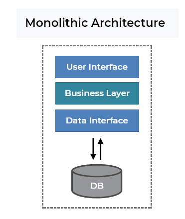

# 아키텍처를 시작하기 전에

## 소프트웨어 아키텍처란

소프트웨어 개발 관점에서 아키텍처는 소프트웨어의 전체적인 구조를 잡아주는 설계도입니다.

아키텍처는 소프트웨어의 큰 그림을 보게 해줍니다.  
좋은 아키텍처는 사람이 세부적인 코드를 일일이 다 보지 않아도, 일관된 코드 구조로 흐름을 쉽게 유추할 수 있도록 합니다.  
또한 개발을 하다 보면 코드를 어떻게 분리하고 모듈화할지, 객체를 어떻게 설계할지 고민하곤 하는데, 아키텍처는 이러한 고민에 방향을 제시해주는 일종의 지침이라고도 볼 수 있습니다.

몇몇 유명한 아키텍처들은 자주 사용되며 패턴화되기도 하는데, 한 번쯤 들어봤을 만한 레이어드 아키텍처, MVC패턴 들이 바로 이렇게 패턴화된 아키텍처입니다.

## 아키텍처가 없다면

먼저 아키텍처가 없이 개발을 진행한 프로젝트 구조의 예시를 봅시다.

```python
project/
    dependency.py
    model.py
    main.py
```

어떤가요? 이 프로젝트가 어떤 프로젝트 인지 조금의 감이라도 오시나요?

위처럼 아키텍처가 없는 프로젝트들은 다음과 같은 문제점이 있습니다.

- 본인이 작성한 코드나 모듈을 프로젝트 어디에 두어야 할지 모릅니다. 고민하거나 결저하는 데 시간이 듭니다.
- 본인이 생각한 기준과 다른 팀원이 생각한 기준이 다를 수 있습니다. 모듈 위치나 이름이 일관성 없게 됩니다.
- 폴더, 파일 간의 의존관계가 복잡해지면서 컴포넌트를 나누기가 힘들어집니다.
- 팀에 새로 들어온 사람이 프로젝트 코드를 보면, 어디서부터 어떻게 봐야 할지 감이 오지 않습니다. 전체적인 흐름과 설게를 이해하는 데 시간이 오래 걸립니다.

특히 아키텍처 없이 지속해서 개발을 하다 보면 어느 순간 프로젝트 전반에 코드가 덕지덕지 붙어있거나, 산발적으로 로직이 흩어져 있는 것을 느끼게 됩니다.  
이 시점부터는 새로운 기능을 개발하는데 시간이 더 오래 걸리기 시작합니다.  
기능을 개발하려면 기존 코드를 파악해야 하는데, 기존 코드를 파악하는 게 쉽지 않기 때문입니다.  
이는 나중에 리팩토링을 할 떄 더 큰 비용을 지불하게 만듭니다.


위 그래프는 유명한 엔지니어인 마틴 파울러가 언급한 내용입니다.  
아키텍처 없는 개발은 초반에는 빠른 생산성을 가질 수 있지만, 개발을 지속할 수록 점차 생산성이 떨어지게 됩니다.  
하지만 아키텍처를 잘 설계해두면 이런 문제를 해결하고 생산성을 지속해서 올릴 수 있습니다.

## 아키텍처가 해주는 것

이번엔 나름 아키텍처를 가지고 있는 프로젝트 구조를 보곘습니다.

```python
project/
    main.py
    entry_point/
        cli.py
    use_cases/
        train.py
        predict.py
    model/
        image_classifier.py
```

> TIP  
> 아키텍처는 단순히 파일을 나누는 폴더링보다 더 포괄적인 개념입니다. 즉 아키텍처를 설계하는 과정에서 자연스럽게 파일을 나누고 특징에 맞게 폴더에 들어갑니다.

어떤가요? 프로젝트가 어떤 프로젝트인지 조금의 감이 오시나요?

- 먼저 `entry_poiunt/cli.py` 를 통해 이 애플리케이션은 CLI(Command Line Interface)를 제공해주는 것을 알 수 있습니다.
- `use_cases/` 내에 있는 모듈들을 통해, 이 애플리케이션에 train 과 predict 기능이 있음을 알 수 있습니다.
- `model/image-classifier`를 통해, 이 이팰리케이션이 이미지 분류 모델과 관련한 내용임을 알 수 있습니다.

이 처럼 아키텍처를 잘 적용한다면 다음과 같은 효과를 얻을 수 있습니다.

- 아키텍처는 시스템에 규칙을 만듭니다.
  - 개발자들이 일관적이고 견고한 코드를 만들 수 있습니다.
  - 개발자들이 모듈 분리와 추상화에 대한 고민을 덜기 때문에 코드 생산성이 올라갑니다.
  - 아키텍처를 파악하면, 누군가 작성한 코드를 파악하거나 새로 코드를 작성하는데 더 빠르게 감을 잡을 수 있습니다.
- 소프트웨어의 구성을 한 눈에 파악하기 좋습니다.
  - 특히 패턴화된 아키텍처들은 개발자들 사이의 일종의 언어입니다.
  - 이런 아키텍처들을 채택함으로써 개발자들 간의 커뮤니케이션 비용을 줄일 수 있습니다.
- 좋은 아키텍처는 소프트웨어의 테스트를 쉽게 만들 수 있도록 돕습니다.
  - 테스트를 잘 만들어두면, 다음에 코드를 언제든지 바꿔도 동작에 문제가 없도록 보장받을 수 있습니다.
  - 좋은 아키텍처 - 테스트 - 소프트웨어의 지속 개발은 항상 같이 맞물리는 개념입니다.

## 트레이드 오프

그렇다면 아키텍처의 도입은 항상 필요하고 항상 좋은 걸까요?

위에서 아키텍처의 장점을 말헀지만, 사실 아키텍처를 도입하면 다음과 같은 어려운 점들이 따라옵니다.

- 초반에 아키텍처를 고민하고 결정하는 시간이 필요합니다.
- 코드를 작성하거나 읽어야 할 때 알아야 될 규칙이 늘어납니다.
- 팀원 전체가 프로젝트의 아키텍처 패턴에 익숙해야 합니다.
- 전반적으로 작성해야 할 코드의 양이 늘어납니다.

프로젝트 초반에 당장 세세한 아키텍처를 도입하는 것은 과할 수도 있습니다.  
문제 상황과 앞으로 프로젝트 방향성이 당장 정해지지 않았다면, 먼저 기본적인 작업 흐름을 유지하면서 개발을 하고 나중에 본격적으로 아키텍처 도입을 고려해보는 것도 하나의 방법입니다.

## TIP

1. 아키텍처를 처음에 쉽게 이해하려면 '의존성' 관계에 집중해주세요. 결국 컴포넌트별로 역할을 명확하게 나누고 의존관계를 분명히 하는 것이 핵심입니다.
2. 본인이 자주 사용하는 언어 프레임워크와 아키텍처 패턴을 구글링해서 다른 사람들은 어떻게 구현하는지 알아보고 적용해보는걸 추천드립니다.
   - ex) react with layered architecture, spring with clean architecture

# 대표적인 아키텍처 패턴 알아보기 - 레이어드 아키텍처

여기에는 가장 유명하고 대표적인 아키텍처들에 대해서 소개합니다.

- 레이어드 아키텍처
- 헥사고날 아키텍처
- 클린 아키텍처

레이어드 아키텍처부터 클린 아키텍처 순으로 알아보도록 하겠습니다. 이번 강의에는 가장 대표적인 아키텍처 패턴인 레이어드 아키텍처에 대해 알아보겠습니다.

## 개념

레이어드 아키텍처는 많은 분야에서 사용되는 아키텍처입니다.  
이름 그대로 여러 레이어를 분리하여 레이어 마다 해야 할 역할을 정의해놓은 구조입니다.


대표적인 레이어드 아키텍처인 4 계층 (4 Layered) 아키텍처의 각 레이어 정리하면 아래와 같습니다.

- 프레젠테이션 레이어
  - 인터페이스와 애플리케이션이 연결되는 곳
  - 웹 통신 프레임 워크, CLI 등 인터페이스, 입출력의 반환 등 외부와의 통신을 담당합니다.
- 애플리케이션 레이어
  - 소프트웨어가 제공하는 주요 기능(비즈니스 로직)을 구현하는 코드가 모이는 곳
  - 로직을 오케스트레이션하고, 트랜잭션의 시작과 끝을 담당합니다.
- 도메인 레이어
  - 도메인과 관련된 객체들이 모이는 곳
  - 도메인 모델(엔티티 값 객체), 도메인 서비스 등 도메인 문제를 코드로 풀어내는 일을 담당합니다.
- 인프라스트럭처 레이어
  - 다른 레이러를 지탱하는 기술적 기반을 담은 객체들이 모이는 곳
  - DB와의 연결, ORM 객체, 메시지 큐 등 애플리에키션 외적인 인프라들과의 어댑터 역활을 담당합니다.

레이어드 아키텍처는 의존성의 방향이 다음처럼 흐릅니다.

```
프레젠테이션 레이어 -> 애플리케이션 레이어 -> 도메인 레이어 -> 인프라스럭처 레이어
```

즉 프레젠테이션 레이어에 있는 코드는 애플리케이션 레이어에 있는 코드에 의존해야 합니다.  
그 반대인 애플리케이션 레이어 코드가 프레젠테이션 레이어에 있는 코드에 의존하면 안 됩니다.  
이 처럼 의존성 흐름은 항상 프레젠테이션 패턴에서 인프라스트럭처 에이어로 흘러야 합니다.

> TIP  
> 위는 4개의 레이어로 구성한 레이어로 구성할 수도 있습니다. 3레이어의 경우 보통 다음처럼 구성합니다.  
> 프레젠테이션 레이어 -> 애플리케이션 레이어 -> 데이터 접근 레이어

## 예시

간단한 예를 살펴보겠습니다.  
쇼필몰 웹 서비스의 백엔드 서버를 만든다고 해보죠. 프로젝트 구조는 다음과 같이 구성할 수 있습니다.

```
src/
    presentation_layer/
        product_conroller.py
        user_controller.py
    application_layer/
        product_service.py
        user_service.py
    domain_layer/
        product.py
        user.py
    infrastructure_layer/
        repositories/
            product_repository.py
            user_repository.py
        database.py
        orm.py
```

프로젝트 최상단에서 디렉토리로 레이어를 구분합니다. 그리고 각 디렉토리 내에서 해당 레이어에 들어갈 컴포넌트들을 배치합니다.

각 레이어에 속하는 컴포넌트들을 살펴봅니다.

## 프레젠테이션 레이어

```python
## src/presentaion_layer/product_controller.py

## REST API 형태로 클라이언트에게 입력을 받고, 이름 애플리케이션 서비스가 활용할 수 있는 형태로 바꾸어 전달합니다.
## 애플리케이션 서비스가 결과를 내놓으면 이름 REST API 에서 약속한 형태로 변환하여 클라이언트에게 HTTP 통신으로 반환합니다.

from fastapi import FastAPI
from src.presentation_layer.web import app
from src.application_layer import product_service

@app.post("/products", status_code=200)
def register_products(json_req) -> None:
    product = product_service.create_product(name=json_req.name, price=json_req.price)
    response = {
        "product": product
    }
    return response

```

## 애플리케이션 레이어

```python
# src/application_layer/product_service.py

# 프레젠테이션 레이어에서 넘겨받은 입력을 비즈니스 로직에 맞게 처리합니다.
# 이런 처리 로직을 서비스라고 하는데, 필요에 따라 도메인 모델을 만들고, 저장소에 저장하는 등 여러 세부적인 로직을 오케스트레이션 합니다.
# 이후 다시 프레젠테이션 레이어에 처리한 결과를 넘겨줍니다.

import src.domain_layer_product import Product
import src.infrastructure_layer.databse import db
import src.infrastructure_layer.repositories.product_repository import ProductRepository

def create_product(name: str, price: str) -> bool:
    try:
        product = Product(name, price)
        with db.Session() as session:
            product_repository = ProductRepository(session)
            product_repository.save(product)
            session.commit()
        return product
    except:
        raise Exception("Product Not Created")
```

## 도메인 레이어

```python
# src/domain_layer/product.py

# 도메인 레이어는 도메인의 내용들을 표현합니다.

from sqlalchmey import Column, String, Integer
# DB와 연결하는 일은 인프라스턹처 레이어에서의 일입니다.
from src.infrastructure_layer.databse import Base

# 도메인 레이어의 컴포넌트(Product)는 인프라스턹처 레이어의 컴포넌트(Base)에 의존합니다.
class Product(Base):
    __tablename__ = "prodcut"

    id = Column(Integer, primary_key=True)
    name = Column(String)
    price = Column(Integer)
```

## 장점

위에서 각 레이어에 포함된 코드들의 일부만 간략히 살펴보았습니다. 이렇게 레이어드 아키텍처 형태로 구성하면 좋은점은 무엇일까요?

- 레이어마다 정해진 역할이 있습니다. SRP(단일 책임 원칙)와 비슷하게 레이어 간의 책임을 두고 분리해서 유지보수 및 코드 관리가 용이합니다.
- 레이어 간의 의존 흐름이 바깥쪽(프레젠테이션 레이어)에서 안쪽(이프라스트럭처 레이어)으로 일정합니다. 새로운 기능을 개발할 때 동일된 흐름에 맞게 빠르게 개발이 가능합니다.
- 코드를 처음 보는 사람은 의존성의 흐름에 따라 자연스럽게 전체적인 구조를 쉽게 파악할 수 있습니다.

## 문제점

레이어드 아키텍처의 단점은 소프트웨어가 최종적으로 인프라스트럭처(ex. DB)에 의존성을 갖도록 한다는 것입니다.

```
프레젠테이션 레이어 -> 애플리케이션 레이어 -> 도메인 레이어 -> 인프라스럭처 레이어
```

소프트웨어에서 중요한 부분은 비즈니스 로직을 처리하는 "애플리케이션 레이어"와 "도메인 레이어"일 것입니다.  
그런데 도메인 레이어가 인프라스트럭처, 특히 DB를 의존하게 된다면 어떻게 될까요? 도메인 레이어와 애플리케이션 레이어가 변경에 쉽게 영향을 받을 수밖에 없습니다.

DB가 도메인 즉 소프트웨어의 설계 핵심에 영향을 미치다 보니, 소프트웨어의 모든 구조가 DB중심의 설계가 됩니다.  
이렇게 되면 애플리케이션 설계에 앞서 데이터베이스를 먼저 선택하고, 데이터베이스 설계(데이터 모델링) 부터 하게 됩니다.  
또한 객체지향에서 추구하는 "액션"이 먼저가 되는 것이 아니라 "상태" 중심적으로 설계를 하다 보니, 점점 객체지향에서 벗어나는 코드들이 생기게 됩니다.

## 헥사고날 아키텍처

애플리케이션은 데이터베이스에 있는 데이터를 그저 옮겨주는 수동적인 소프트웨어를 넘어 보다 적극적이고, 여러 일을 할 수 있어야 합니다.  
데이터베으스 같은 외부 시스템이 애플리케이션의 중심이 아니라, 애플리케이션이 "사용하는" 이룹가 되어야 합니다. 상황에 따라 RDBMS에서 NoSQL을 쓸 수 있고, API서버와 통신 방식을 Rest에서 GraphQL로 바꿀 수 있어야 합니다.

이렇듯 애플리케이션을 중심으로 DB, 웹 프레임워크 등은 모두 애플리케이션이 사용하는 부품(언제든 갈아끼울 수 있는)으로 보는 아키텍처들이 주목받기 시작했습니다. 대표적인 아키텍처로 `헥사고날 아키텍처` 와 `클린 아키텍처`가 있습니다.


헥사고날(포트 앤 어댑터) 아키텍처는 흔히 육각형의 이미졸 소개되는데, 애플리케이션과 바깥의 모듈들을 자유롭게 탈착 가능하게 하는 것이 골지입니다.

"탈착 가능하다"의 개념은 플레이스테이션 같은 게임기를 생각해보면 더 쉽게 이해가 될 것 같습니다.  
게임기에서 가장 중요한 부분은 게임을 실행시키는 문제입니다. 게임기에 연결된 입력 패드나, 게임화면을 보여주는 모니터는 게임기 본체의 포트와 맞는 규격이면 언제든지 사용자 취향에 따라 바뀔 수 있습니다. 따라서 중요한 것은 게임기 본체 그 자체이고, 그 외부적인 것들은 언제든지 탈부착이 가능합니다.

헥사고날 아키텍처의 핵심도 바로 이와 같습니다. 가운데 애플리케이션을 중심으로 애플리케이션 위의 모듈을 애플리케이션에서 제공하는 포트 모양에 맞다면 언제든 바꿀 수 있도록 하는 것입니다.

헥사고날 아키텍처는 어댑터가 포트 모양만 맞으면 동작하는 것과 같다고 해서 포트 앤 어댑터(Ports-and-Adapters)라고 부르기도 합니다. 즉 포트만 맞으면, 어떤 어댑터든 이 포트에 끼울 수 있습니다.

## 구조

이제 헥사고날 아키텍처의 구성 요소를 다음처럼 정리해볼 수 있습니다.

- 도메인
  - 레이어드 아키텍처에서의 도메인 레이어 개념과 같습니다.
  - 애플리케이션의 핵심이 되는 도메인을 표현합니다.
- 애플리케이션
  - 도메인을 이용한 애플리케이션의 비즈니스 로직을 제공합니다.
  - 관용적으로 `Service` 라고 표현하곤 합니다.
  - 애플리케이션은 `포트`를 가지고 있습니다.
    - 포트는 외부 어댑터를 끼울 수 있는 인터페이스 입니다.
    - 위 플레이스테이션 예시에서 게임기 본체가 애플리케이션이고, 본체에 있는 입출력, 혹은 모니터 단자를 끼울 수 있는 포트가 여기서 말하는 포트라고 이해하면 쉽습니다.
    - 애플리케이션으로 흐름이 들어오는 포트는 인바운드 포트, 애플리케이션에서 흐름이 나가는 포트는 아웃바운드 포트라고 합니다.
    - 포트는 프로그래밍 문법에서 인터페이스로 구현할 수 있습니다.
- 어댑터
  - 애플리케이션 내에 있는 포트에 끼울 수 있는 구현체입니다.
  - web이나 cli 들은 인바운드 포트에 끼울 수 있는 인바운드 어댑터에서 이용합니다.
  - db 등은 아웃바운드 포트에 끼울 수 있는 아웃바운드 어댑터를 통해 이용합니다.
  - 어댑터는 보통 포트를 나타내는 인터페이스를 구현합니다.

헥사고날 아키텍처에서 레이어 의존성이 다음처럼 흐릅니다.

```
어댑터 -> 애플리케이션 -> 도메인
```

위의 의존성 흐름을 역행하면 안됩니다. 예를 들면, 비즈니스 로직 -> 어댑터로, 도메인 -> 어댑터로 흐르는 의존성이 없어야 합니다.

## 예시

헥사고날 아키텍처를 프로젝트 구조로 표현하면 다음과 같습니다.

```
src/
    adapter/
        inbound/
            api/
                product_controller.py
                user_controller.py
                ...
        outbound/
            repositories/
                product_repository.py
                user_repository.py
    application/
        service/
            product_service.py
            user_service.py
        port/
            inbound/
                product_port.py
                user_port.py
            outbound/
                product_repository.py
                user_repository.py
    domain/
        product.py
        user.py
```

먼저 프로젝트 최상단에서 크게 어댑터, 애플리케이션, 도메인으로 레이러를 디렉토리로 나눕니다. 그리고 디렉토리내에 해당 레이어에 포함되는 컴포넌틀를 배치합니다.

레이어드 아키텍처에서는 다음처럼 서비스 레이어에 있는 모듈이 인프라스트럭처에 있는 모듈을 사용할 수 있었습니다.

- as-is

```python
# src/application_layer/product_service.py

from src.domain_layer import product
from src.infrastructure_layer.database import db
from src.infrastructure_layer.repositories import product_repository

def create_product(name: str, price: str) -> bool:
    ...
    product_repository = product_repository.ProductRepository(session)
    ...
```

그리고 헥사고날 아키텍처에서는 이런 흐름은 금지되므로, 다음처럼 코드를 수정해야 합니다.

- to-be

```python
# src/application/service/prodcut_service.py

from src.domain import product
from src.application.port.outbound.product_repository import ProductRepository
# 이제 애플리케이션 레이어는 인프라스트럭처 레이어가 아닌 애플리케이션 레이어에 의존합니다.

def create_product(name: str, price: str, product_repository: ProductRespository) -> bool:
    ...
    product_repository.create(...)
    ...
```

> TIP  
> 포트 앤 어댑터의 의존성 원칙은 저수준이 아닌 고수준에 의존하는 의존성 역전 원칙과도 동일 선상이라고 볼 수 있습니다.  
> 보통 컴파일 의존성(코드 의존성)에서는 이렇게 고수준을 의존하게 한 후,런타임에서 의존성을 주입해줍니다.  
> (의존성 주입 프레임워크를 많이 활요함)

포트는 다음처럼 인터페이스(추상 클래스)로 구현합니다.

```python
# src/application/port/outbound/product_repository.py

from abc import ABC, abstractmethod
from src.domain import product

class ProductRespository(ABC):
    @abstractmethod
    def save(product: product.Product) -> None:
        pass
```

그리고 이 포트를 구현한 클래스는 `src/adapter/outbound/repositories/product_repository.py` 에 구현합니다.

도메인도 마찬가지로 레이어드 아키텍처에서는 인프라스트럭처 레이어의 컴포넌트에 의존했습니다.

- as-is

```python
# src/domain_layer/product.py

from sqlalchemy import Column, String, Integer
# DB와 연결하는 일은 인프라스트럭처 레이어에서 일입니다.
from src.infrastructure_layer.database import Base

# 도메인 레이어의 컴포넌트(Product)는 인프라스트럭처 레이어의 컴포넌트(Base)에 의존합니다.
class Product(Base):
    __table__name = 'product'

    id = Column(Integer, primary_key=True)
    name = Column(String)
    price = Column(Integer)
```

이 코드도 이제 도메인이 인프라스트럭처에 의존하지 않게 다음처럼 변경할 수 있습니다.

- to-be

```python
# src/domain/product.py

from dataclasses import datacalss

@dataclass
class Product:
    id: int
    name: str
    price: int
```

어댑터 코드의 경우는 외부 서비스와 연결해주는 인터페이스의 역활을 해주는 코드를 작성해주면 됩니다. 애플리케이션의 Port(고수준)를 구현한 저수준의 코드가 포함됩니다.

```python
# src/adapter/outbound/product_repository.py
...
from src.application.port.outbound.product_repository import ProductRepository

class MysqlProductRepository(ProductRepository):
    ...

    def save(self, name: str, price: int):
        product = Product(name. price)
        with self.db.Session() as session:
            ...
            session.commit()
        ...
```

## 나가며

헥사고날 아키텍처를 통해 우리는 프로젝트의 중요한 부분(애플리케이션과 도메인)과 덜 중요한 부분(어댑터)를 구분하고, 의존성의 방향을 중요한 것으로 흐르게 해서, 덜 중요한 부분은 언제든 바꿀 수 있도록 유연하게 코드를 설계했습니다. 이를 통해 인프라스트럭처 중심의 설계를 하지 않아도 되며, 코드 확장에 대해서도 더 열려있게 되었습니다.

다만 이전보다 어댑터, 포트 등 알아야 할 개념과 보일러 플레이트 코드가 늘어날 수 있다는 단점이 있습니다.

# 클린 아키텍처

이번 시간에는 `클린 아키텍처` 의 개념과 핵심적인 내용에 대해 알아보겠습니다.

## 개요

"클린 아키텍처"는 유명한 프로그래머인 로버트 C.마틴이 처음에 언급한 개념입니다.

책에서는 아키텍처에 대해 다음과 같이 말합니다.

- 좋은 아키텍처는 시스템을 쉽게 (이해하고, 개발하며, 유지보수하고, 배포) 할 수 있게 한다.
- 아키텍처는 시스템의 동작 여부 자체와는 거의 관련이 없다.
- 아키텍처는 소프트웨어를 유연하고 부드럽게 구조화한다.
- 좋은 아키텍트는 시스템의 핵심적인 요소(정책)를 식별하고, 동시에 세부사항은 이 정책에 무관하게 만들 수 있는 형태로 시스템을 구축한다.
- 좋은 아키텍트는 세부사항에 대한 결정을 가능한 한 오랫동안 미룰 수 있는 방향으로 정책을 설계한다.

클린 아키텍처는 이러한 내용을 고려해서 엔터프라이즈 애플리케이션에서도 적용할 수 있도록 만들어진 아키텍처 패턴입니다.

클린 아키텍처의 핵심적인 내용을 정리하면 다음과 같습니다.

1. 세부 사항(DB, 프레임워크)가 정책(업무 규칙)에 영향을 주면 안 된다.
2. 계층별로 관심사를 명확하게 분리하여 변경이 필요할 때 영향을 주는 부분을 최소화한다.
3. 내부 계층이 외부 계층을 의존하지 않아야 한다.(의존성 흐름은 바깥에서 안으로)

## 형태

앞서 소개한 아키텍처들과 마찬가지로, 클린 아키텍처 역시 관심사 단위로 레이어를 나눕니다.


- 엔티티
  - 핵심 업무 규칙을 캡슐화합니다.
  - 메서드를 가지는 객체 거나 일련의 데이터 구조와 함수의 집합일 수 있습니다.
  - 가장 변하지 않고, 외부로부터 영향받지 않는 영역입니다.
- 유스 케이스
  - 애플리케이션에 특화된 업무 규칙을 포함합니다.
  - 시스템의 모든 유스 케이스를 캡슐화하고 구현합니다.
  - 엔티티로 들어오고 나가는 데이터 흐름을 조정하고 조작합니다.
- 인터페이스 어댑터
  - 일련의 어댑터들로 구성됩니다.
  - 어댑터는 데이터를 (유스케이스와 엔티티에 가장 편리한 방식) <-> (데이터베이스나 웹 같은 외부 에이전시에 가장 편리한 형식)으로 변환합니다.
  - 컨트롤러(Controller), 프레젠터(Presenter), 게이트웨이(Gateway) 등이 여기에 속합니다.
- 프레임워크와 드라이버
  - 시스템의 핵심 업무와는 관련 없는 세부 사항입니다. 언제든 갈아 끼울 수 있습니다.
  - 프레임워크나 데이터베이스, 웹서버 등이 여기에 해당합니다.

레이어는 상황에 따라 4가지 이상일 수 있습니다.

핵심은 안쪽 영역으로 갈수록 추상화와 정책의 수준이 높아지고, 반대로 바깥쪽 영역으로 갈수록 구체적인 세부사항으로 구성된다는 것입니다. 안쪽 영역으로 갈수록 고수준이라고 하며, 바깥쪽으로 갈수록 저수준이라고 합니다.

## 의존 방향 규칙

의존성 방향은 항상 저수준에서 고수준으로 흘러야 합니다. 즉 바깥쪽 원에서 안쪽 안으로 의존성이 있어야 한다는 것입니다. 반대로 고수준에서 저수준으로 의존성이 흐르면 안됩니다. 안쪽 원은 바깥쪽 원의 어떤 것도 알지 못해야 합니다.

그러나 실제 애플리케이션이 동작할 때는 제어 흐름은 이런 의존 흐름과는 반대입니다.  
예를 들어 "유저 생성하기" 서비스는 유저를 저장하기 위해 유저 DB에 연동된 리포지터리를 사용할 것 입니다.  
서비스는 유즈 케이스 영역이고, 리포지토리는 프레임워크 & 드라이버(인프라스트럽처) 영역이므로, 유즈 케이스 영역에서 프레임워크 & 드라이브로 실행 흐름이 생기게 됩니다. 고수준이 저수준에 의존하고 있는 것이므로, 이는 의존성 역전 원칙을 위반합니다.

클린 아키텍처에서는 이런 의존성 방향을 제어하기 위해, `의존성 역전` 원칙을 지킵니다. 즉 추상화된 인터페이스를 고 수준 레이어에 두고, 이 인터페이스를 사용합니다. 그리고 저수준에는 이 인터페이스를 상속받는 객체를 구현합니다. 이렇게 하면 고수준 컴포넌트가 저수준 컴포넌트에 의존하게 되지 않고, 반대로 저수준 컴포넌트가 고수준 컴포넌트에 의존하게 됩니다.

# 코드로 알아보는 클린 아키텍처

클린 아키텍처를 적용하여 간단하게 유저를 생성하는 로직을 구현한 서버 코드를 살펴봅니다.

## 프로젝트 구조

```
domain/
    entities.py
application/
    use_cases/
        create_user.py
    interfaces/
        user_repository.py
interface_adapter/
    controller/
        create_user.py
framework_and_driver/
    server.py
    db/
        user_repository.py
        orm.py
```

### 중요

1. 네이밍을 꼭 레이어 이름대로 할 필요는 없습니다.  
   좀 더 명확한 네이밍이나, 팀에서 협의가 된 네이밍 규칙이 있다면 그것을 쓰면 됩니다.
2. 완벽한 + 똑같은 아키텍처는 존재하지 않습니다.  
   상황에 따라 레이어 개수나 레이어별 의미는 달라질 수 있습니다. 중요한 것은 레이어를 잘 나눌 수 있도록 경계를 설정하고 의존 흐름을 바깥에서 안쪽으로 가져가는 것입니다.

### 의조성 다이어그램

#### 엔티티

먼저 다음처럼 엔티티를 정의합니다. 엔티티는 도메인에 핵심을 표현하는 객체입니다.

```python
@dataclass
class User:
    id: str
    name: str
    password: str
```

#### 유즈 케이스

유즈 케이스는 애플리케이션의 주요 정책과 비즈니스 로직이 들어있는 계층입니다. 우리는 "유저 생성하기" 관련 비즈니스 로직을 작성하고 있습니다.

```python
# application/use_cases/create_user.py
from domain.entities import User
from application.interface.user_repository import UserRepository

@dataclass
class CreateUserInputDto:
    user_name: str
    user_password: str

@dataclass
class CretaeUserOutputDto:
    user_id: str


class CreateUser:
    def __init__(self, user_reposiotry:  UserRepository) -> None:
        # 의존성 역전을 위해 같은 레이어(application)에 있는 추상화된 UserRepository에 의존합니다.
        # 다시 말해, 인프라스트럭처에 정의될 구체적인 UserRepositoryImpl 객체에 의존하지 않습니다.
        # 실제 런타임에서는 UserRepository를 상속받은 세부 클래스를 주입해야 합니다.
        # 세부 클래스는 인프라스트럭처 레이어에 정의되며, 이는 의존성 주입하는 부분에서 주입합니다.
        self._user_repository = user_repository

    def execute(self, input_dto: CreateUserInputDto) -> CreateUserOutputDto:
        user_id = self._user_repository.get_next_user_id()
        user = User(id=user_id, name=input_dto.user_name, password=input_dto.user_password)
        return CreateUserOutputDto(user_id=user_id)

```

> TIP  
> DTO(Data Transfer Object) 란?  
> DTO는 데이터를 주고받기 위해 사용하는 객체입니다.  
> 보통 레이어간 의존성을 끊고, 도메인 모델을 보호하기 위해서 유즈 케이스의 입출력으로 DTO를 사용합니다.

```python
# application/user_cases/user_repository.py

class UserRepository(ABC):
    @abstractmethod
    def save(user: User) -> None:
        pass
```

#### 인터페이스 어댑터

인터페이스 어댑터는 외부 영역(외부 DB, 웹 서버 등)과 내부 영역(유즈 케이스)의 인터페이스를 변환해주는 역활을 한다.  
예를 들어 API 요청이 외부에서 들어왔을 때 유즈 케이스 입력으로 변환하여 유즈 케이스를 실행한 후 출력을 JSON데이터로 내보냅니다.

일반적으로 웹, API 서버에서 컨트롤러가 바로 이 인터페이스 어댑터에 해당됩니다.

```python
# interaface_adapter/controller/create_user.py

from application.use_cases.create_user import CreateUser, CreateUserInputDto
from framework_and_driver.repository.userRepository import UserRepositoryImpl
...

class CreateUserJSONRequest(BaseModel):
    name: str
    password: str

class CreateUserJSONResponse(BaseModel):
    user_id: str

def create_user(json_request: CreateUserJSONRequest) -> CreateUserJSONResponse:
    # 엄밀하게 보면 framework를 의존하고 있기에 위배합니다. 보통 의존성 주입(DI) 프레임워크를 사용하거나 별도의 Factory를 둡니다.
    user_repository = UserRepositoryImpl(...)
    use_case = CreateUser(user_repository=user_repository)
    input_dto = CreateUserInputDto(user_name=json_request.name, user_password=json_request.password)
    output_dto = use_case.execute(input_dto)
    return CreateUserJSONResponse(user_id=output_dto.user_id)
```

#### 프레임워크 & 드라이버

프레임워크 & 드라이버에는 웹서버나 외부 데이터베이스 등 구체적으로 사용하는 세부 기술들이 놓이게 됩니다.  
Web Server를 실행하는 프레임워크나 외부 데이터베이스와 직접적으로 통신하는 ORM등의 설정 파일이 포함됩니다.

```python
# framework_and_drvier/server.py
from interface_adpater.controller.create_user import create_user
...

app = FastAPI()


app.add_api_route(
    path="/users", endpoint=create_user, methods=["POST"], status_code=201
)

if __name__ == "__main__":
    uvicorn.run(app)
```

또한 외부 데이터베이스에서 데이터를 받아온 후 유즈 케이스에 맞게 처리하는 Repository도 이에 해당됩니다.

```python
# framework_and_driver/db/user_repository.py
from application.interfaces.user_repository import UserRepository
from domain.entities import User
...

class UserRepositoryImpl(UserRepository):
    def __init__(self, session_factory: Callable(..., AbstractContextManager[Session])):
        self.session_factory = session_factory

    def save(user: User) -> User:
        with self.session_factory() as session:
            ...
        return user
```

## 좋은 아키텍처에 대한 고민

레이어드 아키텍처부터, 헥사고날 그리고 클린 아키텍처까지 살펴보았습니다.

사실 아키텍처에 정답은 없습니다. 아키텍처는 아키텍처 자체로 남는 것이 아니라, 실제로 개발자들이 쉽고 지속적인 개발을 위해 존재합니다. 아무리 유명한 아키텍처라고 하더라도, 당장 상황에 맞지 않은 아키텍처는 좋은 좋은 아키텍처가 아닙니다.

다만 "쉽고 지속적이며 생산성을 높이는 아키텍처"를 고려해본다면 아래를 떠올릴 수 있을 것 같습니다.

- 프로젝트, 아키텍처 구조만 보고도 애플리케이션을 쉽게 파악할 수 있는가?
- 추가 확장 및 수정사항에 용이한 구조를 가지고 있는가?
- 개발자가 어떤 모듈을 어디에 두어야 할지에 대한 고민을 중여주는 가?
- 쉽게 테스트가 가능한가?

이런 질문에 해답을 내놓을 수 있는 아키텍처라면, 개발 생산성에도 도움을 줄 수 있는 좋은 아키텍처라고 할 수 있지 않을까요?

# 모놀리스와 마이크로서비스 아키텍처


최근 IT 관련 아티클들을 보면 모놀리스에서 마이크로서비스 아키텍처로 전환한다는 말이 많이 보게됩니다. 모놀리티와 마이크로서비스는 무엇일까요?  
이 둘은 모두 소프트웨어 아키텍처 패턴을 일컫는 개념입니다. 특히 비교적 최근 마이크로서비스 아키텍처의 등장으로 두 패턴은 자주 비교됩니다. 살펴보면 두 패턴은 각자 상반된 장단점을 가지고 있습니다.

## 모놀리스 아키텍처

### 개념

모놀리스(Monoith) 아키텍처는 하나의 소프트웨어를 구성하는 모든 모듈과 코드를 한 프로젝트에서 관리하는 것을 말합니다.  
애플리케이션을 기동하려면 이 단일 프로젝트만 실행시키면 됩니다.



## 예시

모놀리식 아키텍처로 개발하는 구체적인 예시를 봅시다.  
우리가 쇼핑몰 웹사이트를 위한 백엔드 서버를 간다하게 만들어 본다고 하죠.

```python
app/
    domain/
        users/
            modle.py
            repository.py
        products/
            model.py
            repository.py
        payment/
            model.py
            repository.py
    service/
        user_service.py
        product_servvice.py
        payment_service.py
    controller/
        user_controller.py
        product_controller.py
        payment_controller.py
    main.py
    config.json
```

서버를 구성하기 위한 모든 모듈과 코드가 app/ 내에 존재합니다. 즉, 하나의 프로젝트 안에 담깁니다. 또한 이 서버를 가동하기 위해서는 main.py 만 실행시키면 됩니다.

모놀리스 아키텍처는 이렇게 단순하며 전통적인 우리 상식에 들어맞는 아키텍처 패턴입니다.

## 장단점

모놀리스 아키텍처로 소프트웨어를 구성하면 다음과 같은 점이 좋습니다.

- 한 프로젝트 내에 모든 모둘과 코드가 있으므로 개발이 간단하고 리뷰가 용이합니다.
- 소프트웨어 구조가 비교적 단순해서 애플리케이션을 구성하는 큰 그림을 보는데 편리합니다.
- 애플리케이션 기둥에 main.py만 실행시키면 되므로, 배포하기 쉽습니다.
- 디버깅이나 비교적 장애 대응이 비교적 쉽습니다.

하지만 다음과 같은 한계를 가집니다.

- 애플리케이션 코드가 점점 많아지고 서비스가 확장되면 전체 구조나 코드 흐름을 쉽게 이해하기 어렵습니다.
- 한 프로젝트 내에 있는 코드이므로, 모든 코드가 결합되어 있습니다. 이 때문에 코드 변경이 두렵고 확장이 어려워집니다.
- 위와 같은 이유로 개발 속도도 느려집니다. 코드를 작성하려면 전체 코드를 다 이해해야 하기도 합니다.
- 한 번에 테스트해야 할 정도 점점 늘어나 테스트 속도가 매우 느려집니다. 빌드 역시 마찬가지입니다.
- 최신 기술 스택이 나와도 쉽게 도입하기 어렵습니다. 모든 코드에 영향이 가기 떄문입니다.

보통 기능 개발과 속도가 중요한 사업 초기에는 애플리에키션을 모놀리스 아키텍처로 구성합니다.

## 마이크로서비스 아키텍처

### 개념

마이크로서비스(MicroService) 아키텍처는 하나의 소프트웨어를 구성하는 컴포넌트들을 독립적인 프로젝트들로 분리하여 관리하는 것을 말합니다.  
이 각각의 컴포넌트들을 마이크로 서비스라고 부를 수 있습니다. 개발과 배포도 이렇게 분리된 마이크로서비스 단위로 진행합니다. 즉 하나의 소프트웨어가 정상적으로 동작하기 위해서는 이를 구성하는 각각의 마이크로서비스가 모두 정상 작동해야합니다. 이러한 방식은 보통 소프트웨어가 커지고 복잡해질 떄 필요합니다.


## 예시

마이크로서비스 아키텍처로 개발하는 구체적인 예를 봅니다.  
위에서 예시로 든 쇼핑몰 웹사이트 백엔드 서버를 구성하면 다음처럼 됩니다.

먼저 쇼핑몰 웹사이트 백엔드 프로젝트는 크게 다음처럼 3가지 도메인으로 나눌 수 있습니다.

- 사용자 관련 도메인 (Users)
- 상품 관련 도메인 (Products)
- 결제 관련 도메인 (Payment)

프로젝트도 각 도메인에 맞게 3가지로 나뉘게 됩니다.

```python
# Users
app/
    domain/
        mdoel.py
    servce/
        user_service.py
    controller/
        user_controller.py
    main.py
    config.json
```

```python
# Products
app/
    domain/
        mdoel.py
    service/
        product_service.py
    controller/
        product_controller.py
    main.py
    config.json
```

```python
# Payment
app/
    domain/
        model.py
    service/
        payment_service.py
    controller/
        payment_controller.py
    main.py
    config.json
```

세 가지 도메인은 각각 다른 프로젝트에서 개발하고 배포됩니다. 즉 `Users`. `Products`, `Payment` 프로젝트에서 각각 `main.py`로 서버를 가동하고, 서버 3개가 동시에 떠있는 상태여야 쇼핑몰 웹사이트 백엔드 시스템이 정상적으로 동작한다고 할 수 있습니다.

이 세 서버는 필요한 경우 서로 HTTP 통신하며 협력합니다. 예를 들어 결제 관련 서비스에서 유저 정보가 필요한 경우 PayMent 서버에서 Users 서버로 REST 요청을 보내고 응답받습니다.  
이처럼 마이크로서비스 간에 협력을 통해 사용자에게 최종 기능을 제공합니다.

마이크로서비스 아키텍처는 모놀리스보다 조금 더 복잡하고 해야 할 일도 많은 듯 하지만, 전체 서비스가 복잡해질수록 서비스 개발과 배포를 빠르게 진행할 수 있는 장점이 뚜렷해집니다. 또한 각 마이크로서비스 별로 프로그래밍 언어(파이썬, 자바 등) 이나 데이터베이스(Mysql, PostgreSQL) 등 따로 사용하는 등 기술 스택을 더 자유롭게 가져갈 수 있습니다.

## 장단점

마이크로서비스 아키텍처로 소프트웨어를 구성하면 다음과 같은 점이 좋습니다.

- 각 마이크로서비스가 모놀리스보다 작은 규모이기 때문에 마이크로 서비스별로 보면 코드 구조나 흐름을 이해하기 쉽습니다.
- 전체적으로 분리가 되어있기 떄문에 마이크로 서비스간 결합이 강하지 않습니다. 각 서비스별로 수정이나 확장을 시도하기 편합니다.
- 위와 같은 이유로 개발 속도가 빨라집니다. 특히 각 마이크로서비스를 담당하는 전담 팀들이 있을 때 그렇습니다.
- 마이크로서비스별로 사용할 컴퓨터 리소스(cpuu, memory, etc)를 다르게 줄 수 있습니다. 또한 서버 개수도 다르게 둘 수 있습니다. 이는 요청 증가에 따른 서버 확장에 용이합니다.
- 기술 스택도 각 마이크로서비스별로 다르게 가졀갈 수 있습니다. 예를 들어 `User` 서버는 java, `Products`는 Js로 개발할 수 있습니다. 이처럼 각 마이크로서비스는 독립적인 환경에서 개발되기 떄문에 기술 도입이 유연해집니다.

하지만 다음과 같은 단점들이 존재합니다.

- 각 서비스들이 분산되어 있기에 여러 연관된 서비스를 통합하여 테스트할 때 난이도가 높아집니다.
- 처음에 어떤 기준으로 마이크로서비스를 나눌지 결정하는 것이 어렵습니다. 잘못 나누면 마이크로서비스간 결합도는 높아지고 관리 비용이 늘어날 수 있습니다.
- 각 담당 팀에서 마이크로서비스만 집중해서 개발하다보면 서비스의 전체 프로그램을 파악하기 어려울 떄가 있습니다.  
  이런 큰 그림과 흐름을 파악하기 위해 커뮤니케이션 비용이 들어갑니다.
- 여러 서비스에 걸치 분산 트랜잭션 처리 등 분산 시스템 환경에서 고민할 문제들이 많습니다.

## 정리

- 모놀리스 아키텍처는 하나의 소프트웨어를 하나의 프로젝트로 개발하는 아키텍처입니다.
  - 한 프로젝트 내에 모든 모듈과 코드가 담겨있습니다.
  - 모든 개발자가 이 프로젝트에서 개발하고 협업합니다.
  - 규모가 작은 프로젝트의 경우 코드 파악도 용이하고, 빌드와 배포도 빠릅니다.
  - 서비스 초기에 프로젝트 규모가 작을 떄 주로 사용합니다.
- 마이크로서비스 아키텍처는 하나의 소프트웨어를 여러 독립된 프로젝트로 나누어 개발하는 아키텍처입니다.
  - 하나의 서비스는 여러 마이크로 서비스로 분리도비니다.
  - 각 마이크로서비스 단위로 개발하고 배포합니다. 보통 마이크로서비스 단위로 개발팀이 꾸려집니다.
  - ㅋ규모가 큰 프로젝트의 경우 마이크로 서비스 단위로 코드를 파악하기 용이하고, 빌드와 배포도 빠릅니다
  - 서비스가 성장하고 프로젝트 규모가 커질 떄 모놀리식에서 마이크로서비스로 전환하곤 합니다.
