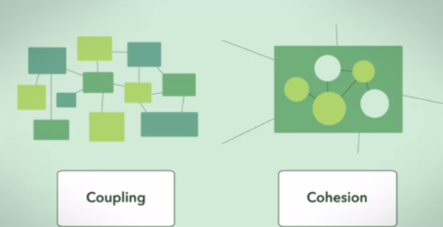

# 의존성 응집도, 결합도

## 의존성

객체 A 입장에서 객체 B의 존재를 알고 있을 때, "객체 A는 객체 B에 의존성이 있다." 라고 합니다.  
의존성은 크게 2가지로 나눠볼 수 있습니다.

## 정적 의존성

코드 레벨에서 객체 A 내에서 객체 B에 접근하는 경우입니다. 다음 예시를 보겠습니다.

```python
from abc import ABC, abstractmethod

class Job(ABC):
    @abstractmethod
    def do(self) -> None:
        pass

class DataEngineer(Job):
    def do(self) -> None:
        print(f"데이터 엔지니어링 관련된 일을 합니다.")

class User:
    def __init__(self, name: str, job: DataEngineer) -> None:
        self.name = name
        self.job = job

    def work(self) -> None:
        self.job.do()
```

위 코드에서 User의 생성자(`__init__(self) 메서드`)에서 DataEngineer 객체를 파라미터로 받고 있습니다.  
즉, User가 DataEngineer 이라고 하는 객체의 존재를 알고 있는 것입니다. 이처럼 코드 레벨에서 직접적으로 두 객체의 의존 관계를 파악할 수 있을 때, 정적 의존성이 있다고 합니다. 컴파일 의존성이라고도 합니다.

위의 경우 User 객체가 DataEngineer 객체가 정적 의존성이 있습니다.

### 동적 의존성

코드 레벨에서 의존성이 드러나지 않지만, 실제 실행 과정에서 두 객체 간 의존 관계가 있을 때 동적 의존성 관계에 있다고 합니다. 다음 예시를 보곘습니다.

```python
from abc import ABC

class Job(ABC):
    def do(self) -> None:
        print(f"{self.work_type} 관련된 일을 합니다.")

class DataEnginner(Job):
    work_type = "데이터 엔지니어링"

class ProjectManager(Job):
    work_type = "프로젝트 매니징"

class User:
    def __init__(self, name: str, job: Job) -> None:
        self.name = name
        self.job = job

    def work(self) -> None:
        self.job.do()

```

위 코드에서 User 객체는 Job 객체(인터페이스)에 정적인 의존성이 있습니다. DataEnginner, ProjectManager 에는 의존성이 없습니다.

하지만 다음처럼 실제 코드가 실행할 때 User 에 DataEnginner 나 ProjectManager 에 의존성이 있도록 만들어 줄 수 있습니다.

```python
>>> user_1 = User(name="grab", job=DataEnginner())  # 여기서 동적으로 의존성을 만들어줍니다.
>>> user_1.work()

"데이터 엔지니어링 관련된 일을 합니다."
```

만약 ProjectManager 로 의존성을 주고 싶으면 다음처럼 하면 됩니다.

```python
>>> user_2 = User(name="grab", job=ProjectManger()) # 여기서 동적으로 의존성을 만들어줍니다.
>>> user_2.work()

"프로젝트 매니저 관련된 일을 합니다."
```

동적 의존성은 이렇게 코드 레벨이 아닌 실제 실행 환경에서 동적으로 의존 관계를 형성할 수 있는 의존성을 말합니다.  
보통 위와 같이 추상 클래스 혹은 인터페이스를 파라미터 타입으로 두고 (`def __init__(self,name: str, job: Job` 부분) 실제로 위 클래스를 생산할 때 구체적인 클래스를 인자로 넘겨주는 방식(`User(name="grab", job=DataEnginner`)으로 동적 의존성을 구현하곤 합니다.

# 결합도 (Coupling) 와 응집도(Cohesion)



객체 지향에서 좋은 설계란 무엇일까요? 흔히들 좋은 설계란 "낮은 결합도와 높은 응집도를 가진 설계" 라고 말하곤 합니다. 그렇다면 결합도와 응집도란 무엇일까요?

## 응집도

객체의 책임을 맞게 속성과 메서드가 유기적으로 결합되어 있는 정도를 `응집도`라고 합니다.

객체는 하나의 책임(SRP)을 수행하도록 잘 설계되어야 합니다. 그래야 중구난방으로 객체가 존재하지도
