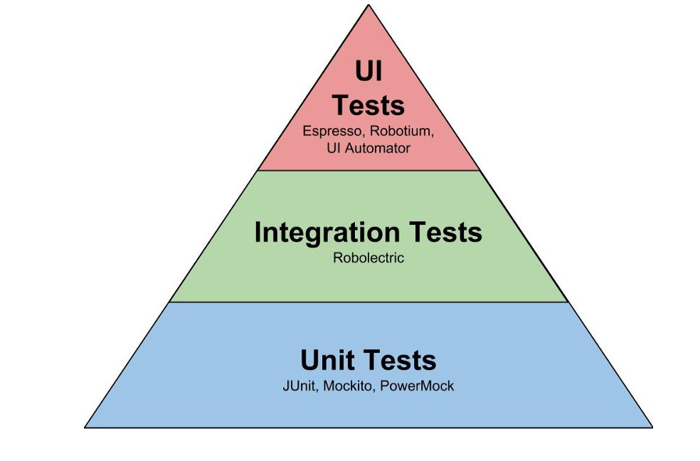
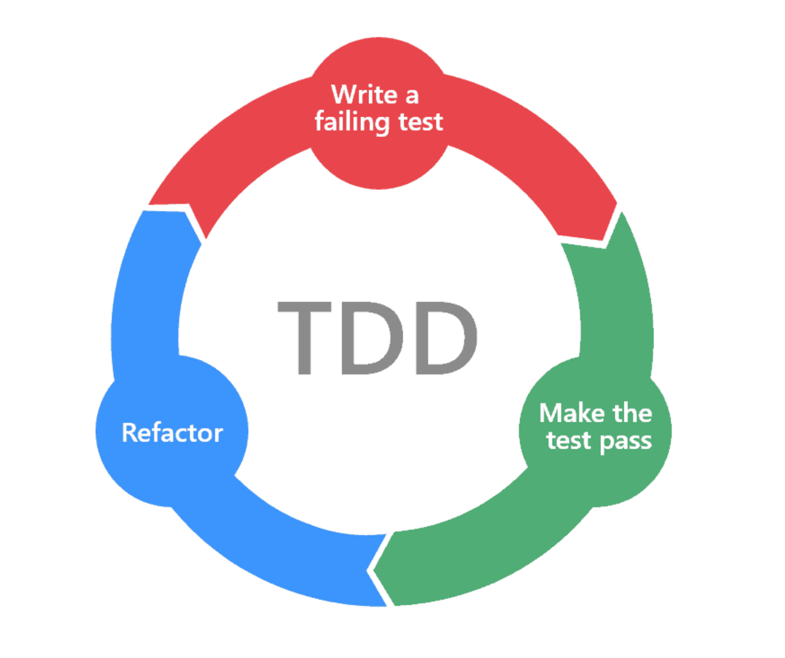

# 견고한 서시브를 위한 테스트 코드 작성하기

## 테스트 기본 이해하기

### 개념

테스트는 이름 그대로, 소프트웨어를 테스트하는 작업입니다.  
소프트웨어에 숨겨진 버그는 없는지, 여러 명이 동시에 이용할 때에도 잘 견디는지 등의 문제들을 꼼꼼히 점검하는 일입니다. 테스트를 거치지 않은 소프트웨어는 일반적으로 신뢰하기 어렵습니다. 실시간으로 언제 어디서 버그가 나올지 모릅니다.

이떄 테스트 코드를 잘 작성해 둔다면, 버그에 견고한 코드를 작성할 수 있습니다. 같은 팀 개발자는 테스트를 보는 것만으로도 프로젝트의 전체적인 기능과 구조를 파악할 수 있게 됩니다.

### 테스트 종류

개발자가 가장 많이 마주하게 되는 테스트는 크게 세 가지로 아래와 같습니다.



- 유닛 테스트
  - 유닛(Unit)이라는 말 그대로, 가장 작은 단위의 테스트입니다.
  - 코드의 함수, 클래스의 메소드가 잘 작동하는지 확인합니다.
  - 테스트하고자 하는 코드는 다른 외부 컴포넌트(웹 서버, DB 등)에 의존성이 없어야합니다.
  - 가장 간단하고, 직관적이며, 빠르게 실행과 결과를 볼 수 있는 테스트입니다.

- 통합 테스트
  - 통합(Integration) 이라는 말 그대로, 여러 요소를 통합한 테스트를 말합니다.
  - 데이터베이스와 연동한 코드가 잘 작동하는지, 여러 함수와 클래스가 엮인 로직이 잘 작동하는지 등을 확인합니다.
  - 유닛 테스트 보다는 복잡하고 느리지만, 소프트웨어는 결국 여러 코드 로직의 통합이라는 점에서 통합 테스트 역시 중요합니다.

- E2E 테스트
  - E2E는 End To End의 약자로, 끝에서 끝, 즉 클라이언트 입장에서 테스트해보는 것입니다.
  - 예를 들어 쇼핑몰 웹사이트의 경우 /login 으로 POST 요청 시 로그인이 잘 되는지, /order 로 POST요청시 주문 결과는 잘 나오는지 등을 확인합니다.
  - 보통 유저 시나리오에 따라 테스트합니다.
  - 테스트 중 가장 느리지만, 결국 소프트웨어를 사용하는 건 유저이고, 유저 입장에서 해보는 테스트이므로, 역시 중요하다고 할 수 있습니다.


보통 테스트는 유닛 -> 통합 -> E2E 순으로 작성하게 됩니다.(꼭 정답이 있는건 아닙니다) 작은 단위부터 테스트를 작성하면서 점점 통합적인 테스트를 진행하게 됩니다.

테스트 개수는 가장 작은 테스트인 유닛 테스트가 가장 많고, E2E 테스트가 가장 적게 됩니다.

> 유닛 테스트로 추후에 어떠한 컴포넌트의 기능이 문제가 있는지 빠르게 찾아낼 수 있습니다. 한편 통합테스트로 프로그램의 로직 흐름에 이상이 없는지를 파악할 수 있습니다. E2E 테스트는 최종적으로 사용자 관점에서 사용하기에 기능적인 문제가 없는지 진행하는 테스트로 정리할 수 있습니다.

### 테스트 코드

그런데 어떻게 테스트를 해볼 수 있을까요?

테스트 역시 코드로 구현할 수 있습니다. 이 강의에서는 파이썬 대표적인 테스트 프레임 워크인 `pytest`를 사용하겠습니다.

```
$ pip install pytest
```

파일 이름은  test_ 를 앞에 붙이고 테스트할 파일이름을 붙인다.

```python
# test_example.py

def add(a, b):
    return a + b


# 테스트 코드를 사용하기 전
if __name__ == "__main__":
    print(add(1,2) == 3)
    print(add(1,2) == 4)


# 테스트 프레임워크 사용할떄,
# add 함수에 대한 테스트 코드로 남게 된다.
def test_add():
    a, b = 1, 2
    assert add(1, 2) == 3

```

- 실행 방법

```
$ python -m pytest test_example.py
```


### 테스트 코드가 필요한 이유

테스트 코드는 프로젝트의 코드를 테스트하기 위해 필요합니다. 하지만 테스트 코드는 단순히 테스트 실행 말고도 다음처럼 더 큰 의미들이 있습니다.

- 테스트 코드는 코드가 동작하기 위해 필요한 것들과 입/출력을 드러냅니다.
  - 테스트는 테스트하고자 하는 코드의 클라이언트 중심으로 작성합니다. 즉 테스트하고자 하는 코드를 사용하려면 어떤 의존성이 필요한지, 어떤 입력을 주면 어떤 출력을 뱉는지 테스트 코드를 보면 알 수 있습니다.
  - 따라서 `테스트 코드는 프로젝트 코드에 대한 가장 정확한 문서가 됩니다.` 테스트 코드만 보면, 코드를 돌리는데 필요한 것들을 알 수 있기 떄문입니다.
  - 이런 맥락에서, 누군가 개발한 코드를 볼 때 테스트 코드를 먼저 보면 로직을 파악하는데 도움이 많이 됩니다. 테스트 코드는 이렇게 다른 개발자들을 위한 일종의 배려이기도 합니다.

- 테스트 코드는 리팩토링과 지속적인 개발을 위해 필수적입니다.
  - 테스트 코드 없이 개발을 계속해서 해나가면, 추가로 개발한 코드가 기존 코드의 어떤 사이드 이펙트를 불러일으키는지 확인하기 어렵습니다.
  - 테스트 코드를 만들어두면, 추가로 코드를 개발할 때마다, 기존 테스트 코드를 모두 실행함으로써 기존 코드의 작동 여부에 사이드 이펙트가 있는 지 빠르게 확인할 수 있습니다.
  - 이런 맥락에서, 테스트 코드는 일종의 안전망입니다. 테스트 코드 없이 개발을 계속해나가면 매번 리팩토링 기능 개발을 할 때마다 마음을 줄이게 됩니다.


## 종류별 테스트 작성하기

시나리오로 간단한 쇼핑몰 웹 사이트에서 백엔드의 로그인 기능을 개발하고 있다고 가정하겠습니다.

### 유닛 테스트

로그인 기능에는 다음처럼 로그인 인증을 마친 유저에게 응답으로 줄 토큰을 생성하는 함수를 사용합니다.

```python
def create_token(user_id: str) -> str:
    return user_id + "_verified"
```

<br>

> 물론 실제로 토큰 발급을 절대 위와 같이 하지 않습니다. 코 예제를 심플하게 가져가기 위해서 간략히 표현헀습니다.

<br>

유닛 테스트는 함수나 메서드 같이 작은 단위의 코드에서 입출력의 결과가 올바른지를 확인하는 테스트입니다. 위 함수는 유닛 테스트를 하기 좋은 대상입니다.  
다음처럼 유닛 테스트 코드를 작성해볼 수 있습니다.

```python
def test_create_token():
    actual = create_token("grab")
    expected = "grab_verified"
    assert actual == expected
```

### 통합 테스트

로그인 기능에는 다음처럼 로그인 로직을 수행하는 함수를 사용합니다.

```python
def login(user_id: str, user_password: str) -> str:
    user_repository = UserRepository() # DB와 연동되어 User 정보를 저장하고 불러오는 객체
    user = user_repository.find_by_id(user_id)
    if user.id == user_id and user.password == user_password:
        return create_token(user_id)
    else:
        return Exception("로그인 인증에 실패했습니다")
```

통합 테스트는 여러 요소를 통합한 프로세스를 검증하는 테스트라고 했습니다. `login()` 함수는 `user_repository` 와 `create_token()` 에 의존하고 있는 통합적인 로직을 가진 함수입니다. 이 함수에 대해 다음처럼 통합 테스트 코드를 작성해 볼 수 있습니다.

```python
def test_login_successful():
    # given
    user_id = "grab"
    user_password = "1234"

    # when
    actual = login(user_id, user_password)

    # then
    assert actual == "grab_verified"

def test_login_failed():
    # given
    user_id = "grab"
    user_password = "wrong password"

    # when % then
    with pytest.raises(Exception):
        login(user_id, user_password)
```

위 코드가 성공하려면 `login()` 함수 내부의 `UserRepository` 인스턴스와 `create_token()` 함수 역시 잘 작동해야 합니다. 이처럼 통합 테스트는 의존성 있는 객체들의 정상 작동 여부까지 포함하는 테스트입니다.

일반적으로 통합테스트는 외부 의존성을 포함하고 있는 경우가 많습니다. 하지만 테스트 환경은 운영 환경과 분리되어야 합니다. 예를 들어, 테스트 코드를 실행할 때 운영DB에 연동하면 안됩니다.

따라서 테스트에서 재현할 수 없는 의부 의존성(운영 데이터베이스, 운영 API 서버 등)은 테스트 더블을 사용합니다.


## E2E 테스트

실제로 유저는 HTTP 요청으로 로그인을 요청하게 됩니다. 따라서 애플리케이션은 다음과 같은 웹 인터페이스를 제공해야 합니다.

```python
from fastapi import FastAPI

app = FastAPI()

class LoginRequest(BaseModel):
    id: str
    password: str

@app.get("/login")
def login_endpoint(req: LoginRequest):
    token = login(user_id=req.id, user_password=req.password)
    return {
        "token": token
    }
```

E2E 테스트는 최종 사용자 입장에서의 테스트입니다. 다음처럼 서버를 `localhost:8000` 에 실행시킨 상황이라고 생각하고, 서버에 요청을 로그인 요청을 보내고 응답받는 테스트 코드를 작성합니다.

```python
import requests

def test_login_endpoint():
    # given
    api_host = "localhost:8000"
    payload = {
        "id": "grab",
        "password": "1234"
    }

    # when
    res = requests.post(url=f"{api_host}/login", json=payload)

    # then
    assert res.data() == {
        "token": "grab_verified"
    }
```

위 테스트 코드가 성공하려면 `localhost:8000`에 실행한 서버가 잘 작동 되어야 합니다. 이처럼 E2E 테스트는 서버 내부 동작은 전혀 관여하지 않은 채, 철저히 엔드 유저 입장에서 서버를 이용하는 시나리오 대로 테스트해보는 것입니다. 

## 의존성을 대체하는 테스트 더블

### 기존 테스트의 문제

테스트 더블은 테스트할 로직에서 의존하고 있는 객체를 대체해주는 객체입니다.  
위의 예시 코드 중 `login()` 함수 내 로직을 다시 보죠

```python
def login(user_id: str, user_password: str) -> str:
    user_repository = UserRepository() # DB와 연동되어 User 정보를 저장하고 불러오는 객체
    user = user_repository.find_by_id(user_id)
    if user.id == user_id and user.password == user_password:
        return create_token(user_id)
    else:
        raise Exception("로그인 인증에 실패했습니다.")
```

위의 코드는 `UserRepository` 객체를 의존하고 있습니다. `UserRepository` 객체는 DB와 연결을 맺어 데이터를 저장하고, 불러오는 객체로 DB가 먼저 실행된 상태여야 정상적으로 작동합니다. 즉 `UserRepository` 객체는 외부 DB에 의존성이 있습니다.

따라서 위 `login()` 함수를 정상적으로 테스트하려면 DB가 어딘가에 실행된 상태여야 하고, `UserRepository` 역시 문제없이 잘 작동하는 상태여야 합니다. 이처럼 로직이 다른 객체들과 외부 컴포넌트(DB 등)을 의존하게 되면 테스트를 실행하는데 신경 써야 할 것들이 생기게 됩니다. 단적으로 DB가 어딘가에서 실행되어 있지 않으면 작성했던 통합 테스트 코드를 정상적으로 실행 시킬 수 없습니다.

### 테스트 더블 적용하기

테스트 더블은 이런 의존성 객체들을 "대체" 함으로써 테스트를 좀 더 원활하게 진행하기 위한 객체입니다.  
예를 들어 위에서 `UserRepository` 객체는 테스트 코드에서 다음과 같은 `FakeRepository` 라는 페이크 객체로 대체할 수 있습니다.

```python
class FakeReposutory(Repository):
    """ DB를 이용하지 않고, 인메모리로 데이터를 저장하고 불러냅니다. """

    def __init__(self, data: Dict(str,User)) -> None:
        self.data = data

    def find_by_id(id: str) -> Optional(User):
        return self._data.get(id, None) 
```

login() 함수를 좀 더 테스트 하기 수비게 만들기 위해, 의존하는 객체를 함수 내부에서 직접 생성하지 않고, 외부에서 파라미터로 주입받도록 수정합니다.

```python
def login(user_id: str, user_password: str, repository: Repository) -> str:  # repository 의존성
    user = repository.find_by_id(user_id)
    if user_id == user.id and user.password == user_password:
        return create_token(user_id)
    else:
        raise Exception("로그인 인증에 실패했습니다.")
```

이제 테스트 코드는 다음처럼 `FakeRepository`를 이용하여 작성할 수 있다.

```python
def test_login_successful():
    # given
    repository = FakeRepository(data={
        "grab": {
            "id": "grab",
            "password": "1234"
        }
    })
    user_id = "grab"
    user_password = "1234"

    # when
    actual = login(user_id, user_password, repository) # 테스트 더블 객체를 주입합니다.

    # then
    assert actual == "grab_verified"
```

이제 테스트 코드는 DB에 대한 의존성이 없는 상태로 테스트가 가능합니다. 위 예시 코드에서 우리가 사용한 더블은 fake object입니다.

### 테스트 더블의 종류

위 테스트에서는 외부 의존성을 대체하기 위해 테스트 더블 중 하나인 페이크 객체로 구현하였습니다.  
테스트 더블은 이 외에도 대표적으로 다음과 같은 종류가 있습니다.

#### dummy

- 실제로 내부 동작은 구현하지 않은 채, 객체의 인터페이스만 구현한 테스트 더블 객체입니다.
- 메서드가 동작하지 않아도 테스트에 문제가 없을 때 사용합니다.

```python
class DummyRepository(Repository):
    def insert(self, data):
        return True
    
    def find_by_id(self, user_id):
        return "grab"
```

#### stub

- dummy 테스트 더블 객체에서 테스트에 필요한 최소한의 구현만 해둔 더블 객체입니다.
- 테스트에서 호출될 요청에 대해 미리 준비해둔 결과만을 반환합니다.

```python
class StubUserRepository(Repository):
    def insert(self, data):
        return "OK"

    def findById(self, user_id):
        return {"id": user_id, "name": "test_grab", ...}
```


#### spy

- stub에서 테스트에 필요한 정보를 기록해두는 테스트 더블 객체입니다.
- 보통 stub의 역활을 포함합니다.
- 실제로 내부가 잘 동작했는지 등을 별도의 인스턴스 변수로 기록해둡니다.

```python
class SpyUserRepository(Repository):
    insert_called=0

    def insert(self, data):
        SpyUserRepository.insert_called += 1
        return "OK"

    @property
    def get_insert_called(self):
        return SpyUserRepository.insert_called
    
    ...
```

#### fake

- 동작의 구현은 갖추고 있지만, 테스트에서만 사용할 수 있는 테스트 더블 객체입니다.
- 대체할 객체가 복잡한 내부 로직이나 외부 의존성이 있을 때 사용합니다.

```python
class FakeUserRepository(Repository):
    def __init__(self):
        self.users = []

    def insert(self, data):
        self.users.append(data)

    def find_by_id(self, user_id):
        return [user for user in self.users if user.id == user_id]
```

#### mock

- 테스트에 필요한 인터페이스와 반환값을 제공해주는 객체입니다.
- 해당 메서드가 제대로 호출됐는지를 확인하는 `행위 검증`의 기능을 가집니다.
- 다른 테스트 더블과 다르게 보통은 객체의 직접 정의하지 않고, 보통 `Mock` 객체로 반환 값을 미리 지정해둡니다.
  - 대부분의 테스트 프레임워크 Mocking을 정밀하게 할 수 있도록 지원해줍니다.

```python
@mock.path.object(UserRepository, 'insert')
def test(insert_method):
    insert_method.return_value = "OK" # stub처럼 기대값을 반환합니다.
    insert_method({"id": 1, "name":"grab"})
    insert_method.assert_called_once() # 해당 메서드가 호출되었는지를 확인한다.(행위 검증)

# 서드 파티 라이브러리에 mocking하는 사례를 추가헀습니다.
@mock.patch("requests.get")
def test_get_user(mock_get):
    response = mock_get.return_value # 해당 mock 객체를 받아 자유롭게 mocking 합니다.
    response.status_code = 200
    response.json.return_value = {
        "name": "Test User",
        "email": "user@test.com"
    }
    user = get_user(1)

    assert user["name"] == "Test User"
    # 해당 메서드와 인자가 제대로 불렀는지 행위를 검증합니다.
    mock_get.assert_called_once_with("https://api-server.com/users/1")
```

> TIP  
> 테스트 더블의 종류를 외울 필요는 절대 없습니다. 서로 개념적으로 비슷한 부분들이 많기 떄문에 현업에서도 여러 용어로 부르곤 합니다.

## TDD 기본 개념 익히기

### TDD 정의

TDD(Test Driven Developement)는 테스트가 개발을 이끌어가는 방법론입니다. 즉, 테스트가 개발보다 선행하게 됩니다.

개발해야 하는 사항을 미리 정의하고, 각 기능의 입/출력을 미리 정한 뒤, 기능을 구현하는 프로세스는 아주 일반적인 개발 과정입니다. 이떄 TDD 방식으로 개발하게 된다면, 테스트 코드를 먼저 작성함으로써 개발사항과 각 기능의 입/출력 요구사항을 코드로 문서화 한 후 기능을 개발하게 됩니다.

### TDD 예제

간단하게 실습해 보겠습니다.

간단한 쇼핑몰 웹사이트의 백엔드 서버에서 로그인기능을 개발하는 상황을 가정하겠습니다. 다음과 같은 요구사항이 있습니다.

- `POST /login` 으로 `user_id` 와 `user_password` 를 json을 실어 요청하면, `token`을 응답받아야 합니다.
- `token`은 `user_id`에 `"_verifed"`가 붙은 문자열입니다.

이제 위 요구상항 구현을 TDD로 진행해봅시다.

1. 테스트 작성하기

위 요구 사항을 테스트 코드로 작성하면 다음과 같습니다.

```python
import request

def test_login_endpoint():
    # given
    api_host = "http://localhost:8000"

    payload = {
        "id": "grab",
        "password": "1234"
    }

    # when
    res = requests.post(url=f"{api_host}/login", json=payload)

    # then
    assert res.data() == {
        "token": "grab_verified"
    }
```

이 테스트 코드를 실행하면 당연히 실패할 것입니다. 아직 저희는 테스트 코드만 작성하고, 테스트할 대상을 작성하지 않았기 때문입니다.

2. 테스트 대상 구현하기

이제 테스트할 대상인 서버를 구현해봅니다.

```python
from fastapi import FastAPI
from dataclasses import dataclass

app = FastAPI()

@dataclass
class LoginRequest:
    id: str
    password: str

@app.post("/login")
def login(req: LoginRequest):
    user_id = req.id
    user_password = req.password

    user_repository = UserRepository() # DB와 연동되어 User 정보를 저장하고 불러오는 객체
    user = user_repository.find_by_id(user_id)

    if user_id == user.id and user.password == user_password:
        return create_token(user_id)
    else:
        raise Exception("로그인 인증에 실패했습니다.")
```

테스트가 통과하도록 서버 로직을 구현했습니다. 이제 서버를 실행 시킨 뒤, 테스트 코드를 실행하면 테스트는 성공할 것입니다.

3. 테스트 대상 리팩토링하기

테스트는 성공해서 모든 일이 끝난 것처럼 보입니다. 하지만 위 서버 코드는 현재 하나의 모듈에 너무 많은 내용을 담고 있는 것 같아, SRP 원칙에 위배됩니다. 기존 코드를 좀 더 구조적으로 리팩토링하고 싶습니다. 그래서 다음처럼 코드를 분리해보려고 합니다.

- http 요청과 응답을 주고 받는 책임을 담당하는 함수
- 로그인 로직을 실행을 담당하는 함수
- 토큰 생성 로직을 담당하는 함수

먼저 "로그인 로직을 실행을 담당하는 함수"를 `login()`으로 정의해봅니다. 테스트 코드로 `login()` 함수의 입/출력을 정의하는 것으로 시작합니다.

```python
def test_login_successful():
    # given
    user_id = "grab"
    user_password = "1234"

    # when
    actual = login(user_id, user_password)

    # then 
    assert actual == "grab_verified"


def test_login_failed():
    # given
    user_id = "grab"
    user_password = "wrong password"

    # when & then
    with pytest.raise(Exception):
        login(user_id, user_password)    

```

아래 login() 함수를 함수를 구현하지 않았기 때문에 두 테스트는 실패합니다.  
이제 login 함수를 다음처럼 구현합니다.

```python
def login(user_id: str, user_password: str) -> str:
    user_repository = UserRepository() # DB와 연동되어 User 정보를 불러오는 객체
    user = user_repository.find_by_id(user_id)
    if user_id == user.id and user.password == user.password:
        # 토큰 생성 로직은 create_token() 함수에 위임합니다.
        return create_token(user_id)
    else:
        raise Exception("로그인 인증에 실패합니다")
```

마지막 "토근 생성 로직을 담당하는 함수"를 create_token() 으로 정의해봅니다. 마찬가지로 테스트 코드로 create_token() 함수의 입/출력 정의하는 것으로 시작합니다.

```python
def test_create_token():
    actual = create_token("grab")
    expected = "grab_verified"
    assert actual == expected
```

이제 create_token() 함수의 구현을 작성해 봅니다.

```python
def create_token(user_id: str) -> str:
    return user_id + "_verified"
```

마지막으로 http 요청과 응답을 주고 받는, 기존 login_endpoint 함수를 리팩토링 합니다.

```python
from fastapi import FastAPI
from dataclass import dataclass

app = FastAPI()

@dataclass
class LoginRequest:
    id: str
    password: str

@app.post("/login")
def login_endpoint(req: LoginRequest):
    # 로그인 로직은 login() 함수에 위임합니다.
    token = login(user_id=req.id, user_password=req.password)
    return {
        "token" :token
    }

```

이제 모두 구현을 하였기 떄문에 성공이 나옵니다.

> TIP  
> 예시에서 코드를 Top-Down 방식으로 작성하였습니다. Bottom-Up 방식으로 내부 로직부터 코드를 작성하는 방식으로도 진행할 수 있습니다.


### TDD와 레드-그린-리팩토링



위 예제에서 우리가 진행한 방식은 TDD 에서는 말하는 "레드-그린-리팩토링" 입니다. 레드-그린 리팩토링의 과정은 다음과 같습니다.

1. 테스트를 먼저 작성합니다.
   - 테스트할 대상은 아직 구현되지 않았으므로, 테스트는 실패합니다.(실패는 보통 빨간색으로 표현됩니다.)

2. 테스트가 통과되도록 코드를 작성합니다.
   - 구현이 완료되면 테스트는 성공합니다.(성공은 보통 초록색으로 표현합니다.)

3. 기존 코드를 필요에 따라 리팩토링합니다.
   - 리팩토링은 기존 동작에 영향을 주면 안됩니다. 다시말하면, 입/출력은 변하지 않고, 내부적인 동작만 바꾸어야합니다.
   - 리팩토링은 종종 사이드 이팩트를 불러오기도 합니다.
   - 하지만 테스트 코드로 이런 사이드 이펙트를 확인할 수 있습니다. 리팩토링하다가 동작에 문제가 생긴다면, 테스트는 실패할 것입니다.
   - 한편, 리팩토링을 성공적으로 했다면 기존 테스트 역시 성공했습니다.

이처럼 TDD를 하게 되면 실패 -> 성공 -> 리팩토링의 순환을 가지는 "레드-그린-리팩토링" 순서로 개발을 진행하게 됩니다.

> 로버트 마틴의 TDD의 3가지 원칙
> 1. 실패한 단위 테스트를 만들기 전에 제품 코드를 만들지 않는다.
> 2. 컴파일이 안되거나 실패한 단위 테스트가 아직 있으면 더 이상 단위 테스트를 만들지 않는다.
> 3. 실패한 단위 테스트를 통과하는 이상의 제품 코든느 만들지 않는다.

### TDD의 장단점

TDD로 인한 장점은 다음과 같습니다.

- 개발하고자 하는 대상에서 기대하는 것을 테스트 코드로 미리 명확하게 정의할 수 있습니다.
  - 소프트웨어를 개발할 때 중요한 것은 이 소프트웨어가 "어떻게"가 돌아가느냐가 아니라 "무엇을" 제공해줄 것이냐 입니다.
  - 테스트 코드로 먼저 작성하면 입/출력과 발생하는 예외를 무엇으로 정의해야 할지 먼저 명확하게 정의할 수 있습니다.
  - 덕분에 좀 더 사용하는 쪽의 코드나 사람 입장에서 사용하기 좋은 좋은 코드를 작성할 수 있게 됩니다.

- 테스트를 훨씬 꼼꼼히 작성하게 됩니다.
  - 테스트 코드는 사실 작성하기 번거로운 존재입니다. 특히 구현을 먼저하고 테스트를 작성하면, 테스트 작성에 느슨해지고, 자칙 에외나 몇몇 시나리오에 대한 테스트를 놓칠 수 있습니.
  - TDD로 진행하게 되면, 테스트를 먼저 작성하기 떄문에, 테스트 코드를 누락시킬 빈도가 낮아집니다.
  - 테스트 코드가 탄탄하게 있기 떄문에, 리팩토링도 겁먹지 않고 진행할 수 있습니다.

- 테스트 코드가 깔끔한 코드 사용 문서가 됩니다.
  - TDD에서 테스트 코드는 테스트할 대상의 구현을 모른 채 작성되기 떄문에, 철저히 사용자 중심적으로 작성됩니다.
  - 따라서 테스트 코드는 코드를 사용하기 위해 필요한 최소한의 내용만 담게 됩니다.

TDD로 인한 단점은 다음과 같습니다.

- 테스트가 가능하도록 코드를 설계하는 것은 어렵습니다.
  - TDD를 진행하게 되면 모든 코드들을 테스트 가능하도록 설계해야합니다.
  - 테스트 가능하도록 코드를 설계하려면, 추상화, 의존성 주입 등을 잘 활용해야 합니다.
  - 또한 테스트 환경을 제대로 구축하는 것( Docker compose, DB 데이터 초기화 등 )의 작업은 꽤나 번거롭습니다.

- 익숙하지 않은 채 TDD를 진행하면, 개발 프로세스가 느려질 수 있습니다.
  - 위에서 말했듯, 테스트 가능한 코드의 테스트 환경을 만드는 것 자체가 어려운 일입니다.
  - 구현 로직보다 테스트 코드를 작성하고 고민하는데 훨씬 시간이 많이 들 수 있습니다.


## 정리 

- TDD 는 테스트가 구현을 선행하는 개발프로세스입니다.
- TDD를 하게 되면 보통 레드-그린-리팩토링 순서로 개발을 진행하게 됩니다.
- TDD를 하면 꼼꼼한 테스트를 통해 코드 품질과 테스트 코드의 문서화 품질이 올라갑니다.
- 하지만 그만큼 테스트 가능한 코드와 테스트 환경을 갖추는 일은 어렵습니다.
