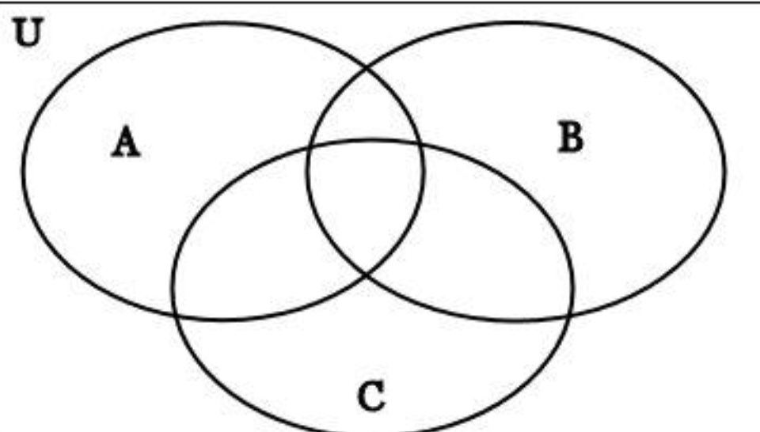

# 집합

- 특정 조건에 맞는 원소들의 모임
- 집합 표현 방법
  - 원소 나열법
    - A = {1,2,3,4,5}, B = {2,4,6,8,10}
  - 조건제시법
    - A = {A|A는 정수, 1 <= A <= 5}
    - B = {2B| B는 정수, 1 <= B <= 5
  - 밴 다이어그램

## 교집합

- 두 집합이 공통으로 포함하는 원소로 이루어진 집합

## 합집합

- 어느 하나에라도 속하는 원소들을 모두 모든 집합

## 차집합

- A or B 에만 속하는 원소들의 집합

## 여집합

- 전체집합(U) 중 A의 원소가 아닌 것들의 집합