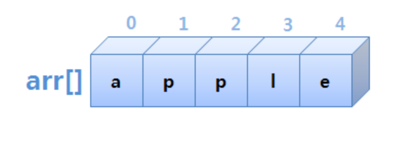

# 배열 ( Array )

- 많은 수의 데이터를 다룰 때 사용하는 자료구조
- 각 데이터를 인덱스와 1:1 대응하도록 구성
- 데이터가 메모리 상에 연속적으로 저장됨

## 배열의 장점

- 인덱스를 이용하여 데이터에 빠르게 접근 가능

- arr[0] -> 'a'
- arr[1] -> 'b'
- arr[2] -> 'c'

## 배열의 단점

- 데이터의 추가/ 삭제가 번거로운 편
  - 미리 최대 길이를 정해서 생성해야 함
  - 가변 길이 배열은 배열의 크기를 변경할 떄마다 새로운 배열을 생성
  - 데이터 삭제 시, 인덱스를 유지하기 위해 빈 공간 유지

