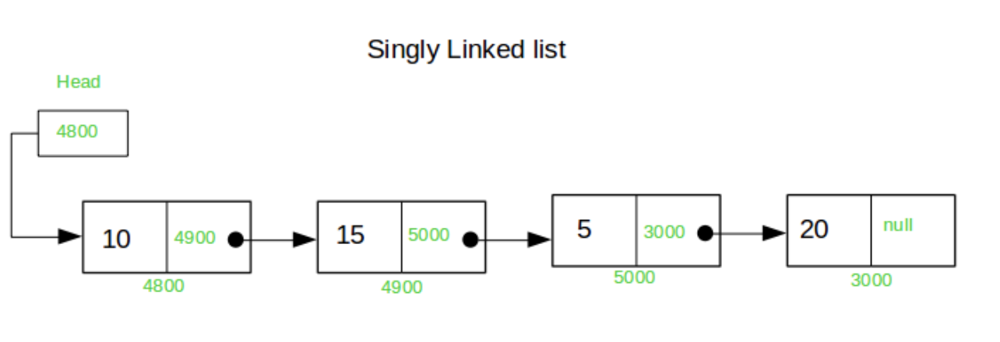

# 연결리스트 (Linked List)

- 데이터를 링크로 연결해서 관리하는 자료구조  
- 자료의 순서는 정해져 있지만,  
메모리상 연속성이 보장되지 않음

## 연결 리스트의 장점

- 데이터의 공간을 미리 할당할 필요 없음
- 즉, 리스트의 길이가 가변적이라 데이터 추가/삭제 용이

## 연결리스트의 단점

- 연결구조를 위한 별도 데이터 공간 필요
- 연결 정보를 찾는 시간이 필요(접근 속도가 상대적으로 느림)
- 데이터 추가, 삭제 시 앞뒤 데이터의 연결을 재구성하는 작업 필요

## 연결리스트 기본 구조

- 노드 (Node)
  - 데이터 저장 단위로, 값과 포인터로 구성

## 연결 리스트 기본 연산

- 데이터 추가
  - 데이터 추가 위치(head, 중간 ,tail)에 따른 연결 작업 필요

- 데이터 맨 앞에 추가시

1. 추가할 데이터를 담을 노드 생성
2. 링크 연결 작업
3. head 이전 작업

- 중간에 데이터 추가 시

1. 추가할 데이터를 담을 노드 생성
2. head로 부터 데이터 추가 위치 직전 노드까지 순회
3. 링크 연결 작업

- 데이터 삭제
  - 데이터 삭제 위치(head, 중간, tail)에 따른 연결 작업 필요

- 위 연결 리스트의 가장 앞의 데이터 삭제 시,

1. 삭제 대상 노드 지정(delete node)
2. head 이전 작업
3. delete_node 삭제

- 연결 리스트의 가장 끝의 데이터 삭제 시

1. head로 부터 가장 끝까지 순회
2. 끝 노드 삭제
3. 삭제 이전 노드의 링크 처리

- 위 연결 리스트의 중간 데이터 삭제 시,

1. head로부터 삭제 대상 노드까지 순회 및 해당 노드 지정(delete_node)
2. 삭제 대상 이전/이후 노드의 링크 연결 작업
3. delete_node 삭제