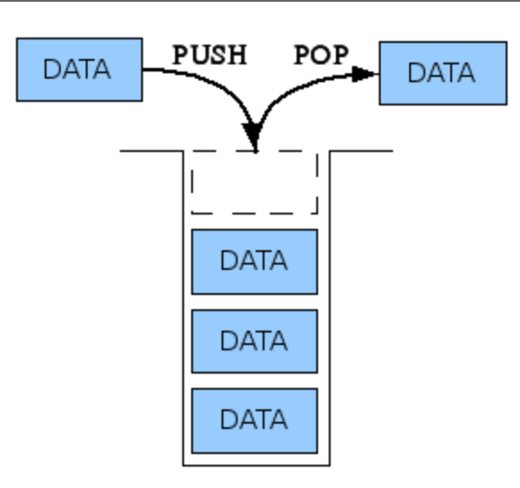

# 자료구조- 1

## 스택 (Stack)

- 스택은 한쪽 긑에서만 자료를 넣고 뺼 수 있는 자료구조이다.



### 스택의 구현

- 일차원 배열 하나로 구현할 수 있다.

기본 값 세팅
```java
int stack[10000];
int size = 0;
```

push 
```java
void push(int data) {
    stack[size] = data;
    size += 1;
}
```

pop
```java
int pop() {
    stack[size-1] = 0;
    size -= 1;
}
```

스택은 LIFO ( Last In First Out ) 의 특징을 가지고 있다.

