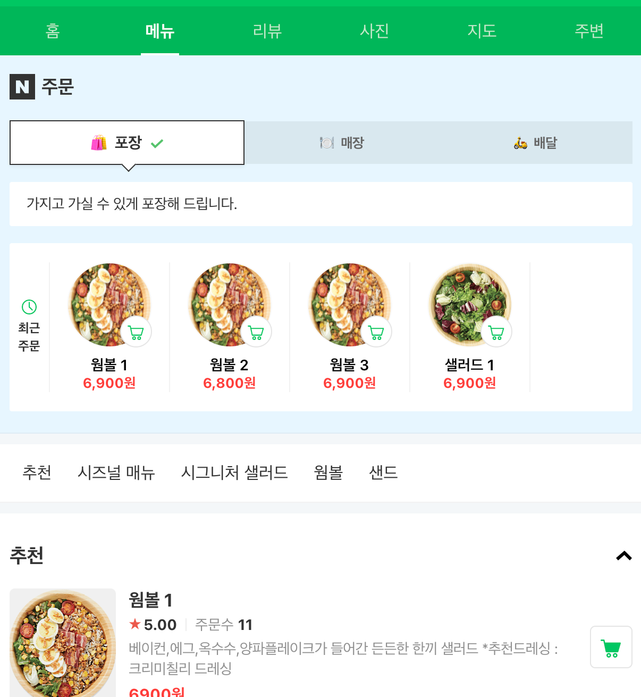
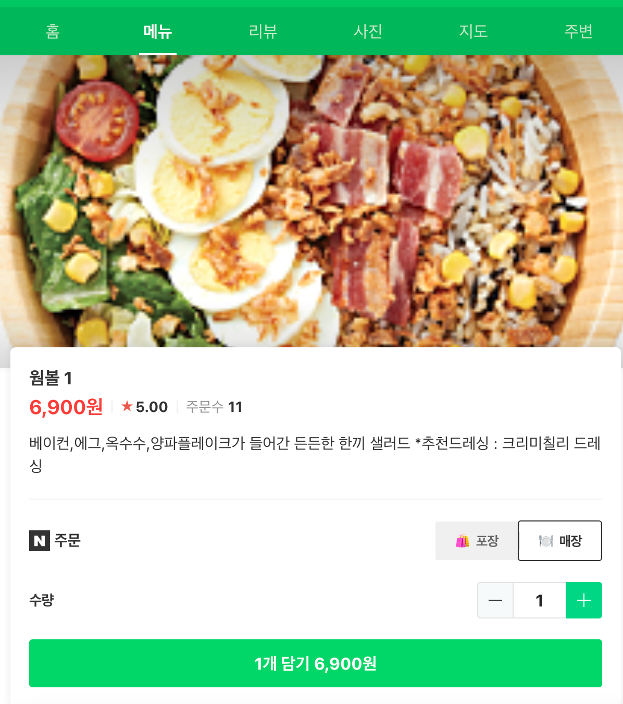
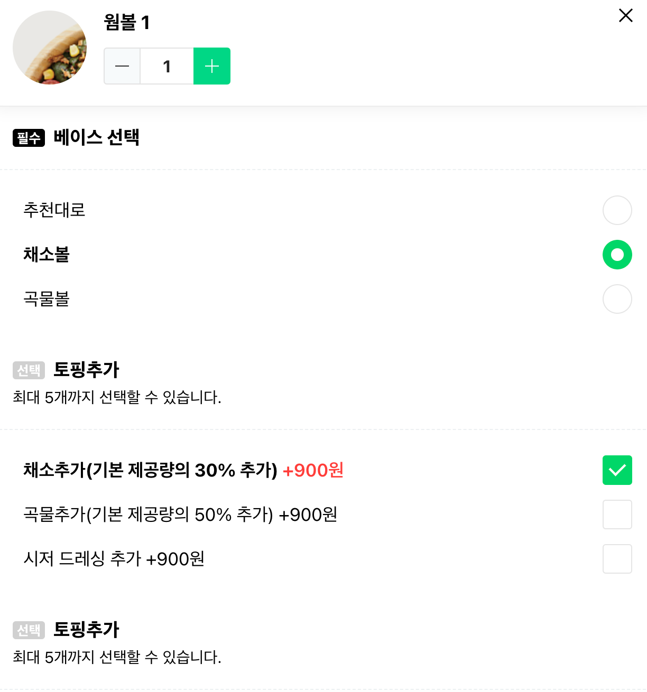

# 네이버 주문하기 클론코딩

## 시작 전 준비 작업

### 📌 프론트 서버 띄우는 방법

1. polymer-cli 설치 합니다.

```
npm install -g polymer-cli
```

2. 실행하는 법

package.json 에 scripts로 지정된 명령어를 입력해줍니다.

```
yarn front
```

### 📌 데이터베이스 서버 시작하는 방법

1. json-server를 설치합니다.

```
npm install -g json-server
```

2. 실행하는 법

package.json 에 scripts로 지정된 명령어를 입력해줍니다.

```
yarn server
```

## 작업물

1. 메인화면



2. 주문하기 화면



3. 옵션 추가


