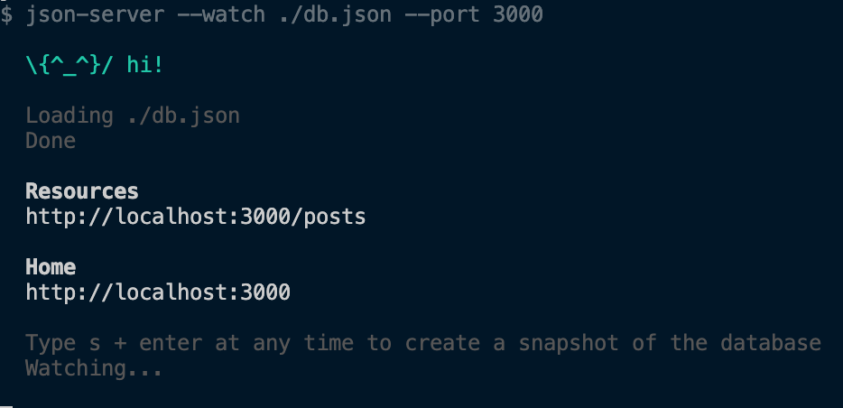
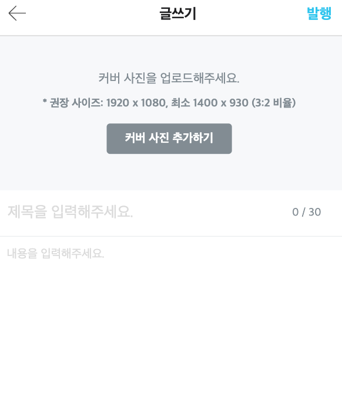

# 오늘의 집 클론

## 실행하기전에 작업해야 할 것!

json-server을 설치해주세요~

- 📌 npm 일 경우
```
npm i 또는 npm install
```

- 📌 yarn 일 경우

```
yarn
```

## DB 서버 실행 법

명령어를 실행해주세요.

```cmd
yarn server 또는 npm run server
```




프론트 실행은 vs-code의 확장프로그램의 live-server을 사용해주세요


## 실행 결과

- 메인화면


- 포스트


- 글쓰기


